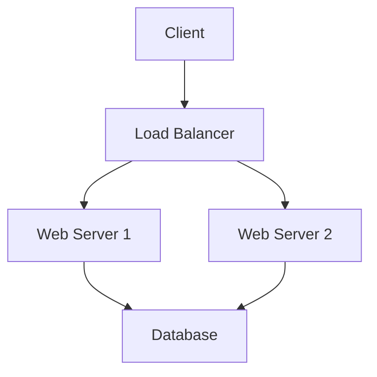
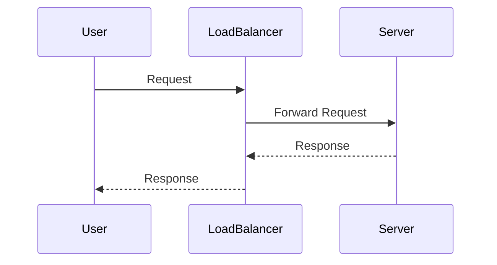

# System Design Basics

## Overview
System design is the process of defining the architecture, components, modules, interfaces, and data for a system to satisfy specified requirements. It involves making high-level decisions about the system's structure, behavior, and interactions, focusing on scalability, reliability, performance, and maintainability.

## Detailed Explanation
Key principles in system design include:

- **Scalability:** Ability to handle increased load by adding resources.
- **Reliability:** System's ability to function correctly despite failures.
- **Availability:** Proportion of time the system is operational.
- **Performance:** Speed and efficiency of operations.
- **Maintainability:** Ease of modifying and updating the system.
- **Security:** Protecting the system from threats.

Common components:

- **Load Balancers:** Distribute traffic across servers.
- **Databases:** Store and retrieve data.
- **Caching:** Improve performance by storing frequently accessed data.
- **Message Queues:** Decouple components for asynchronous processing.
- **CDNs:** Deliver content closer to users.

### System Architecture Diagram


## Real-world Examples & Use Cases
- **URL Shortener:** Simple service to shorten URLs, handle redirects.
- **Rate Limiter:** Control the rate of requests to prevent abuse.
- **Key-Value Store:** Basic database for storing key-value pairs.
- **Notification System:** Send notifications to users asynchronously.

## Code Examples
### Simple URL Shortener (Pseudocode)
```python
class URLShortener:
    def __init__(self):
        self.url_map = {}
        self.id_counter = 0

    def shorten(self, long_url):
        short_id = self.generate_id()
        self.url_map[short_id] = long_url
        return f"http://short.ly/{short_id}"

    def redirect(self, short_id):
        return self.url_map.get(short_id)

    def generate_id(self):
        self.id_counter += 1
        return str(self.id_counter)
```

### Basic Load Balancer (Round Robin)
```java
import java.util.Arrays;
import java.util.List;

class LoadBalancer {
    private List<String> servers = Arrays.asList("server1", "server2", "server3");
    private int current = 0;

    public String getServer() {
        String server = servers.get(current);
        current = (current + 1) % servers.size();
        return server;
    }
}
```

## STAR Summary
- **Situation:** Designing a system for a growing application with increasing user load.
- **Task:** Ensure the system can scale, remain reliable, and perform efficiently.
- **Action:** Incorporate load balancers for traffic distribution, caching for performance, and databases for data persistence.
- **Result:** Achieved high availability, reduced latency, and improved user experience.

## Journey / Sequence


## Common Pitfalls & Edge Cases
- **Single Point of Failure:** Ensure no single component can bring down the system.
- **Over-engineering:** Start simple, scale as needed.
- **Ignoring Bottlenecks:** Identify and address performance bottlenecks early.
- **Edge Case:** Sudden traffic spikes, data corruption, network failures.

## References
- "System Design Interview" by Alex Xu
- https://github.com/donnemartin/system-design-primer
- "Designing Data-Intensive Applications" by Martin Kleppmann

## Github-README Links & Related Topics
- [lld-hld-basics](../lld-hld-basics/)
- [high-scalability-patterns](../high-scalability-patterns/)
- [cap-theorem-and-distributed-systems](../cap-theorem-and-distributed-systems/)</content>
</xai:function_call ><xai:function_call name="write">
<parameter name="filePath">high-scalability-patterns/README.md