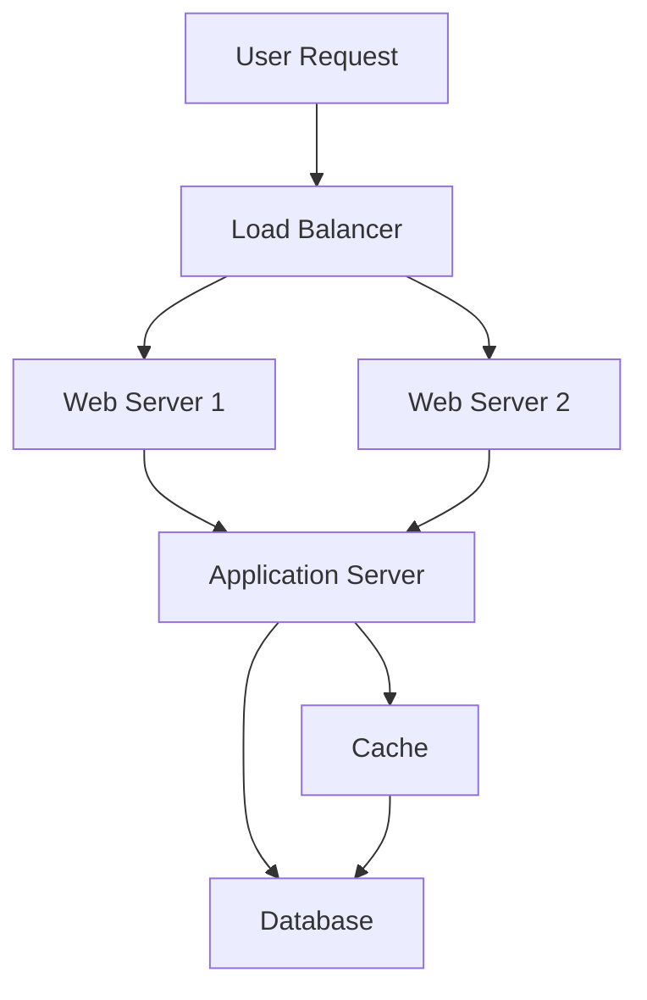

## Overview

System design is the process of planning, structuring, and defining the architecture of a software system. It involves translating user requirements into a detailed blueprint that guides the implementation phase. The goal is to create a well-organized and efficient structure that meets the intended purpose while considering factors like scalability, maintainability, and performance. System design is a critical phase in the Software Development Life Cycle (SDLC), providing the backbone to handle exceptional scenarios by representing the business logic of the software.

Key aspects include:
- **Scalability**: Ability to handle increased loads.
- **Reliability**: Ensuring system availability and fault tolerance.
- **Performance**: Minimizing latency and optimizing response times.
- **Security**: Protecting against unauthorized access and data breaches.
- **Maintainability**: Ease of updates and modifications.

## Detailed Explanation

System design encompasses both High-Level Design (HLD) and Low-Level Design (LLD), each serving distinct purposes in the development process.

### High-Level Design (HLD)
HLD provides an overview of the system's architecture, focusing on major components, their interactions, and data flow. It is typically created by architects and stakeholders to outline the big picture, including technology stack, infrastructure, and high-level decisions on scalability and security.

Key elements:
- System architecture overview
- Data flow and component interactions
- Technology stack and infrastructure choices
- Module responsibilities and performance trade-offs

Prerequisites for HLD include knowledge of databases, caching, APIs, networking, and tools like message queues.

### Low-Level Design (LLD)
LLD delves into the internal implementation of each component, providing detailed blueprints for developers. It includes class designs, database schemas, API definitions, and error handling logic.

Key elements:
- Component/module breakdown with internal logic
- Database schema and structures
- API and interface definitions
- Error handling, validation, and design patterns (e.g., SOLID principles)

Prerequisites for LLD include strong Object-Oriented Programming (OOP) skills and familiarity with design patterns.

| Aspect | High-Level Design (HLD) | Low-Level Design (LLD) |
|--------|-------------------------|-------------------------|
| Focus | Overall architecture and interactions | Internal implementation details |
| Audience | Architects, stakeholders | Developers |
| Artifacts | Architecture diagrams, data flow diagrams | Class diagrams, sequence diagrams, pseudocode |
| Scope | Big picture, scalability decisions | Code-level logic, methods, attributes |

### Key Concepts in System Design
- **Scalability**: Horizontal (adding more servers) vs. Vertical (upgrading existing servers) scaling.
- **Availability**: Ensuring the system is operational, often measured by uptime percentages.
- **Consistency**: Maintaining data integrity across distributed systems.
- **Reliability**: Fault tolerance and recovery mechanisms.
- **CAP Theorem**: In distributed systems, you can achieve at most two of Consistency, Availability, and Partition Tolerance.
- **Load Balancing**: Distributing traffic across servers to prevent overload.
- **Caching**: Storing frequently accessed data to reduce latency.
- **Databases**: Choosing between SQL (relational) and NoSQL (non-relational) based on needs.



This diagram illustrates a basic system architecture with load balancing, caching, and database interaction.

## Real-world Examples & Use Cases

System design principles are applied in various large-scale applications:

- **Netflix**: Transitioned from a monolithic architecture to microservices for scalability. Uses event-driven systems for real-time recommendations and handles millions of concurrent users during peak times like holiday seasons.
- **Uber**: Employs an event-driven architecture for ride requests, location updates, and dynamic pricing. Ensures low-latency matching between riders and drivers through distributed systems.
- **Twitter**: Implements load balancing and caching for trending topics and tweets. Manages real-time data flows and high user concurrency with fault-tolerant designs.

Use cases include:
- E-commerce platforms requiring high availability during sales events.
- Social media apps needing to scale with user growth and handle real-time interactions.
- Streaming services managing video delivery with minimal latency.

## Code Examples

Here are simple code snippets demonstrating basic system design concepts.

### Example 1: Basic Load Balancer Simulation in Python
```python
import random

class LoadBalancer:
    def __init__(self, servers):
        self.servers = servers

    def get_server(self):
        return random.choice(self.servers)

# Usage
servers = ["server1", "server2", "server3"]
lb = LoadBalancer(servers)
print(lb.get_server())  # Randomly selects a server
```

### Example 2: Simple Caching Mechanism in Java
```java
import java.util.HashMap;
import java.util.Map;

class Cache {
    private Map<String, String> cache = new HashMap<>();

    public String get(String key) {
        return cache.get(key);
    }

    public void put(String key, String value) {
        cache.put(key, value);
    }
}

// Usage
Cache cache = new Cache();
cache.put("user:123", "John Doe");
System.out.println(cache.get("user:123"));  // Outputs: John Doe
```

These examples illustrate fundamental patterns; in real systems, consider thread safety and persistence.

## References

- [What is System Design - Learn System Design](https://www.geeksforgeeks.org/what-is-system-design-learn-system-design/) - Comprehensive guide on system design fundamentals, HLD, LLD, and key concepts.
- [System Design Tutorial](https://www.geeksforgeeks.org/system-design/system-design-tutorial/) - Overview of system design topics and interview preparation.
- [CAP Theorem in System Design](https://www.geeksforgeeks.org/system-design/cap-theorem-in-system-design/) - Explanation of the CAP theorem and its implications.

## Github-README Links & Related Topics

- [Scalability Patterns](../scalability-patterns/README.md) - Detailed patterns for scaling systems.
- [Load Balancing and Strategies](../load-balancing-and-strategies/README.md) - Techniques for distributing load.
- [Caching](../caching/README.md) - In-depth on caching strategies.
- [Database Design Principles](../database-design-principles/README.md) - Best practices for database architecture.
- [Microservices Architecture](../microservices-architecture/README.md) - Design principles for microservices.
- [Fault Tolerance in Distributed Systems](../fault-tolerance-in-distributed-systems/README.md) - Ensuring system reliability.