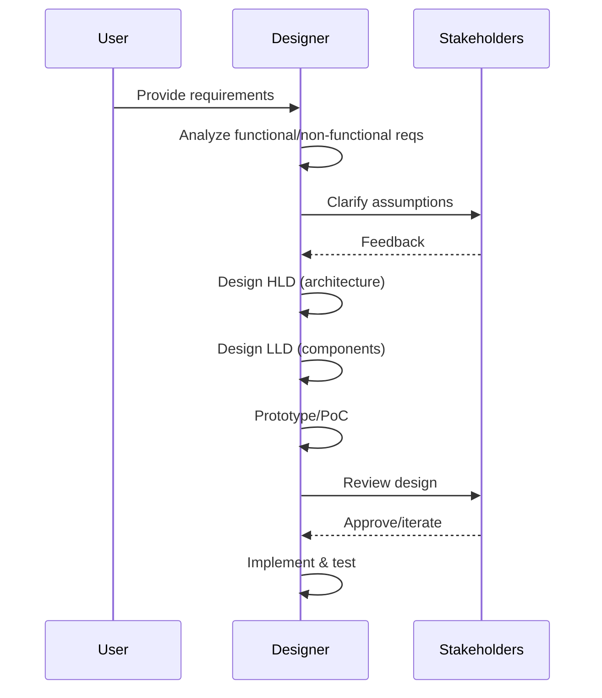
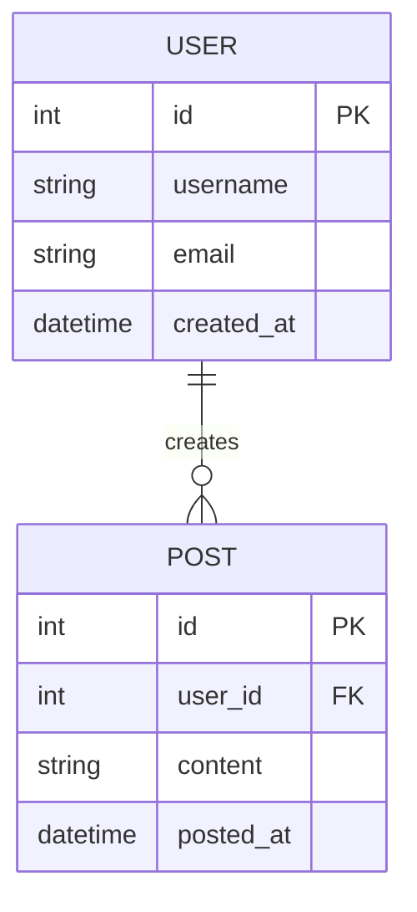

## Overview

System design basics encompass the foundational principles and concepts for architecting scalable, reliable, and efficient software systems. This includes understanding key trade-offs, core components, and design patterns that enable systems to handle growth in users, data, and traffic while maintaining performance, availability, and consistency. Topics cover scalability strategies, database choices, caching mechanisms, and distributed system challenges like the CAP theorem. Mastering these basics is essential for designing systems that can evolve from simple applications to complex, distributed architectures.

## Detailed Explanation

System design involves translating functional requirements into a structured architecture that addresses non-functional requirements such as performance, reliability, and maintainability. At its core, it balances competing priorities through informed trade-offs.

### Core Principles

| Principle | Description | Key Considerations |
|-----------|-------------|-------------------|
| **Scalability** | Ability to handle increased load by adding resources (horizontal/vertical scaling). | Vertical: Increase server capacity; Horizontal: Add more servers. Trade-off: Cost vs. complexity. |
| **Availability** | System's uptime and resilience to failures. Measured as percentage (e.g., 99.9% uptime). | Redundancy, failover mechanisms. Trade-off: Consistency vs. availability (CAP theorem). |
| **Consistency** | Ensuring data remains accurate and uniform across replicas. | Strong vs. eventual consistency. Trade-off: Performance vs. accuracy. |
| **Partition Tolerance** | System continues operating despite network partitions. | Fault-tolerant design. Trade-off: Availability vs. consistency. |

### Key Components and Patterns

- **Load Balancers**: Distribute incoming traffic across multiple servers to prevent overload. Algorithms include round-robin, least connections, and IP hashing.
- **Databases**: Relational (e.g., PostgreSQL) for structured data; NoSQL (e.g., MongoDB) for unstructured or high-volume data.
- **Caching**: In-memory stores (e.g., Redis) to reduce database load and improve response times. Strategies: Write-through, write-behind, cache-aside.
- **Content Delivery Networks (CDNs)**: Global networks of servers to deliver static content faster by caching at edge locations.
- **Message Queues**: Asynchronous communication (e.g., RabbitMQ) for decoupling services and handling bursts.
- **Microservices vs. Monoliths**: Modular architecture for scalability vs. simplicity.

### Architecture Diagram

```mermaid
graph TD
    A[Client] --> B[API Gateway]
    B --> C[Load Balancer]
    C --> D[Web Server 1]
    C --> E[Web Server 2]
    D --> F[Application Server]
    E --> F
    F --> G[Cache (Redis)]
    F --> H[Database (SQL/NoSQL)]
    F --> I[Message Queue]
    I --> J[Worker Service]
    H --> K[CDN]
```

This diagram illustrates a basic distributed system with load balancing, caching, and asynchronous processing.

## Real-world Examples & Use Cases

### E-commerce Platform (e.g., Amazon)
- **Use Case**: Handle millions of concurrent users during flash sales.
- **Design Elements**: Horizontal scaling with auto-scaling groups, CDN for product images, caching for user sessions, and database sharding for order data.
- **Challenges**: Peak load spikes; mitigated by load balancers and queue-based order processing.

### Social Media Feed (e.g., Twitter)
- **Use Case**: Deliver personalized feeds to billions of users in real-time.
- **Design Elements**: Fan-out on write for timeline generation, caching layers (L1/L2), and eventual consistency for likes/comments.
- **Challenges**: High write/read ratios; addressed with write-through caching and distributed databases.

### Banking System (e.g., Online Banking App)
- **Use Case**: Secure, consistent transactions with high availability.
- **Design Elements**: Strong consistency via ACID databases, multi-factor authentication, and redundant data centers.
- **Challenges**: Regulatory compliance and zero-downtime; solved with failover and audit logging.

### Video Streaming Service (e.g., Netflix)
- **Use Case**: Stream high-quality video to global audiences.
- **Design Elements**: CDN for content delivery, adaptive bitrate streaming, and microservices for recommendation engines.
- **Challenges**: Bandwidth and latency; optimized with edge computing and predictive caching.

## Code Examples

### Simple Round-Robin Load Balancer in Python

```python
class RoundRobinLoadBalancer:
    def __init__(self, servers):
        self.servers = servers
        self.current = 0

    def get_server(self):
        if not self.servers:
            raise ValueError("No servers available")
        server = self.servers[self.current]
        self.current = (self.current + 1) % len(self.servers)
        return server

# Usage
lb = RoundRobinLoadBalancer(['server1.example.com', 'server2.example.com', 'server3.example.com'])
for _ in range(5):
    print(lb.get_server())
# Output: server1, server2, server3, server1, server2
```

### Basic Caching with TTL in Java

```java
import java.util.concurrent.ConcurrentHashMap;
import java.util.Map;

class SimpleCache<K, V> {
    private final Map<K, CacheEntry<V>> cache = new ConcurrentHashMap<>();
    
    static class CacheEntry<V> {
        V value;
        long expiryTime;
        
        CacheEntry(V value, long ttlMillis) {
            this.value = value;
            this.expiryTime = System.currentTimeMillis() + ttlMillis;
        }
        
        boolean isExpired() {
            return System.currentTimeMillis() > expiryTime;
        }
    }
    
    public void put(K key, V value, long ttlMillis) {
        cache.put(key, new CacheEntry<>(value, ttlMillis));
    }
    
    public V get(K key) {
        CacheEntry<V> entry = cache.get(key);
        if (entry != null && !entry.isExpired()) {
            return entry.value;
        }
        cache.remove(key);
        return null;
    }
}

// Usage
SimpleCache<String, String> cache = new SimpleCache<>();
cache.put("user:123", "John Doe", 60000); // 1 minute TTL
System.out.println(cache.get("user:123")); // John Doe
```

### Database Connection Pooling Pseudocode

```
class ConnectionPool:
    def __init__(self, max_connections):
        self.max_connections = max_connections
        self.available = []
        self.in_use = set()
    
    def get_connection(self):
        if self.available:
            conn = self.available.pop()
        elif len(self.in_use) < self.max_connections:
            conn = create_new_connection()
        else:
            raise Exception("No available connections")
        self.in_use.add(conn)
        return conn
    
    def release_connection(self, conn):
        if conn in self.in_use:
            self.in_use.remove(conn)
            self.available.append(conn)
```

## Journey / Sequence

A typical system design process follows this sequence:



## Data Models / Message Formats

### Basic User Entity (ER Diagram)



### API Message Format (JSON Example)

```json
{
  "request": {
    "method": "GET",
    "endpoint": "/api/users/123",
    "headers": {
      "Authorization": "Bearer <token>",
      "Content-Type": "application/json"
    }
  },
  "response": {
    "status": 200,
    "data": {
      "id": 123,
      "username": "johndoe",
      "email": "john@example.com"
    }
  }
}
```

## Common Pitfalls & Edge Cases

- **Over-Scaling Prematurely**: Adding complexity without load; mitigate by monitoring metrics first.
- **Ignoring Network Latency**: Assuming local speeds; test with global users.
- **Weak Consistency Models**: Data inconsistencies in distributed systems; use appropriate isolation levels.
- **Single Points of Failure**: No redundancy; implement failover and backups.
- **Edge Case: Hot Keys**: One key/item overloaded (e.g., viral post); shard or replicate hot data.
- **Edge Case: Thundering Herd**: Cache expiry causing mass requests; use staggered TTLs.

## Tools & Libraries

| Category | Tools/Libraries | Description |
|----------|-----------------|-------------|
| **Caching** | Redis, Memcached | In-memory data stores for fast access. |
| **Databases** | PostgreSQL, MongoDB | Relational and document databases. |
| **Load Balancing** | NGINX, HAProxy | Software load balancers. |
| **Monitoring** | Prometheus, Grafana | Metrics collection and visualization. |
| **Message Queues** | Kafka, RabbitMQ | Asynchronous messaging. |
| **CDNs** | Cloudflare, Akamai | Content delivery networks. |

## References

- [System Design Primer - GitHub](https://github.com/donnemartin/system-design-primer)
- [Designing Data-Intensive Applications by Martin Kleppmann](https://www.oreilly.com/library/view/designing-data-intensive-applications/9781491903063/)
- [CAP Theorem Explained - GeeksforGeeks](https://www.geeksforgeeks.org/cap-theorem-in-system-design/)
- [Scalability Patterns - Microsoft](https://docs.microsoft.com/en-us/azure/architecture/patterns/)
- [System Design Interview Guide - Educative](https://www.educative.io/courses/system-design-interview-prep)

## Github-README Links & Related Topics

- [CAP Theorem & Distributed Systems](../cap-theorem-and-distributed-systems/)
- [Caching](../caching/)
- [Load Balancing and Strategies](../system-design/load-balancing-and-strategies/)
- [Database Design and Indexing](../system-design/database-design-and-indexing/)
- [Microservices Architecture](../system-design/microservices-architecture/)
- [High Scalability Patterns](../high-scalability-patterns/)
- [Fault Tolerance Patterns](../fault-tolerance-patterns/)
