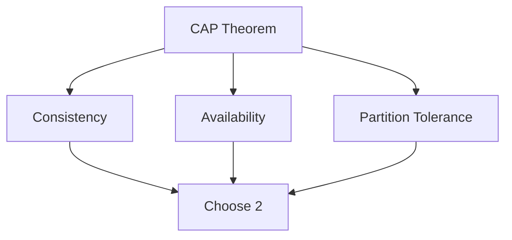

## Overview

System design is the process of defining the architecture, components, modules, interfaces, and data for a system to satisfy specified requirements. Basics include understanding scalability, availability, consistency, and the trade-offs involved in distributed systems. It involves breaking down complex systems into manageable parts, considering factors like performance, reliability, security, and cost.

## Detailed Explanation

### Core Concepts
- **Scalability**: The ability of a system to handle increased load by adding resources (horizontal scaling) or upgrading existing ones (vertical scaling).
- **Availability**: The percentage of time a system is operational and accessible. Measured as uptime (e.g., 99.9% SLA).
- **Consistency**: Ensuring all nodes in a distributed system have the same data at the same time.
- **Partition Tolerance**: The system's ability to continue operating despite network partitions or node failures.
- **Reliability**: The system's ability to perform consistently and recover from failures.
- **Performance**: Metrics like latency, throughput, and response time.

### CAP Theorem
Proposed by Eric Brewer, it states that in a distributed system, you can only guarantee 2 out of 3 properties:
- **Consistency**
- **Availability**
- **Partition Tolerance**



### System Design Process
1. **Requirements Gathering**: Functional and non-functional requirements.
2. **High-Level Design**: Architecture overview, components, data flow.
3. **Detailed Design**: APIs, databases, algorithms.
4. **Trade-off Analysis**: Evaluate options based on CAP, scalability, etc.
5. **Prototyping/Implementation**: Build and test.

| Component | Purpose | Example |
|-----------|---------|---------|
| Load Balancer | Distribute requests | Nginx, AWS ELB |
| Database | Data storage | MySQL (SQL), MongoDB (NoSQL) |
| Cache | Fast data access | Redis, Memcached |
| Message Queue | Asynchronous communication | Kafka, RabbitMQ |

## Real-world Examples & Use Cases

- **E-commerce Platform**: Handle millions of users, ensure high availability during peak sales.
- **Social Media App**: Scale to billions of users, maintain consistency in timelines.
- **Banking System**: Prioritize consistency and security over availability.
- **IoT Platform**: Manage distributed sensors with partition tolerance.

## Code Examples

### Simple Load Balancer (Pseudo Code)
```python
class LoadBalancer:
    def __init__(self, servers):
        self.servers = servers
        self.index = 0

    def get_server(self):
        server = self.servers[self.index]
        self.index = (self.index + 1) % len(self.servers)
        return server

# Usage
lb = LoadBalancer(['server1', 'server2', 'server3'])
print(lb.get_server())  # server1
```

### Basic Caching (Java)
```java
import java.util.HashMap;
import java.util.Map;

class SimpleCache {
    private Map<String, String> cache = new HashMap<>();

    public String get(String key) {
        return cache.get(key);
    }

    public void put(String key, String value) {
        cache.put(key, value);
    }
}

// Usage
SimpleCache cache = new SimpleCache();
cache.put("user:123", "John Doe");
System.out.println(cache.get("user:123"));  // John Doe
```

## Common Pitfalls & Edge Cases

- **Over-Engineering**: Designing for non-existent scale; start simple.
- **Ignoring Trade-offs**: Forcing all CAP properties; choose based on needs.
- **Single Points of Failure**: Ensure redundancy in critical components.
- **Underestimating Latency**: Network calls add overhead; design for async where possible.
- **Security Oversights**: Encrypt data, validate inputs early.

## Tools & Libraries

- **Diagramming**: Draw.io, Lucidchart for architecture diagrams.
- **Simulation**: Apache JMeter for load testing.
- **Monitoring**: Prometheus, Grafana for observability.
- **Cloud Platforms**: AWS, Azure for scalable infrastructure.

## References

- [System Design Primer](https://github.com/donnemartin/system-design-primer)
- [Designing Data-Intensive Applications](https://www.amazon.com/Designing-Data-Intensive-Applications-Reliable-Maintainable/dp/1449373321)
- [CAP Theorem Explained](https://en.wikipedia.org/wiki/CAP_theorem)
- [Martin Kleppmann's Blog](https://martin.kleppmann.com/)

## Github-README Links & Related Topics

- [High Scalability Patterns](../high-scalability-patterns/)
- [CAP Theorem & Distributed Systems](../cap-theorem-and-distributed-systems/)
- [Load Balancing and Strategies](../load-balancing-and-strategies/)
- [Caching](../caching/)
- [Database Design Principles](../database-design-principles/)