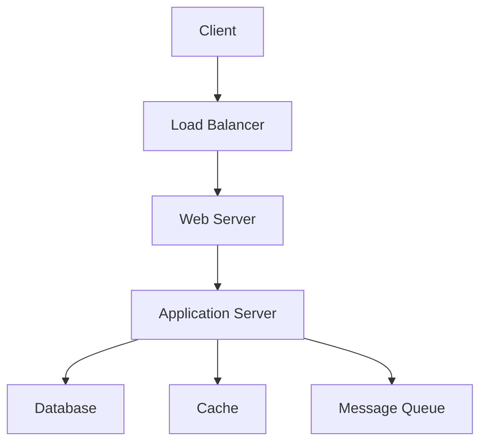

# System Design Basics

## Overview

System design is the process of defining the architecture, components, modules, interfaces, and data for a system to satisfy specified requirements. It involves creating a blueprint that outlines how different parts of a system interact to achieve scalability, reliability, and efficiency. Key principles include understanding trade-offs between consistency, availability, and partition tolerance (CAP theorem), designing for fault tolerance, and optimizing for performance metrics like latency and throughput.

## Detailed Explanation

### Core Concepts

- **Scalability**: The ability of a system to handle increased load by adding resources (horizontal scaling) or upgrading existing ones (vertical scaling).
- **Reliability**: Ensuring the system continues to operate correctly despite failures.
- **Availability**: The proportion of time the system is operational and accessible.
- **Performance**: Metrics such as response time, throughput, and resource utilization.
- **Security**: Protecting data and systems from unauthorized access and threats.
- **Maintainability**: Ease of updating, debugging, and extending the system.

### System Design Process

1. **Requirements Gathering**: Understand functional and non-functional requirements.
2. **High-Level Design (HLD)**: Define overall architecture, components, and data flow.
3. **Low-Level Design (LLD)**: Detail individual components, APIs, and databases.
4. **Trade-off Analysis**: Evaluate options using principles like CAP theorem.
5. **Prototyping and Testing**: Validate design with proofs of concept.

### Basic Architecture Patterns



- **Load Balancer**: Distributes traffic across servers.
- **Web Server**: Handles HTTP requests.
- **Application Server**: Processes business logic.
- **Database**: Stores persistent data.
- **Cache**: Speeds up data retrieval.
- **Message Queue**: Decouples components for asynchronous processing.

### Data Storage Options

| Type | Description | Examples | Use Case |
|------|-------------|----------|----------|
| Relational | Structured data with ACID properties | MySQL, PostgreSQL | Transactions, complex queries |
| NoSQL | Flexible schemas, high scalability | MongoDB, Cassandra | Big data, real-time analytics |
| In-Memory | Fast access, volatile | Redis, Memcached | Caching, session storage |

## Real-world Examples & Use Cases

- **E-commerce Platform**: Handle millions of users, product catalogs, and transactions with load balancers, databases, and caches.
- **Social Media App**: Scale user feeds, notifications, and data storage using sharding and replication.
- **IoT System**: Process sensor data with message queues and distributed databases.
- **Content Delivery Network (CDN)**: Distribute static content globally for low latency.

## Code Examples

### Simple Load Balancer Simulation (Pseudo-code)

```python
class LoadBalancer:
    def __init__(self, servers):
        self.servers = servers
        self.index = 0

    def get_server(self):
        server = self.servers[self.index]
        self.index = (self.index + 1) % len(self.servers)
        return server

# Usage
lb = LoadBalancer(['server1', 'server2', 'server3'])
print(lb.get_server())  # server1
print(lb.get_server())  # server2
```

### Basic Caching with HashMap (Java)

```java
import java.util.HashMap;
import java.util.Map;

public class SimpleCache {
    private Map<String, String> cache = new HashMap<>();

    public String get(String key) {
        return cache.get(key);
    }

    public void put(String key, String value) {
        cache.put(key, value);
    }
}

// Usage
SimpleCache cache = new SimpleCache();
cache.put("user:123", "John Doe");
System.out.println(cache.get("user:123"));  // John Doe
```

## Common Pitfalls & Edge Cases

- **Single Points of Failure**: Avoid relying on single components; use redundancy.
- **Over-Engineering**: Start simple and scale as needed.
- **Ignoring Trade-offs**: Balance CAP theorem constraints based on use case.
- **Security Oversights**: Implement authentication, encryption, and access controls early.

## Tools & Libraries

- **Diagramming**: Draw.io, Lucidchart for architecture diagrams.
- **Simulation**: Apache JMeter for load testing.
- **Frameworks**: Spring Boot for microservices, Docker for containerization.

## References

- [System Design Primer](https://github.com/donnemartin/system-design-primer)
- [Designing Data-Intensive Applications](https://www.amazon.com/Designing-Data-Intensive-Applications-Reliable-Maintainable/dp/1449373321)
- [Martin Fowler's Microservices](https://martinfowler.com/microservices/)
- [CAP Theorem Explained](https://en.wikipedia.org/wiki/CAP_theorem)

## Github-README Links & Related Topics

- [High Scalability Patterns](../high-scalability-patterns/)
- [CAP Theorem & Distributed Systems](../cap-theorem-and-distributed-systems/)
- [Load Balancing Strategies](../load-balancing-strategies/)
- [Caching](../caching/)
- [Database Design Principles](../database-design-principles/)
