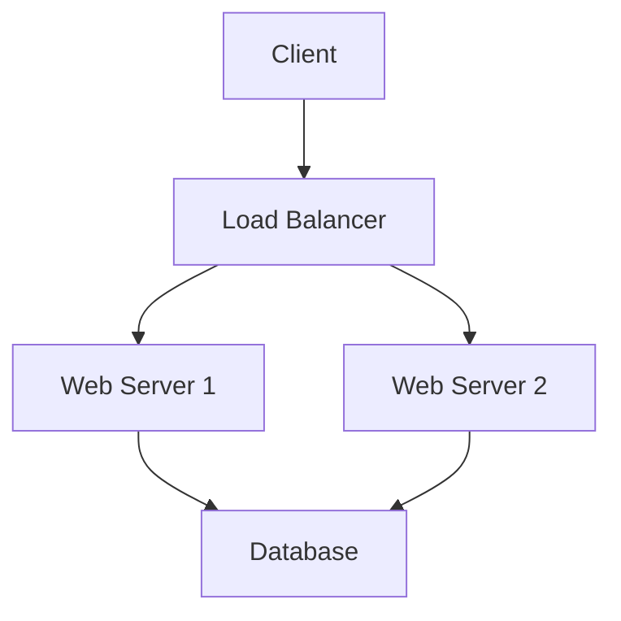

## Overview
System design basics cover the fundamental principles and components for designing scalable, reliable, and efficient software systems. It involves understanding requirements, trade-offs, and architectural patterns.

## Detailed Explanation
- **Requirements Gathering:** Functional and non-functional requirements (scalability, availability, etc.).
- **Components:** Load balancers, databases, caches, message queues.
- **Scalability:** Vertical vs horizontal scaling.
- **Availability:** Redundancy, failover.
- **Performance:** Latency, throughput.

## Real-world Examples & Use Cases
- Designing a web application to handle millions of users.
- Building a chat system with real-time messaging.
- E-commerce platform with inventory management.

## Code Examples
### Simple Load Balancer Pseudo-code
```python
class LoadBalancer:
    def __init__(self, servers):
        self.servers = servers
        self.index = 0

    def get_server(self):
        server = self.servers[self.index]
        self.index = (self.index + 1) % len(self.servers)
        return server
```

## Data Models / Message Formats


## Common Pitfalls & Edge Cases
- Ignoring bottlenecks in single points of failure.
- Over-scaling prematurely.
- Not considering data consistency.

## Tools & Libraries
- AWS, GCP for cloud services.
- Nginx for load balancing.

## Github-README Links & Related Topics
Related: [lld-hld-basics](../lld-hld-basics/), [high-scalability-patterns](../system-design/high-scalability-patterns/)

## References
- "Designing Data-Intensive Applications" by Martin Kleppmann
- https://github.com/donnemartin/system-design-primer
- https://www.systemdesigninterview.org/