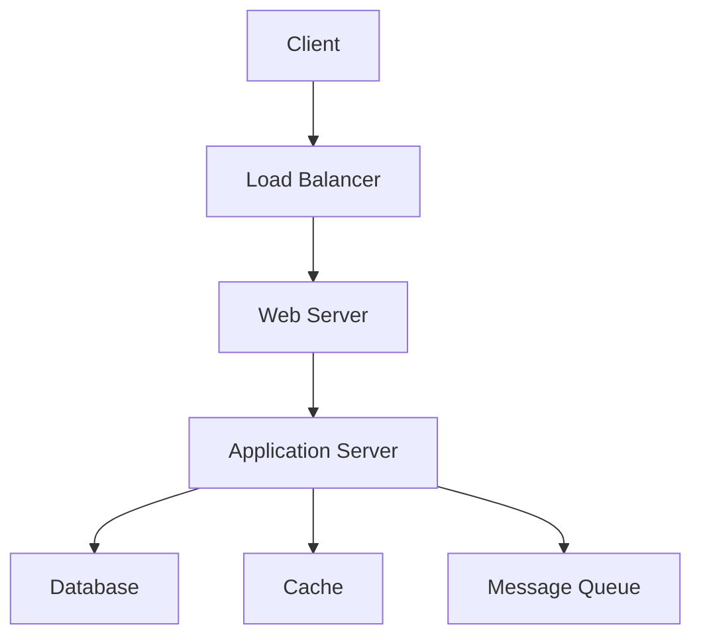

# Overview

System design is the process of defining the architecture, components, modules, interfaces, and data for a system to satisfy specified requirements. It involves high-level design (HLD) for overall structure and low-level design (LLD) for detailed implementation. Key principles include scalability, reliability, maintainability, and performance. System design addresses trade-offs in distributed systems, such as CAP theorem, and incorporates patterns like load balancing, caching, and microservices.

# Detailed Explanation

## Core Concepts

- **Scalability**: Ability to handle growth in users, data, or traffic. Horizontal (adding nodes) vs. vertical (upgrading hardware).
- **Reliability**: System's ability to function correctly despite failures. Achieved through redundancy, failover, and fault tolerance.
- **Availability**: Percentage of time the system is operational (e.g., 99.9% uptime).
- **Consistency**: Data remains accurate and uniform across the system.
- **Performance**: Response time, throughput, and latency metrics.
- **Security**: Protecting data and systems from threats.

## Design Process

1. **Requirements Gathering**: Functional (features) and non-functional (performance, security).
2. **High-Level Design**: System architecture, components, data flow.
3. **Low-Level Design**: Detailed class diagrams, database schemas, APIs.
4. **Trade-off Analysis**: Evaluate options using metrics like CAP theorem.
5. **Prototyping and Validation**: Build proofs-of-concept.

## Key Components

- **Load Balancer**: Distributes traffic.
- **Database**: Relational (SQL) vs. NoSQL for scalability.
- **Cache**: In-memory storage for fast access.
- **Message Queue**: Asynchronous communication.
- **CDN**: Content delivery for global users.



## Distributed Systems Challenges

- **Partition Tolerance**: System continues operating despite network failures.
- **Consistency vs. Availability**: Trade-offs in CAP theorem.
- **Data Partitioning**: Sharding for scalability.
- **Concurrency**: Handling simultaneous operations.

# Real-world Examples & Use Cases

- **E-commerce Platform**: Design for high traffic during sales, using load balancers, caches, and microservices.
- **Social Media App**: Handle millions of users with sharding, CDNs, and event-driven architecture.
- **Banking System**: Ensure security, consistency, and compliance with distributed databases and encryption.
- **IoT System**: Process sensor data with message queues and real-time analytics.
- **Video Streaming**: Use CDNs, adaptive bitrate, and edge computing for global delivery.

# Code Examples

## Simple Load Balancer in Java

```java
import java.util.List;
import java.util.concurrent.atomic.AtomicInteger;

public class LoadBalancer {
    private final List<String> servers;
    private final AtomicInteger index = new AtomicInteger(0);

    public LoadBalancer(List<String> servers) {
        this.servers = servers;
    }

    public String getServer() {
        return servers.get(index.getAndIncrement() % servers.size());
    }
}
```

## Caching with HashMap

```java
import java.util.HashMap;
import java.util.Map;

public class SimpleCache<K, V> {
    private final Map<K, V> cache = new HashMap<>();

    public V get(K key) {
        return cache.get(key);
    }

    public void put(K key, V value) {
        cache.put(key, value);
    }
}
```

## Database Connection Pooling

```java
import com.zaxxer.hikari.HikariConfig;
import com.zaxxer.hikari.HikariDataSource;

HikariConfig config = new HikariConfig();
config.setJdbcUrl("jdbc:mysql://localhost:3306/mydb");
config.setUsername("user");
config.setPassword("password");
config.setMaximumPoolSize(10);

HikariDataSource dataSource = new HikariDataSource(config);
```

# References

- [Designing Data-Intensive Applications](https://dataintensive.net/)
- [System Design Primer](https://github.com/donnemartin/system-design-primer)
- [AWS Architecture Center](https://aws.amazon.com/architecture/)
- [Google SRE Book](https://sre.google/sre-book/table-of-contents/)

# Github-README Links & Related Topics

- [Scalability Patterns](../high-scalability-patterns/)
- [CAP Theorem](../cap-theorem-and-distributed-systems/)
- [Microservices Architecture](../microservices-architecture/)
- [Load Balancing](../load-balancing/)
- [Caching](../caching/)
- [Database Design](../database-design/)

# STAR Summary

- **Situation**: Building a scalable web app for growing user base.
- **Task**: Design system to handle 10x traffic increase.
- **Action**: Implemented load balancing, caching, and database sharding.
- **Result**: Achieved 99.9% uptime and sub-second response times.

# Journey / Sequence

1. Assess requirements and constraints.
2. Sketch high-level architecture.
3. Detail components and interfaces.
4. Prototype critical parts.
5. Iterate based on testing and feedback.

# Data Models / Message Formats

- **User Entity**: JSON with id, name, email.
- **API Request**: RESTful JSON payloads.
- **Event Message**: Kafka message with headers and body.

# Common Pitfalls & Edge Cases

- Ignoring network latency in distributed systems.
- Over-engineering for non-existent scale.
- Neglecting security in design phase.
- Failing to monitor and iterate.

# Tools & Libraries

- **Diagramming**: Draw.io, Lucidchart.
- **Prototyping**: Figma, Balsamiq.
- **Simulation**: JMeter for load testing.
- **Frameworks**: Spring Boot for Java apps.