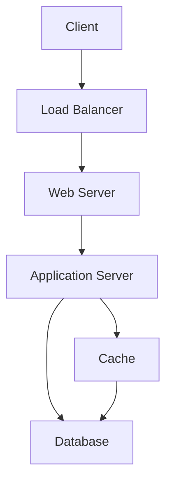

# System Design Basics

## Overview

System design is the process of defining the architecture, components, modules, interfaces, and data for a system to satisfy specified requirements. It involves translating user needs into a detailed blueprint that guides implementation, ensuring the system is scalable, reliable, maintainable, and efficient. System design is crucial in software development as it provides the backbone for handling business logic, exceptional scenarios, and future growth.

System design can be broadly divided into two levels:
- **High-Level Design (HLD)**: Focuses on the overall architecture, major components, data flow, and technology stack. It provides a big-picture view for architects and stakeholders.
- **Low-Level Design (LLD)**: Details the internal workings of each component, including class structures, algorithms, database schemas, and APIs. It serves as a blueprint for developers.

Key principles include scalability (handling growth), availability (system uptime), consistency (data integrity), and performance (latency and throughput). System design is iterative, involving trade-offs between functional requirements (what the system does) and non-functional requirements (how well it performs).

## Detailed Explanation

### Core Concepts

1. **Scalability**: The ability of a system to handle increased load. Achieved through vertical scaling (adding resources to a single node) or horizontal scaling (adding more nodes).
   - **Vertical Scaling**: Increases capacity of existing hardware (e.g., more CPU/RAM).
   - **Horizontal Scaling**: Distributes load across multiple servers (e.g., load balancers).

2. **Availability**: The percentage of time a system is operational. Measured in "nines" (e.g., 99.9% uptime).
   - Patterns: Fail-over (active-passive/active-active), replication.

3. **Consistency**: Ensures all nodes see the same data at the same time.
   - Patterns: Strong consistency (immediate updates), eventual consistency (updates propagate over time).

4. **CAP Theorem**: In a distributed system, you can only guarantee two of: Consistency, Availability, Partition Tolerance.
   - **CP (Consistency + Partition Tolerance)**: Prioritizes data accuracy, may sacrifice availability.
   - **AP (Availability + Partition Tolerance)**: Ensures system responsiveness, may allow stale data.

5. **Latency vs. Throughput**:
   - **Latency**: Time for a single operation.
   - **Throughput**: Number of operations per unit time. Aim for maximal throughput with acceptable latency.

### Key Components

- **Load Balancers**: Distribute traffic across servers. Types: Layer 4 (transport layer), Layer 7 (application layer).
- **Databases**:
  - **SQL (Relational)**: ACID-compliant, structured data (e.g., MySQL, PostgreSQL).
  - **NoSQL**: Flexible schemas, high scalability (e.g., MongoDB for documents, Redis for key-value).
  - Patterns: Sharding (splitting data), Replication (copying data).
- **Caching**: Stores frequently accessed data in memory (e.g., Redis, Memcached). Strategies: Cache-aside, write-through, write-behind.
- **CDNs (Content Delivery Networks)**: Distribute static content globally to reduce latency.
- **Message Queues**: Enable asynchronous communication (e.g., RabbitMQ, Kafka).
- **APIs and Microservices**: Break systems into independent services communicating via APIs.

### Design Process

1. **Requirements Gathering**: Identify functional (e.g., user login) and non-functional (e.g., 99.99% uptime) requirements.
2. **High-Level Design**: Sketch architecture, components, and interactions.
3. **Low-Level Design**: Detail internals, schemas, and algorithms.
4. **Trade-offs**: Balance cost, performance, security, and maintainability.
5. **Validation**: Use back-of-the-envelope calculations for capacity estimation.

### Common Patterns

- **Client-Server**: Clients request, servers respond.
- **Peer-to-Peer**: Nodes act as both clients and servers.
- **Event-Driven**: Systems react to events via queues.

## Real-world Examples & Use Cases

### Example 1: Designing a URL Shortener (e.g., Bitly)

**Requirements**: Shorten long URLs, handle millions of requests, ensure uniqueness.

**HLD**:
- **Components**: Web server, application server, database, cache.
- **Data Flow**: User submits URL → Generate hash → Store in DB → Return short URL.

**LLD**:
- Use base62 encoding for hashes.
- Database: Table with original_url, short_code, created_at.
- Handle collisions and expiration.

**Scalability**: Use sharding for DB, CDN for redirects.

### Example 2: Social Media Feed (e.g., Twitter Timeline)

**Requirements**: Display personalized feeds, handle real-time updates.

**HLD**:
- **Components**: User service, post service, feed service, cache, message queue.
- **Data Flow**: User posts → Queue for processing → Update followers' feeds in cache.

**LLD**:
- Use graph DB for relationships.
- Cache recent posts; fall back to DB for older ones.

**Challenges**: High write load; use eventual consistency.

### Example 3: E-commerce Platform (e.g., Amazon)

**Requirements**: Product search, inventory, payments, high availability.

**HLD**:
- Microservices: Catalog, search, cart, payment.
- Load balancer distributes traffic.

**LLD**:
- Search: Elasticsearch for indexing.
- Payments: Secure API with encryption.

**Use Case**: Black Friday spikes → Auto-scale with Kubernetes.

### Mermaid Diagram: Basic System Architecture



This diagram shows a typical client-server setup with load balancing, caching, and database layers.

## Code Examples

### Example 1: Simple Load Balancer in Python (Pseudocode)

```python
class LoadBalancer:
    def __init__(self, servers):
        self.servers = servers
        self.index = 0

    def get_server(self):
        server = self.servers[self.index]
        self.index = (self.index + 1) % len(self.servers)
        return server

# Usage
lb = LoadBalancer(['server1', 'server2', 'server3'])
print(lb.get_server())  # Round-robin selection
```

### Example 2: Basic Cache Implementation (Python)

```python
class SimpleCache:
    def __init__(self, capacity=100):
        self.cache = {}
        self.capacity = capacity

    def get(self, key):
        return self.cache.get(key, None)

    def set(self, key, value):
        if len(self.cache) >= self.capacity:
            # Simple eviction: remove oldest
            oldest = next(iter(self.cache))
            del self.cache[oldest]
        self.cache[key] = value

# Usage
cache = SimpleCache()
cache.set('user:123', {'name': 'Alice'})
print(cache.get('user:123'))  # {'name': 'Alice'}
```

### Example 3: REST API Endpoint (Flask, Python)

```python
from flask import Flask, jsonify

app = Flask(__name__)

@app.route('/api/users/<int:user_id>', methods=['GET'])
def get_user(user_id):
    # Simulate DB query
    user = {'id': user_id, 'name': f'User {user_id}'}
    return jsonify(user)

if __name__ == '__main__':
    app.run(debug=True)
```

Run with `python app.py` and test with `curl http://localhost:5000/api/users/1`.

## References

- [Systems Design - Wikipedia](https://en.wikipedia.org/wiki/Systems_design)
- [System Design Primer - GitHub](https://github.com/donnemartin/system-design-primer)
- [What is System Design - GeeksforGeeks](https://www.geeksforgeeks.org/getting-started-with-system-design/)
- [CAP Theorem - Wikipedia](https://en.wikipedia.org/wiki/CAP_theorem)
- [Scalability Lecture - Harvard](https://www.youtube.com/watch?v=-W9F__D3oY4)

## Github-README Links & Related Topics

- [CAP Theorem and Distributed Systems](../cap-theorem-and-distributed-systems/)
- [Database Design Principles](../database-design-principles/)
- [Caching](../caching/)
- [Load Balancing](../load-balancing/)
- [Microservices](../microservices/)
- [API Design Best Practices](../api-design-best-practices/)

### Related Topics

- Scalability Patterns
- Fault Tolerance
- Distributed Systems
- Cloud Architecture
- Performance Tuning