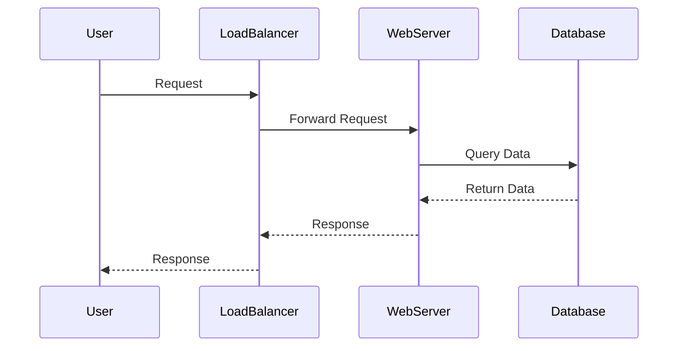
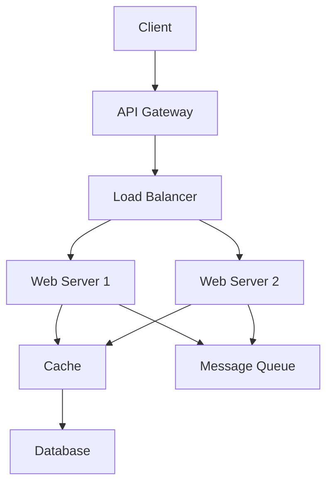

## Overview
System design basics encompass the foundational concepts for architecting scalable, reliable, and efficient software systems. This involves analyzing requirements, evaluating trade-offs, and applying architectural patterns to meet functional and non-functional needs.

## Detailed Explanation
System design focuses on breaking down complex systems into manageable components while considering scalability, availability, performance, and maintainability.

### Key Concepts
- **Requirements Analysis:** Distinguish between functional requirements (what the system does) and non-functional requirements (how well it performs).
- **Scalability:** Ability to handle growth. Vertical scaling (adding resources to a single node) vs. horizontal scaling (adding more nodes).
- **Availability:** Ensuring the system remains operational. Achieved through redundancy, failover mechanisms, and load balancing.
- **Performance:** Measured by latency (response time) and throughput (requests per second).
- **Reliability:** Fault tolerance and error handling.
- **Security:** Protecting data and systems from threats.

### Core Components
| Component | Purpose | Example |
|-----------|---------|---------|
| Load Balancer | Distributes traffic across servers | Nginx, HAProxy |
| Database | Stores and retrieves data | MySQL, PostgreSQL, MongoDB |
| Cache | Speeds up data access | Redis, Memcached |
| Message Queue | Decouples services | RabbitMQ, Kafka |
| API Gateway | Manages API requests | Kong, Apigee |

## Real-world Examples & Use Cases
- **Social Media Platform:** Handling billions of user interactions with high availability and low latency.
- **E-commerce Site:** Managing inventory, payments, and user sessions during peak traffic like Black Friday.
- **Ride-Sharing App:** Real-time matching of drivers and riders with location-based services.
- **Streaming Service:** Delivering video content with adaptive bitrate and global CDN.

## Code Examples
### Simple Round-Robin Load Balancer in Python
```python
class LoadBalancer:
    def __init__(self, servers):
        self.servers = servers
        self.index = 0

    def get_server(self):
        if not self.servers:
            return None
        server = self.servers[self.index]
        self.index = (self.index + 1) % len(self.servers)
        return server

# Usage
lb = LoadBalancer(['server1', 'server2', 'server3'])
print(lb.get_server())  # server1
print(lb.get_server())  # server2
```

### Basic Cache Implementation
```python
class SimpleCache:
    def __init__(self, capacity=100):
        self.cache = {}
        self.capacity = capacity
        self.order = []

    def get(self, key):
        if key in self.cache:
            self.order.remove(key)
            self.order.append(key)
            return self.cache[key]
        return None

    def put(self, key, value):
        if key in self.cache:
            self.order.remove(key)
        elif len(self.cache) >= self.capacity:
            oldest = self.order.pop(0)
            del self.cache[oldest]
        self.cache[key] = value
        self.order.append(key)
```

## Journey / Sequence


## Data Models / Message Formats
### User Request JSON
```json
{
  "user_id": "12345",
  "action": "login",
  "timestamp": "2023-09-25T10:00:00Z"
}
```

### System Architecture Diagram


## Common Pitfalls & Edge Cases
- **Single Point of Failure:** Ensure no component can bring down the entire system.
- **Thundering Herd:** Cache stampedes when multiple requests hit expired cache simultaneously.
- **Data Consistency:** Handling eventual consistency in distributed systems.
- **Edge Case:** Zero users or extreme load spikes.

## Tools & Libraries
- **Cloud Platforms:** AWS, Azure, GCP
- **Load Balancers:** Nginx, HAProxy, AWS ELB
- **Databases:** PostgreSQL, MongoDB, DynamoDB
- **Caching:** Redis, Memcached
- **Monitoring:** Prometheus, Grafana

## Github-README Links & Related Topics
- [lld-hld-basics](../lld-hld-basics/)
- [high-scalability-patterns](../high-scalability-patterns/)
- [load-balancing-and-strategies](../load-balancing-and-strategies/)

## References
- "Designing Data-Intensive Applications" by Martin Kleppmann
- https://github.com/donnemartin/system-design-primer
- https://www.systemdesigninterview.org/
- https://aws.amazon.com/architecture/well-architected/