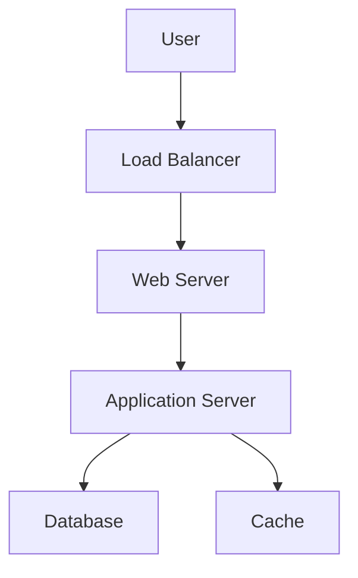

## Overview

System design basics cover the fundamental principles for designing scalable, reliable, and efficient systems. Key concepts include scalability, availability, consistency, and trade-offs like CAP theorem. This topic lays the groundwork for more advanced patterns.

## Detailed Explanation

### Core Principles
- **Scalability**: Ability to handle growth in users/data.
- **Availability**: System uptime and fault tolerance.
- **Consistency**: Data integrity across replicas.
- **Partition Tolerance**: Operation despite network failures.

### Components
- **Load Balancers**: Distribute traffic.
- **Databases**: Relational vs. NoSQL.
- **Caching**: Reduce database load.
- **CDNs**: Speed up content delivery.



## Real-world Examples & Use Cases

- **E-commerce Site**: Handling peak traffic during sales.
- **Social Media**: Scaling user-generated content.
- **Banking App**: Ensuring data consistency and security.

## Code Examples

### Simple Load Balancer Simulation (Pseudocode)
```python
class LoadBalancer:
    def __init__(self, servers):
        self.servers = servers
        self.index = 0

    def get_server(self):
        server = self.servers[self.index]
        self.index = (self.index + 1) % len(self.servers)
        return server

# Usage
lb = LoadBalancer(['server1', 'server2'])
print(lb.get_server())  # server1
```

## References

- [System Design Primer](https://github.com/donnemartin/system-design-primer)
- [Martin Fowler on Scalability](https://martinfowler.com/bliki/Scalability.html)

## Github-README Links & Related Topics

- [High Scalability Patterns](../high-scalability-patterns/)
- [CAP Theorem & Distributed Systems](../cap-theorem-and-distributed-systems/)
- [Caching](../caching/)
