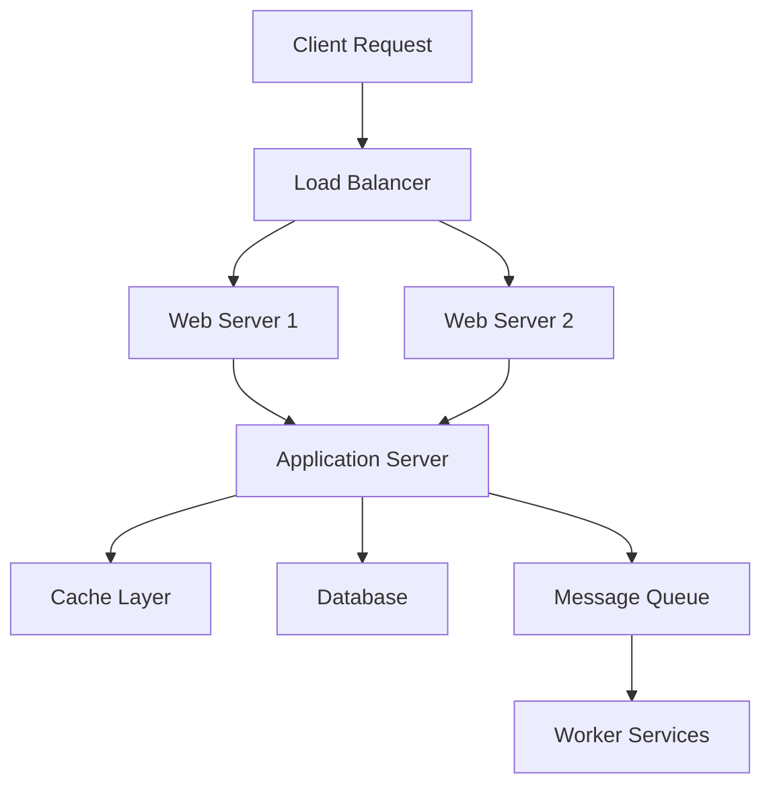
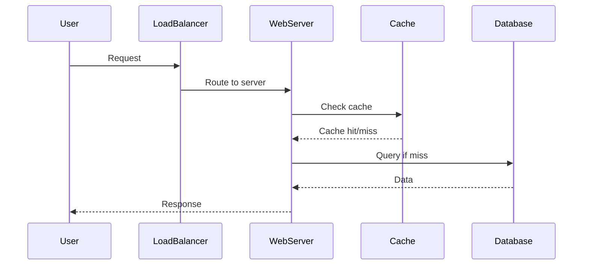

## Overview

System design basics encompass the fundamental principles and components for designing scalable, reliable, and efficient software systems. It involves understanding trade-offs between scalability, availability, consistency, and performance in distributed environments. Key topics include load balancing, caching, database design, and communication patterns to handle real-world requirements like high traffic and data growth.

## Detailed Explanation

### Core Principles

- **Scalability**: The ability of a system to handle increased load. Horizontal scaling (adding more servers) vs vertical scaling (upgrading hardware).
- **Availability**: The percentage of time a system is operational, often measured in "nines" (e.g., 99.9% uptime).
- **Reliability**: Fault tolerance through redundancy and error handling.
- **Consistency**: Ensuring data is the same across all nodes (strong consistency) or eventually consistent.
- **Performance**: Metrics like latency (response time) and throughput (requests per second).

### Key Components

- **Load Balancers**: Distribute incoming traffic across multiple servers to prevent overload. Examples: Round-robin, least connections.
- **Databases**: Choice between SQL (ACID, structured data) and NoSQL (flexible, scalable). Concepts: Replication for availability, sharding for scalability.
- **Caching**: Store frequently accessed data in memory for faster retrieval. Layers: Browser, CDN, application, database.
- **Message Queues**: Asynchronous communication between services. Examples: Kafka for high-throughput, RabbitMQ for reliability.
- **APIs and Microservices**: RESTful APIs, gRPC for inter-service communication.



### Design Process

1. **Requirements Gathering**: Understand functional/non-functional requirements, expected load.
2. **High-Level Design**: Sketch components and data flow.
3. **Detailed Design**: Choose technologies, define APIs, data models.
4. **Trade-off Analysis**: Evaluate CAP theorem, bottlenecks.
5. **Implementation Planning**: Consider deployment, monitoring.

## Real-world Examples & Use Cases

- **E-commerce Platform**: Handle user authentication, product search, checkout with high availability during peak sales.
- **Social Media Feed**: Scale to millions of users posting and viewing content, using caching for timelines.
- **Ride-Sharing App**: Real-time matching, GPS tracking, payment processing with low latency.
- **Video Streaming Service**: Deliver content globally via CDNs, handle concurrent viewers.
- **Banking System**: Ensure strong consistency for transactions, high security and compliance.

## Code Examples

System design examples are often high-level; here are simple implementations of key concepts.

### Round-Robin Load Balancer (Python)

```python
class LoadBalancer:
    def __init__(self, servers):
        self.servers = servers
        self.index = 0

    def get_server(self):
        if not self.servers:
            return None
        server = self.servers[self.index]
        self.index = (self.index + 1) % len(self.servers)
        return server

# Usage
lb = LoadBalancer(['server1', 'server2', 'server3'])
print(lb.get_server())  # server1
print(lb.get_server())  # server2
```

### Simple In-Memory Cache (Java)

```java
import java.util.HashMap;
import java.util.Map;

public class SimpleCache {
    private Map<String, String> cache = new HashMap<>();

    public String get(String key) {
        return cache.get(key);
    }

    public void put(String key, String value) {
        cache.put(key, value);
    }

    public void remove(String key) {
        cache.remove(key);
    }
}

// Usage
SimpleCache cache = new SimpleCache();
cache.put("user:123", "John Doe");
System.out.println(cache.get("user:123"));  // John Doe
```

### Database Sharding Simulation (JavaScript)

```javascript
// Simple sharding by user ID
function getShard(userId, numShards) {
    return userId % numShards;
}

// Usage
console.log(getShard(123, 4));  // 3
console.log(getShard(456, 4));  // 0
```

## STAR Summary

- **Situation**: Designing a system for a growing startup with increasing user base and data volume.
- **Task**: Ensure the system can scale horizontally, maintain high availability, and handle peak loads.
- **Action**: Implemented load balancing, added caching layers, chose appropriate databases, and designed for microservices.
- **Result**: System handled 10x traffic increase with 99.9% uptime, reduced latency by 50%, and improved user experience.

## Journey / Sequence



## Common Pitfalls & Edge Cases

- **Single Points of Failure**: Avoid single load balancers or databases; use redundancy.
- **Thundering Herd**: Cache misses causing database overload; use cache warming.
- **Data Inconsistency**: In distributed systems, handle eventual consistency carefully.
- **Over-Engineering**: Start simple; scale only when needed.
- **Security Oversights**: Encrypt data, use HTTPS, implement rate limiting.
- **Edge Cases**: Zero users, extreme load, network partitions, data corruption.

## Tools & Libraries

- **Load Balancers**: Nginx, HAProxy, AWS ELB.
- **Databases**: PostgreSQL (SQL), MongoDB (NoSQL), Redis (cache).
- **Message Queues**: Apache Kafka, RabbitMQ.
- **Monitoring**: Prometheus, Grafana.
- **Cloud Platforms**: AWS, GCP, Azure for scalable infrastructure.

## References

- [System Design Primer](https://github.com/donnemartin/system-design-primer)
- [Designing Data-Intensive Applications by Martin Kleppmann](https://dataintensive.net/)
- [AWS Architecture Center](https://aws.amazon.com/architecture/)
- [Google Cloud Architecture](https://cloud.google.com/architecture)

## Github-README Links & Related Topics

- [High Scalability Patterns](../high-scalability-patterns/)
- [CAP Theorem & Distributed Systems](../cap-theorem-and-distributed-systems/)
- [Caching](../caching/)
- [Load Balancing](../load-balancing/)
- [Database Design Principles](../database-design-principles/)
