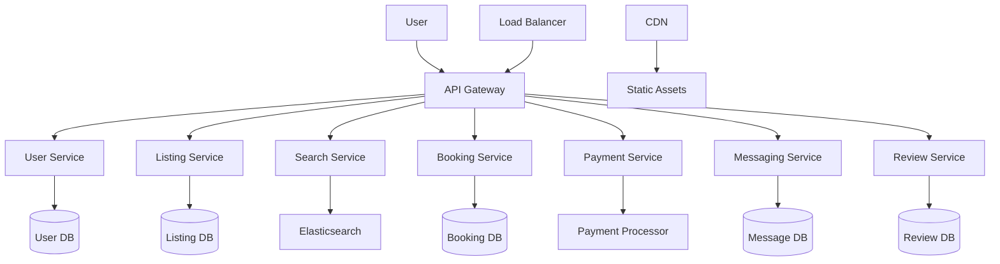
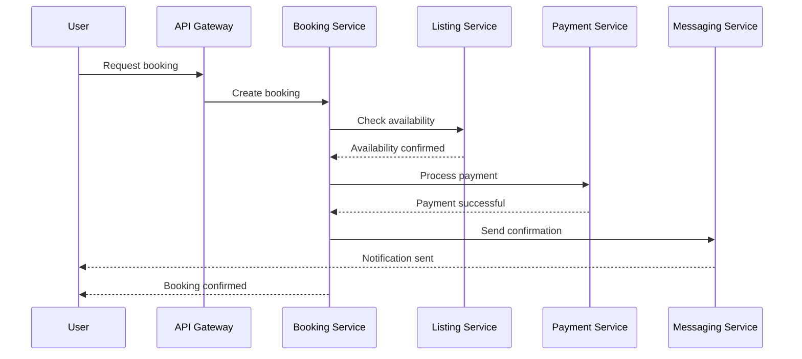

# Airbnb System Design

## Overview

Airbnb is a peer-to-peer marketplace connecting hosts who list their properties with travelers seeking accommodations. The system must handle millions of listings, bookings, payments, and user interactions while ensuring scalability, reliability, and trust. Key challenges include managing dynamic inventory, real-time availability, fraud prevention, and personalized recommendations.

The architecture follows a microservices pattern with components for user management, listings, search, booking, payments, messaging, and reviews. It leverages distributed databases, caching, load balancing, and event-driven systems to handle high traffic (e.g., 150 million users, 7 million listings).

### Key Requirements
- **Functional**: User registration, listing creation, search/filter, booking, payment processing, messaging, reviews.
- **Non-Functional**: High availability (99.9% uptime), low latency (<200ms for search), scalability (handle 10x traffic spikes), security (PCI compliance for payments), data consistency.

### High-Level Architecture


## Detailed Explanation

### Sequence Diagram for Booking Flow


### Key Components

1. **User Service**: Manages user profiles, authentication (OAuth, JWT), and roles (host/guest). Uses relational DB like PostgreSQL for ACID transactions.

2. **Listing Service**: Handles property listings with photos, descriptions, pricing, and availability calendars. Employs NoSQL like Cassandra for scalability.

3. **Search Service**: Powers search and filtering using Elasticsearch for full-text search, geolocation (via GeoHash), and faceted filters. Includes recommendation engine using collaborative filtering.

4. **Booking Service**: Manages reservations, availability checks, and conflict resolution. Uses event sourcing for audit trails.

5. **Payment Service**: Integrates with Stripe/PayPal for secure transactions. Implements PCI DSS compliance, escrow for funds.

6. **Messaging Service**: Real-time chat between hosts and guests using WebSockets or MQTT.

7. **Review Service**: Collects and displays ratings/reviews, with moderation for spam.

### Scalability Considerations
- **Sharding**: Shard databases by region or user ID to distribute load.
- **Caching**: Redis for session data, listings cache to reduce DB hits.
- **Load Balancing**: Nginx or AWS ELB for traffic distribution and fault tolerance.
- **CDN**: Cloudflare for static content delivery to edge locations.
- **Microservices**: Independent deployment, API versioning for rolling updates.
- **Auto-scaling**: Horizontal scaling based on traffic metrics.
- **Database Optimization**: Read replicas, indexing for queries.

### Data Models
| Entity | Fields | Storage |
|--------|--------|---------|
| User | id, name, email, role, profile_pic | PostgreSQL |
| Listing | id, host_id, title, location, price, availability, photos | Cassandra |
| Booking | id, user_id, listing_id, dates, status, total_price | PostgreSQL |
| Payment | id, booking_id, amount, method, status | Encrypted DB |
| Message | id, sender_id, receiver_id, content, timestamp | MongoDB |
| Review | id, booking_id, rating, comment, moderated | PostgreSQL |

### Message Formats (JSON)
```json
{
  "booking_request": {
    "user_id": "123",
    "listing_id": "456",
    "check_in": "2023-10-01",
    "check_out": "2023-10-05",
    "guests": 2
  }
}
```

### Data Flow
1. User searches for listings via Search Service querying Elasticsearch.
2. Filters applied (price, location, amenities).
3. User selects listing, Booking Service checks availability.
4. If available, payment initiated through Payment Service.
5. Booking confirmed, notifications sent via Messaging Service.

## Real-world Examples & Use Cases

- **Peak Traffic Handling**: During events like New Year's Eve, the system handles 10x normal load through auto-scaling groups in AWS, ensuring <200ms response times.
- **Fraud Detection**: ML models analyze booking patterns to detect fraud, such as bulk reservations from bots, reducing chargebacks by 30%.
- **Personalization**: Collaborative filtering recommends listings based on past bookings and user preferences, increasing conversion rates.
- **Global Expansion**: Supports 62 countries with localized search (e.g., geolocation), multi-currency payments, and language translations.
- **Dynamic Pricing**: Hosts set flexible pricing; system adjusts based on demand using algorithms similar to airline yield management.
- **Instant Bookings**: For verified hosts, bookings are confirmed immediately, improving user experience and reducing no-shows.
- **Experiences Platform**: Extends beyond stays to offer tours, classes, and activities, using similar search and booking flows.
- **Mobile Optimization**: App supports offline browsing, push notifications for booking updates, and camera integration for listing photos.
- **Host Onboarding**: Automated verification of properties via AI image recognition and background checks.
- **Dispute Resolution**: Escrow system holds funds until check-out; mediation service handles cancellations or damages.

## Code Examples

### Java: Booking Service Snippet
```java
@Service
public class BookingService {
    @Autowired
    private BookingRepository bookingRepo;

    public Booking createBooking(BookingRequest request) {
        // Check availability
        if (!isAvailable(request.getListingId(), request.getDates())) {
            throw new RuntimeException("Listing not available");
        }
        Booking booking = new Booking(request);
        return bookingRepo.save(booking);
    }

    private boolean isAvailable(String listingId, DateRange dates) {
        // Query DB for conflicts
        return true; // Simplified
    }
}
```

### Python: Search Filter
```python
def search_listings(query, filters):
    es_query = {
        "query": {
            "bool": {
                "must": [{"match": {"title": query}}],
                "filter": [{"range": {"price": {"gte": filters['min_price']}}}]
            }
        }
    }
    return elasticsearch.search(index="listings", body=es_query)
```

## References

- [Alex Xu Blog: Airbnb System Design](https://www.alexxu.com/blog/airbnb-system-design/)
- [Educative: Grokking System Design Interview](https://www.educative.io/courses/grokking-the-system-design-interview)
- [GeeksforGeeks: System Design Interview Guide](https://www.geeksforgeeks.org/system-design-interview-guide/)
- [InterviewBit: Airbnb System Design](https://www.interviewbit.com/blog/airbnb-system-design/)

## Github-README Links & Related Topics
- [Twitter System Design](./twitter-system-design/README.md)
- [YouTube System Design](./youtube-system-design/README.md)
- [Facebook System Design](./facebook-system-design/README.md)
- [Uber System Design](./uber-system-design/README.md)
- [Popular System Designs LLD and HLD](./popular-system-designs-lld-and-hld/README.md)

