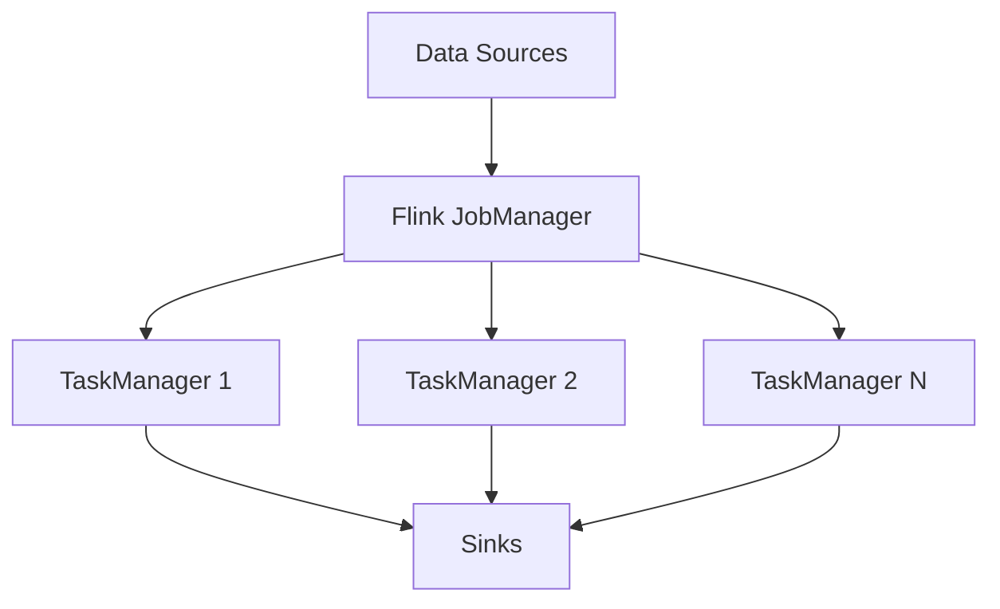

# Apache Flink

## Overview

Apache Flink is an open-source, unified stream-processing and batch-processing framework developed by the Apache Software Foundation. It provides high-throughput, low-latency processing of data streams.

## Detailed Explanation

Flink is designed to run stateful computations over unbounded and bounded data streams. It has a rich set of APIs for different levels of abstraction and provides libraries for common data processing use cases.

Key features:
- **Event Time Processing**: Handle out-of-order events.
- **State Management**: Maintain state across events.
- **Fault Tolerance**: Exactly-once processing guarantees.
- **Scalability**: Runs on clusters of thousands of nodes.

### Architecture Diagram



## Real-world Examples & Use Cases

- **Real-time Analytics**: Process streaming data for dashboards.
- **Fraud Detection**: Analyze transactions in real-time.
- **IoT Data Processing**: Handle sensor data streams.
- **ETL Pipelines**: Batch and stream processing.

## Code Examples

### Flink Streaming Example (Java)

```java
import org.apache.flink.streaming.api.datastream.DataStream;
import org.apache.flink.streaming.api.environment.StreamExecutionEnvironment;

public class StreamingExample {
    public static void main(String[] args) throws Exception {
        final StreamExecutionEnvironment env = StreamExecutionEnvironment.getExecutionEnvironment();

        DataStream<String> text = env.socketTextStream("localhost", 9999);

        DataStream<String> counts = text
            .flatMap(new Tokenizer())
            .keyBy(0)
            .sum(1);

        counts.print();

        env.execute("Streaming WordCount");
    }
}
```

### Flink Batch Example (Java)

```java
import org.apache.flink.api.java.DataSet;
import org.apache.flink.api.java.ExecutionEnvironment;

public class BatchExample {
    public static void main(String[] args) throws Exception {
        final ExecutionEnvironment env = ExecutionEnvironment.getExecutionEnvironment();

        DataSet<String> text = env.readTextFile("input.txt");

        DataSet<String> counts = text
            .flatMap(new Tokenizer())
            .groupBy(0)
            .sum(1);

        counts.writeAsText("output.txt");

        env.execute("Batch WordCount");
    }
}
```

### Flink Configuration (flink-conf.yaml)

```yaml
jobmanager.rpc.address: localhost
jobmanager.rpc.port: 6123
taskmanager.numberOfTaskSlots: 2
parallelism.default: 1
```

## References

- [Apache Flink Documentation](https://flink.apache.org/documentation/)
- [Flink Forward](https://flink-forward.org/)

## Github-README Links & Related Topics

- [Event Streaming with Apache Kafka](./event-streaming-with-apache-kafka/)
- [Apache Kafka Streams](./apache-kafka-streams/)