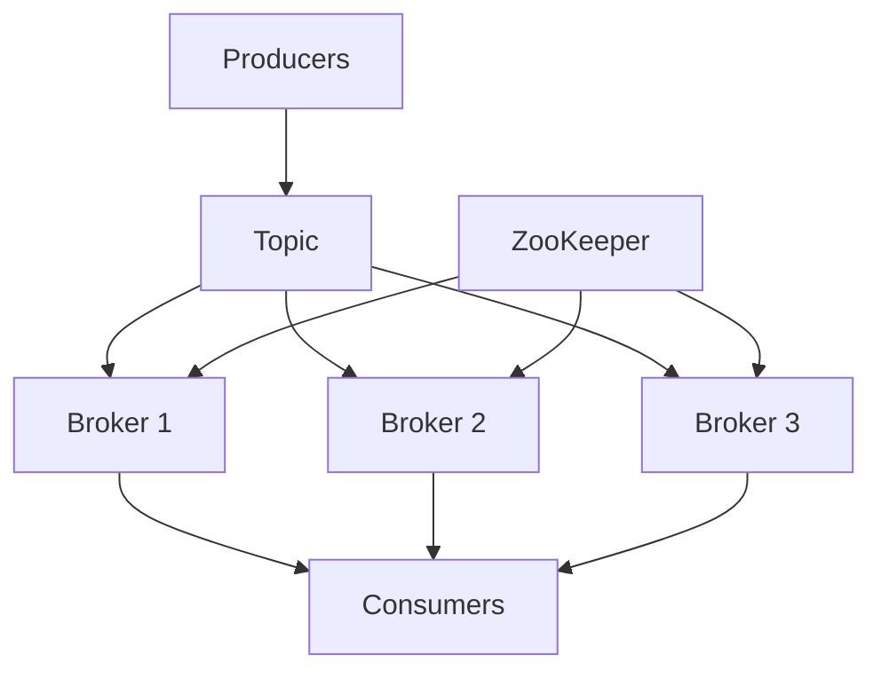

# Apache Kafka

## Overview

Apache Kafka is an open-source distributed event streaming platform used for high-performance data pipelines, streaming analytics, data integration, and mission-critical applications.

## Detailed Explanation

Kafka is a distributed system consisting of servers and clients that communicate via a high-performance TCP network protocol. It can be deployed on bare-metal hardware, virtual machines, and containers in on-premise as well as cloud environments.

Key concepts:
- **Topics**: Categories for messages.
- **Producers**: Send messages to topics.
- **Consumers**: Read messages from topics.
- **Brokers**: Servers that store and serve messages.
- **ZooKeeper**: Manages cluster metadata (being phased out in favor of KRaft).

### Architecture Diagram



## Real-world Examples & Use Cases

- **Log Aggregation**: Collect and process logs from multiple sources.
- **Real-time Analytics**: Process streaming data for analytics.
- **Event Sourcing**: Store events for CQRS architectures.
- **Data Pipeline**: Move data between systems.

## Code Examples

### Producer Example (Java)

```java
import org.apache.kafka.clients.producer.KafkaProducer;
import org.apache.kafka.clients.producer.ProducerRecord;

import java.util.Properties;

public class ProducerExample {
    public static void main(String[] args) {
        Properties props = new Properties();
        props.put("bootstrap.servers", "localhost:9092");
        props.put("key.serializer", "org.apache.kafka.common.serialization.StringSerializer");
        props.put("value.serializer", "org.apache.kafka.common.serialization.StringSerializer");

        KafkaProducer<String, String> producer = new KafkaProducer<>(props);

        ProducerRecord<String, String> record = new ProducerRecord<>("my-topic", "key", "value");
        producer.send(record);

        producer.close();
    }
}
```

### Consumer Example (Java)

```java
import org.apache.kafka.clients.consumer.ConsumerRecords;
import org.apache.kafka.clients.consumer.KafkaConsumer;

import java.util.Arrays;
import java.util.Properties;

public class ConsumerExample {
    public static void main(String[] args) {
        Properties props = new Properties();
        props.put("bootstrap.servers", "localhost:9092");
        props.put("group.id", "test-group");
        props.put("key.deserializer", "org.apache.kafka.common.serialization.StringDeserializer");
        props.put("value.deserializer", "org.apache.kafka.common.serialization.StringDeserializer");

        KafkaConsumer<String, String> consumer = new KafkaConsumer<>(props);
        consumer.subscribe(Arrays.asList("my-topic"));

        while (true) {
            ConsumerRecords<String, String> records = consumer.poll(100);
            records.forEach(record -> System.out.println(record.value()));
        }
    }
}
```

### Kafka Configuration (server.properties)

```properties
broker.id=0
listeners=PLAINTEXT://:9092
log.dirs=/tmp/kafka-logs
zookeeper.connect=localhost:2181
```

## References

- [Apache Kafka Documentation](https://kafka.apache.org/documentation/)
- [Kafka: The Definitive Guide](https://www.oreilly.com/library/view/kafka-the-definitive/9781491936153/)

## Github-README Links & Related Topics

- [Event Streaming with Apache Kafka](./event-streaming-with-apache-kafka/)
- [Message Queue Patterns](./message-queue-patterns/)