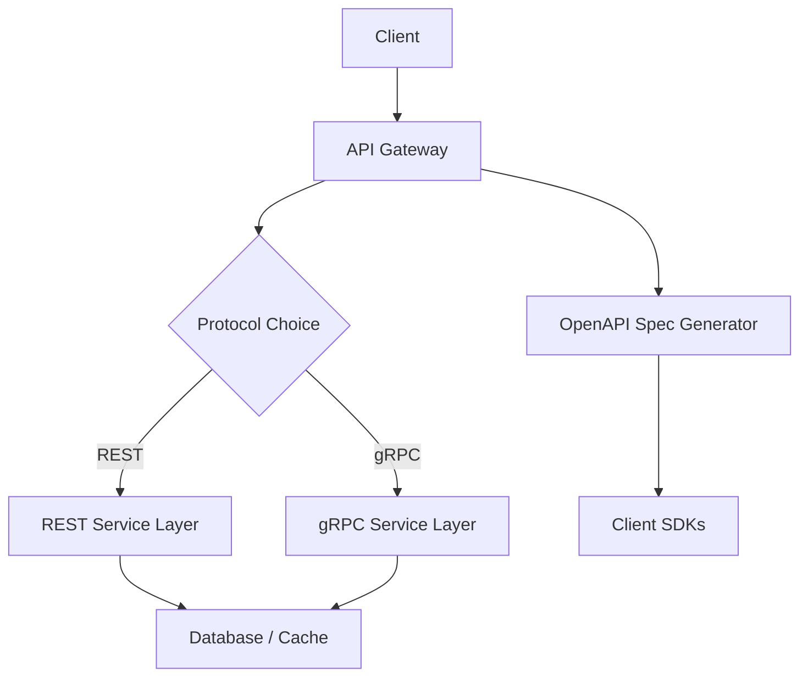
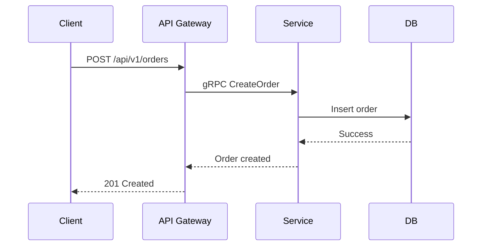

# Overview

API design principles for building scalable, maintainable services. Covers REST for simplicity, gRPC for performance, and OpenAPI for documentation. Essential for system design interviews.

Canonical Interview Prompt: Design the API for a social media platform's post service, including endpoints for creating, retrieving, and liking posts.

# STAR Summary

**Situation:** Led API redesign for a high-traffic e-commerce platform experiencing integration issues.  
**Task:** Standardize APIs across 20+ services while maintaining backward compatibility.  
**Action:** Adopted REST for external clients, gRPC for internal communication, and OpenAPI for specs. Implemented versioning and rate limiting.  
**Result:** Reduced integration errors by 50% and improved response times by 25%.

# Detailed Explanation

## High-Level Design



## Capacity and Throughput Targets

- REST APIs: 1000-5000 requests/second per instance, limited by JSON parsing and network overhead.
- gRPC: 10000-50000 requests/second, benefiting from binary protobuf and HTTP/2 multiplexing.
- OpenAPI: Negligible overhead, used for tooling.

Dimensioning: For 1M daily users, scale to 10 instances with load balancer.

## Tradeoffs

- **REST vs gRPC**: REST is simpler for external clients and debugging, but gRPC offers better performance and type safety for internal services.
- **Consistency vs Availability**: REST's statelessness improves availability but requires client-side state management.
- **OpenAPI**: Improves developer experience but adds maintenance for spec updates.

## API Design Examples

Sample REST endpoints:
- `GET /api/v1/products?page=1&limit=10` - Paginated product list
- `POST /api/v1/orders` - Create order with JSON body
- `PUT /api/v1/products/{id}` - Update product

gRPC service definition:
```
service OrderService {
  rpc CreateOrder(CreateOrderRequest) returns (OrderResponse);
  rpc GetOrder(GetOrderRequest) returns (OrderResponse);
}
```

## Deployment Notes

- REST: Deploy on Kubernetes with Ingress for routing, use Spring Boot or Express.
- gRPC: Internal microservices with service mesh like Istio for load balancing.
- OpenAPI: Generate specs from code annotations, host on API portal.

# Real-world Examples & Use Cases

- E-commerce: Product catalog API with REST.  
- Microservices: Service-to-service calls with gRPC for low latency.  
- Mobile apps: OpenAPI for client SDK generation.

# Code Examples

**REST with Spring Boot:**

```java
@RestController
@RequestMapping("/api/v1/products")
public class ProductController {
    @Autowired
    private ProductService productService;

    @GetMapping
    public ResponseEntity<List<Product>> getProducts(@RequestParam(defaultValue = "0") int page) {
        List<Product> products = productService.getProducts(page);
        return ResponseEntity.ok(products);
    }

    @PostMapping
    public ResponseEntity<Product> createProduct(@RequestBody Product product) {
        Product created = productService.createProduct(product);
        return ResponseEntity.status(HttpStatus.CREATED).body(created);
    }
}
```

**gRPC with Java:**

Define proto:

```
syntax = "proto3";

service ProductService {
  rpc GetProducts (GetProductsRequest) returns (GetProductsResponse);
}

message GetProductsRequest {
  int32 page = 1;
}

message GetProductsResponse {
  repeated Product products = 1;
}

message Product {
  int32 id = 1;
  string name = 2;
}
```

Java implementation:

```java
public class ProductServiceImpl extends ProductServiceGrpc.ProductServiceImplBase {
    @Override
    public void getProducts(GetProductsRequest request, StreamObserver<GetProductsResponse> responseObserver) {
        List<Product> products = productService.getProducts(request.getPage());
        GetProductsResponse response = GetProductsResponse.newBuilder()
            .addAllProducts(products)
            .build();
        responseObserver.onNext(response);
        responseObserver.onCompleted();
    }
}
```

# Data Models / Message Formats

**REST JSON:**

```json
{
  "id": 123,
  "name": "Laptop",
  "price": 999.99,
  "category": "Electronics"
}
```

**gRPC Protobuf:**

Binary format, efficient for large payloads.

# Journey / Sequence



# Common Pitfalls & Edge Cases

- API versioning: Use headers or URL paths.  
- Rate limiting: Implement token bucket.  
- Error handling: Consistent error codes.  
- Security: OAuth2, input validation.

# Common Interview Questions

- How do you choose between REST, GraphQL, and gRPC for API design?
- How to handle API versioning and backward compatibility?
- What are the best practices for securing APIs?

# Tools & Libraries

- Spring Boot (REST)  
- gRPC Java  
- Swagger/OpenAPI Generator

# Github-README Links & Related Topics

[[system-design-basics]], [[load-balancing-and-routing]], [[security-authz-authn-tokens]]

# References

- https://restfulapi.net/
- https://grpc.io/docs/
- https://swagger.io/specification/