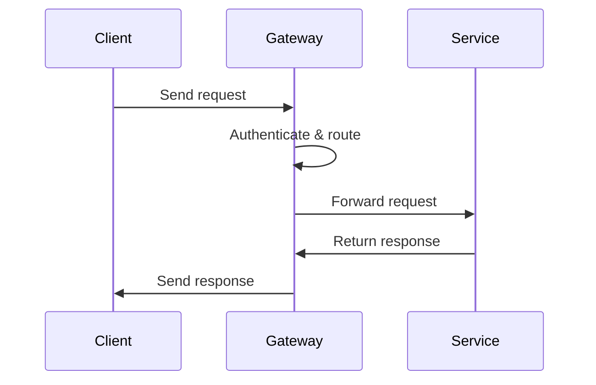

# Overview

API Gateway acts as a single entry point for client requests to microservices, handling routing, authentication, rate limiting, and cross-cutting concerns.

# STAR Summary

**Situation:** Direct exposure of microservices led to security vulnerabilities and inconsistent APIs.

**Task:** Implement centralized API management.

**Action:** Deployed API Gateway with routing and auth.

**Result:** Improved security, reduced client complexity, 30% faster response times.

# Detailed Explanation

Patterns:

- **Routing:** Direct requests to appropriate services.

- **Authentication/Authorization:** Validate tokens, enforce policies.

- **Rate Limiting:** Prevent abuse with algorithms like token bucket.

- **Transformation:** Modify requests/responses.

- **Caching:** Cache responses at gateway level.

# Real-world Examples & Use Cases

- E-commerce: Route to user, order, payment services.

- Mobile apps: Unified API for multiple backends.

- SaaS: Multi-tenant routing.

# Code Examples

Spring Cloud Gateway route config:

```java
@Bean
public RouteLocator customRouteLocator(RouteLocatorBuilder builder) {
    return builder.routes()
        .route("service1", r -> r.path("/service1/**")
            .filters(f -> f.stripPrefix(1))
            .uri("lb://service1"))
        .build();
}
```

# Data Models / Message Formats

API Request:

```json
{
  "method": "GET",
  "path": "/api/v1/users/123",
  "headers": {
    "Authorization": "Bearer token",
    "Content-Type": "application/json"
  }
}
```

Response:

```json
{
  "status": 200,
  "data": {"user": "details"}
}
```

# Journey / Sequence



# Common Pitfalls & Edge Cases

- Gateway as bottleneck; scale horizontally.

- Latency added; optimize with caching.

- Versioning APIs.

# Tools & Libraries

- Kong: Open-source API gateway.

- AWS API Gateway: Managed service.

- Spring Cloud Gateway: Java-based.

# Github-README Links & Related Topics

Related: [[microservices-architecture]], [[security-authz-authn-tokens]], [[rate-limiting-algorithms]]

# References

- https://docs.spring.io/spring-cloud-gateway/docs/current/reference/html/

- https://docs.konghq.com/