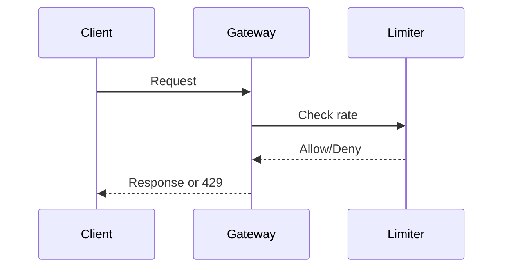

## Overview
API rate limiting controls request rates to prevent abuse, ensure fairness, and protect resources. Algorithms like token bucket and leaky bucket manage bursts and sustained loads.

## STAR Summary
**Situation:** API faced DDoS attacks, overwhelming servers.  
**Task:** Implement rate limiting without blocking legitimate users.  
**Action:** Deployed token bucket with Redis for distributed state.  
**Result:** Reduced attack impact by 80%, maintained 99.9% uptime.

## Detailed Explanation
- **Token Bucket:** Allows bursts up to bucket size; refills at rate.
- **Leaky Bucket:** Smooths traffic; fixed outflow rate.
- **Sliding Window:** Tracks requests in time windows for precision.
- Tradeoffs: Token bucket for flexibility; leaky for consistency.

## Real-world Examples & Use Cases
- Social APIs: Limit posts per user per hour.
- Payment gateways: Throttle transactions to prevent fraud.
- Cloud services: Enforce quotas for cost control.

## Code Examples
Java token bucket with Guava:
```java
import com.google.common.util.concurrent.RateLimiter;

public class ApiController {
    private final RateLimiter rateLimiter = RateLimiter.create(10.0); // 10 requests/sec

    @GetMapping("/api/data")
    public ResponseEntity<String> getData() {
        if (rateLimiter.tryAcquire()) {
            return ResponseEntity.ok("Data");
        }
        return ResponseEntity.status(429).body("Rate limit exceeded");
    }
}
```

Distributed with Redis:
```java
import redis.clients.jedis.Jedis;

public class RedisRateLimiter {
    private Jedis jedis;

    public boolean allow(String key, int limit, long windowMs) {
        long now = System.currentTimeMillis();
        String windowKey = key + ":" + (now / windowMs);
        Long count = jedis.incr(windowKey);
        jedis.expire(windowKey, windowMs / 1000);
        return count <= limit;
    }
}
```

## Data Models / Message Formats
| Key | Requests | Window Start |
|-----|----------|--------------|
| user:123 | 5 | 1634567890 |

## Journey / Sequence


## Common Pitfalls & Edge Cases
- Clock skew in distributed systems; use NTP.
- Bursty traffic; combine with queues.
- False positives; monitor and adjust limits.

## Tools & Libraries
- Spring Cloud Gateway for built-in limiting.
- Redis for distributed counters.
- Nginx rate limiting modules.

## Github-README Links & Related Topics
Related: [[api-gateway-patterns]], [[security-in-distributed-systems]], [[circuit-breaker-pattern]]

## References
- https://en.wikipedia.org/wiki/Rate_limiting
- https://redis.io/commands/INCR