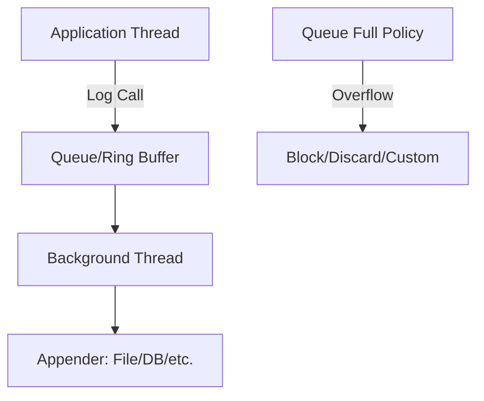

# Overview

Asynchronous logging is a technique to improve application performance by decoupling log message generation from the actual I/O operations. Instead of blocking the main application thread while writing logs to files, databases, or other destinations, async logging uses a background thread or queue to handle the output. This reduces latency in the calling code and can handle bursts of log messages more efficiently, though it introduces trade-offs like potential message loss if the queue overflows and increased complexity in error handling.

# Detailed Explanation

In synchronous logging, each log call (e.g., `logger.info("message")`) directly performs I/O, blocking the thread until complete. Asynchronous logging buffers log events in a queue and processes them in a separate thread, allowing the application to continue immediately.

Key components:
- **Queue/Buffer**: Holds log events temporarily. Common implementations use ring buffers (e.g., LMAX Disruptor) for high performance.
- **Background Thread**: Consumes from the queue and writes to appenders (e.g., files, consoles).
- **Queue Full Policy**: Defines behavior when the queue is full, such as blocking, discarding lower-level messages, or custom handling.

## Benefits
- **Higher Throughput**: Handles log bursts without blocking.
- **Lower Latency**: Faster return from log calls.
- **Non-blocking**: Prevents logging from impacting critical paths.

## Drawbacks
- **Queue Overflow**: If logging rate exceeds processing rate, messages may be lost or cause backpressure.
- **Error Handling**: Exceptions in the background thread are harder to propagate.
- **Resource Usage**: Additional threads and memory for queues.
- **Ordering**: Messages may not be written in exact order due to concurrency.

## Architecture Diagram



The diagram shows the flow: application threads enqueue log events, a background thread dequeues and processes them via appenders. Policies handle overflow.

## Configuration Options
- **All Async**: Make all loggers async for max performance (e.g., via context selector in Log4j).
- **Mixed**: Selective async loggers for flexibility.
- **Tuning**: Adjust queue size, wait strategies (e.g., Blocking, Sleeping), and policies.

# Real-world Examples & Use Cases

| Use Case | Description | Example |
|----------|-------------|---------|
| High-Traffic Web Servers | Prevents logging from slowing down request handling. | Apache Tomcat with async logging to handle thousands of requests/sec. |
| Financial Trading Systems | Low-latency requirements; async logging avoids delays in trade execution. | Stock exchanges logging trades asynchronously to meet microsecond latencies. |
| IoT Devices | Resource-constrained environments; buffers logs for batch sending. | Sensors queuing logs and sending in bursts to cloud. |
| Batch Processing | Handles log volume during data processing without blocking jobs. | Hadoop jobs using async logging for map-reduce tasks. |

In these scenarios, async logging ensures performance under load, but requires monitoring queue sizes to avoid data loss.

# Code Examples

## Java with Log4j2 (All Async)

Add dependency:
```xml
<dependency>
  <groupId>com.lmax</groupId>
  <artifactId>disruptor</artifactId>
  <version>4.0.0</version>
  <scope>runtime</scope>
</dependency>
```

Set system property: `-Dlog4j2.contextSelector=org.apache.logging.log4j.core.async.AsyncLoggerContextSelector`

Configuration (`log4j2.xml`):
```xml
<?xml version="1.0" encoding="UTF-8"?>
<Configuration>
  <Appenders>
    <Console name="Console" target="SYSTEM_OUT">
      <PatternLayout pattern="%d{HH:mm:ss.SSS} [%t] %-5level %logger{36} - %msg%n"/>
    </Console>
  </Appenders>
  <Loggers>
    <Root level="info">
      <AppenderRef ref="Console"/>
    </Root>
  </Loggers>
</Configuration>
```

Usage:
```java
import org.apache.logging.log4j.LogManager;
import org.apache.logging.log4j.Logger;

public class App {
    private static final Logger logger = LogManager.getLogger(App.class);

    public static void main(String[] args) {
        logger.info("This is an async log message");
    }
}
```

## Java with Log4j2 (Mixed Sync/Async)

Configuration:
```xml
<Loggers>
  <Root level="INFO">
    <AppenderRef ref="Console"/>
  </Root>
  <AsyncLogger name="com.example" level="TRACE">
    <AppenderRef ref="Console"/>
  </AsyncLogger>
</Loggers>
```

## Python with asyncio (Custom Async Logging)

Python's standard logging is sync, but you can wrap it with asyncio.

```python
import asyncio
import logging
import queue
import threading

class AsyncLogger:
    def __init__(self):
        self.queue = queue.Queue()
        self.logger = logging.getLogger(__name__)
        self.logger.setLevel(logging.INFO)
        handler = logging.StreamHandler()
        handler.setFormatter(logging.Formatter('%(asctime)s - %(levelname)s - %(message)s'))
        self.logger.addHandler(handler)
        self.thread = threading.Thread(target=self._process_queue, daemon=True)
        self.thread.start()

    def log(self, level, message):
        self.queue.put((level, message))

    def _process_queue(self):
        while True:
            level, message = self.queue.get()
            self.logger.log(level, message)
            self.queue.task_done()

# Usage
async def main():
    async_logger = AsyncLogger()
    async_logger.log(logging.INFO, "Async log message")
    await asyncio.sleep(0.1)  # Allow processing

asyncio.run(main())
```

This uses a thread for background processing.

# References

- [Apache Log4j Asynchronous Loggers](https://logging.apache.org/log4j/2.x/manual/async.html) - Official documentation on Log4j async logging.
- [LMAX Disruptor](https://lmax-exchange.github.io/disruptor/) - Library used for high-performance async logging.
- [Java Logging Overview](https://docs.oracle.com/en/java/javase/11/core/java-logging-overview.html) - Oracle's guide on logging.
- [Python Logging Module](https://docs.python.org/3/library/logging.html) - Standard library logging.

# Github-README Links & Related Topics

- [Logging and Monitoring](../system-design/logging-and-monitoring/README.md)
- [Concurrent Programming Patterns](../java/concurrent-programming-patterns/README.md)
- [Performance Tuning and Profiling](../java/performance-tuning-and-profiling/README.md)
- [Low Latency Systems](../system-design/low-latency-systems/README.md)