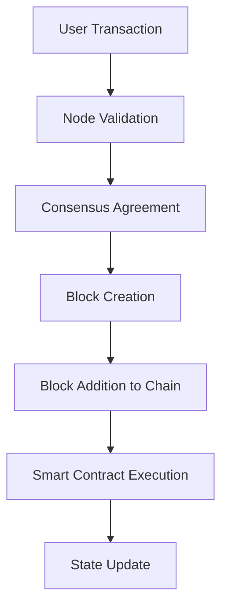

# Blockchain System Design

## Overview

Blockchain System Design focuses on creating decentralized, secure, and transparent systems using blockchain technology. It involves designing consensus mechanisms, smart contracts, and scalable networks to support applications like cryptocurrencies, supply chain management, and decentralized finance (DeFi).

## Detailed Explanation

### Key Components

1. **Decentralized Ledger**: A distributed database that records transactions across multiple nodes, ensuring immutability and transparency.

2. **Consensus Mechanisms**: Protocols like Proof-of-Work (PoW), Proof-of-Stake (PoS), or Practical Byzantine Fault Tolerance (PBFT) to agree on the state of the ledger.

3. **Smart Contracts**: Self-executing contracts coded on the blockchain, automating processes without intermediaries.

4. **Cryptographic Security**: Using hashing, digital signatures, and encryption to secure transactions and prevent tampering.

5. **Scalability Solutions**: Techniques like sharding, sidechains, or layer-2 solutions (e.g., Lightning Network) to handle high transaction volumes.

6. **Interoperability**: Enabling communication between different blockchain networks.

### Architecture Patterns

- **Public Blockchains**: Open to anyone, like Bitcoin or Ethereum.
- **Private Blockchains**: Permissioned networks for enterprise use, like Hyperledger.
- **Hybrid Models**: Combining public and private elements for specific use cases.



## Real-world Examples & Use Cases

- **Cryptocurrencies**: Bitcoin for peer-to-peer digital currency transfers.
- **Supply Chain Tracking**: Walmart uses blockchain to trace food products from farm to store.
- **Decentralized Finance (DeFi)**: Platforms like Uniswap for decentralized trading without banks.
- **Voting Systems**: Secure, tamper-proof electronic voting in elections.

## Code Examples

### Simple Smart Contract with Solidity

```solidity
pragma solidity ^0.8.0;

contract SimpleStorage {
    uint256 private storedData;

    function set(uint256 x) public {
        storedData = x;
    }

    function get() public view returns (uint256) {
        return storedData;
    }
}
```

### Interacting with Blockchain using Web3.py

```python
from web3 import Web3

# Connect to Ethereum node
w3 = Web3(Web3.HTTPProvider('https://mainnet.infura.io/v3/YOUR_PROJECT_ID'))

# Check connection
print(w3.isConnected())

# Get latest block
latest_block = w3.eth.get_block('latest')
print(latest_block)
```

## References

- [Mastering Bitcoin by Andreas Antonopoulos](https://github.com/bitcoinbook/bitcoinbook)
- [Ethereum Whitepaper](https://ethereum.org/en/whitepaper/)
- [Blockchain Technology Overview](https://www.ibm.com/topics/blockchain)

## Github-README Links & Related Topics

- [Blockchain Basics](./blockchain-basics/README.md)
- [Blockchain Consensus](./blockchain-consensus/README.md)
- [Distributed Consensus](./distributed-consensus/README.md)
- [Byzantine Fault Tolerance](./byzantine-fault-tolerance/README.md)