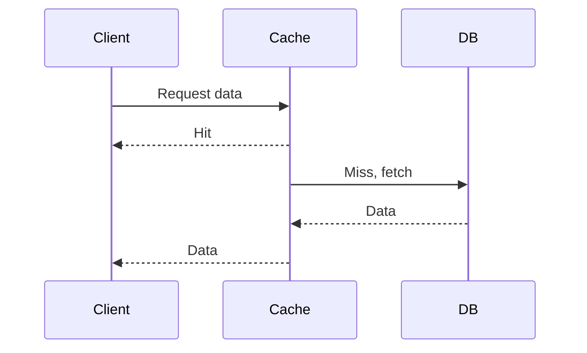
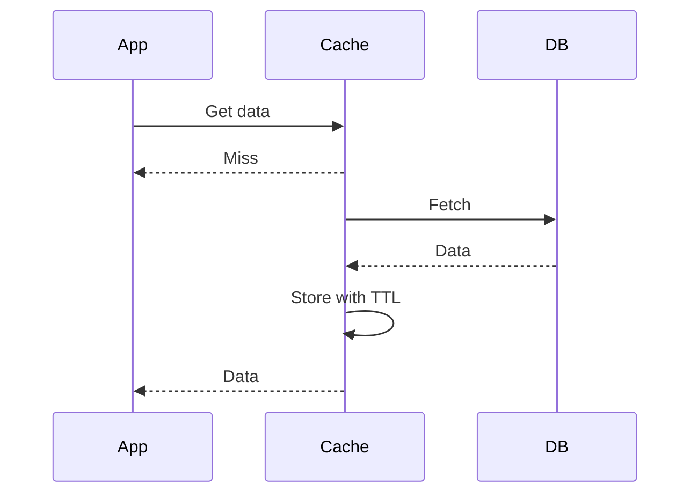

## Overview
Caching stores frequently accessed data to reduce latency and load on backend systems. Strategies include cache-aside, write-through, and invalidation policies.

## STAR Summary
**Situation:** Database queries slowed down the app.  
**Task:** Speed up data retrieval.  
**Action:** Implemented cache-aside with Redis.  
**Result:** 70% faster response times.

## Detailed Explanation
- **Cache-Aside:** Load data on miss.
- **Write-Through:** Update cache and DB together.
- **Write-Behind:** Update cache first, DB later.
- **Invalidation:** TTL, LRU eviction.

### Canonical Interview Prompt
**Design a Caching Layer for a Social Media Feed System**

- **Functional Requirements:** Cache user feeds, invalidate on new posts, support millions of users.
- **Non-Functional Requirements:** Low latency (<50ms), high throughput (100k RPS), eventual consistency.
- **High-Level Design (HLD):**

```mermaid
graph TD
    A[Client] --> B[API Gateway]
    B --> C[Cache (Redis Cluster)]
    C --> D[DB (NoSQL)]
    B --> E[Feed Service]
    E --> C
```

- **Capacity Estimation:** 1B users, 10M active, feed size 100 posts, cache hit rate 80%, memory ~10TB for Redis.
- **Tradeoffs:** Consistency vs Performance - use write-behind for high write throughput, accepting eventual consistency. Scalability vs Cost - distributed cache increases complexity but allows global scaling.
- **API Design (OpenAPI-style minimal):**
  - `GET /feed/{user_id}` -> cached feed
  - `POST /post` -> invalidate related caches
- **Deployment Notes:** Use Redis Cluster for sharding, TTL 1 hour, monitor cache hit rates with Prometheus.

## Real-world Examples & Use Cases
- Browser caching for static assets to reduce server load.
- Redis in e-commerce for product data caching.
- Use case: News feed caching to handle viral content spikes.

## Code Examples
### Cache-Aside with Map
```java
import java.util.HashMap;
import java.util.Map;

class CacheAside {
    private Map<String, String> cache = new HashMap<>();

    public String get(String key) {
        if (cache.containsKey(key)) return cache.get(key);
        String data = fetchFromDB(key); // Simulate
        cache.put(key, data);
        return data;
    }

    private String fetchFromDB(String key) { return "data"; }
}
```

## Data Models / Message Formats


| Field | Type | Description |
|-------|------|-------------|
| key | string | Cache key (e.g., user_feed:123) |
| value | json | Cached data |
| ttl | int | Time to live in seconds |

## Journey / Sequence


## Common Pitfalls & Edge Cases
- Cache inconsistency; edge case: stale data after DB update.
- Thundering herd on cache miss; use probabilistic early expiration.
- Over-caching leading to memory issues; edge case: cache eviction storms.

## Tools & Libraries
- Redis: In-memory cache.
- Caffeine: Java caching library.

## Github-README Links & Related Topics
Related: [database-design-and-indexing](../database-design-and-indexing/), [performance-tuning-and-profiling](../../java/performance-tuning-and-profiling/), [load-balancing-and-routing](../load-balancing-and-routing/), [consistency-and-availability](../consistency-and-availability/)

## Common Interview Questions
- What are the main caching strategies and their use cases?
- Explain cache invalidation problems like cache stampede.
- How does Redis implement LRU eviction?
- Describe write-through vs write-behind caching.
- How to handle cache consistency in distributed systems?

## References
- Redis documentation.
- "Caching in Distributed Systems" articles.
- https://redis.io/