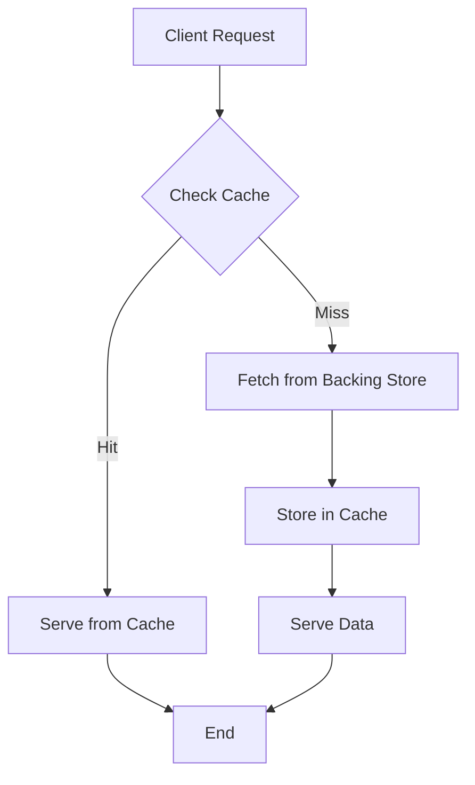

# Overview

Caching is a fundamental technique in computer systems and software engineering that stores copies of frequently accessed data in a faster, more accessible storage layer to reduce latency, improve performance, and decrease load on underlying resources. By exploiting locality of reference—temporal (recently accessed data is likely to be accessed again) and spatial (nearby data is likely to be accessed together)—caches enable systems to serve requests more efficiently. Caches are ubiquitous in hardware (e.g., CPU caches) and software (e.g., web caches, database caches), forming a critical component in scalable system design.

# Detailed Explanation

A cache acts as an intermediary storage layer between a client and a slower backing store (e.g., disk, network, or database). When data is requested, the cache is checked first; if present (a **cache hit**), it's served quickly. If absent (a **cache miss**), the data is fetched from the backing store, stored in the cache, and then returned. Cache effectiveness is measured by hit rate (hits / total requests), with higher rates indicating better performance.

## Cache Operation Flow



## Write Policies

Caches handle writes differently to balance consistency and performance:

- **Write-Through**: Writes go to both cache and backing store simultaneously. Ensures consistency but increases latency.
- **Write-Back (Write-Behind)**: Writes update the cache immediately; backing store is updated later (e.g., on eviction). Improves performance but risks data loss if cache fails.

## Eviction Policies

When the cache is full, entries are removed based on policies. Common policies include:

| Policy | Description | Pros | Cons | Use Case |
|--------|-------------|------|------|----------|
| **LRU (Least Recently Used)** | Evicts the least recently accessed item. | Simple, effective for temporal locality. | Ignores access frequency. | Web caches, file systems. |
| **LFU (Least Frequently Used)** | Evicts the least accessed item over time. | Good for frequency-based access. | May retain stale data; complex to implement. | Database caches. |
| **FIFO (First In, First Out)** | Evicts the oldest item. | Simple and fair. | Ignores access patterns. | Basic buffering. |
| **Random** | Evicts a random item. | Low overhead. | Unpredictable performance. | High-throughput systems. |
| **TTL (Time To Live)** | Evicts items after a fixed time. | Ensures freshness. | May evict useful data early. | Real-time data (e.g., weather). |

## Cache Coherence and Challenges

In distributed systems, multiple caches must stay consistent via protocols like MESI (Modified, Exclusive, Shared, Invalid). Challenges include cache stampedes (thundering herd), where expired caches cause simultaneous misses, and cold starts, where caches are empty post-restart.

# Real-world Examples & Use Cases

- **CPU Caches**: Multi-level (L1, L2, L3) caches in processors reduce memory access latency, enabling GHz speeds.
- **Web Caching**: Browsers cache static assets; CDNs like Cloudflare cache content globally, reducing server load and latency for sites like Netflix.
- **Database Caching**: Redis or Memcached cache query results, e.g., in e-commerce sites to speed up product searches.
- **API Response Caching**: Services like GitHub API cache responses to handle high traffic without overloading databases.
- **Content Delivery Networks (CDNs)**: Distribute cached media (videos, images) closer to users, improving streaming performance.
- **Operating System Page Cache**: Caches disk pages in RAM, speeding up file I/O.

# Code Examples

## Simple In-Memory Cache in Python

A basic LRU cache using `collections.OrderedDict`:

```python
from collections import OrderedDict

class LRUCache:
    def __init__(self, capacity: int):
        self.cache = OrderedDict()
        self.capacity = capacity

    def get(self, key: int) -> int:
        if key not in self.cache:
            return -1
        self.cache.move_to_end(key)
        return self.cache[key]

    def put(self, key: int, value: int) -> None:
        if key in self.cache:
            self.cache.move_to_end(key)
        self.cache[key] = value
        if len(self.cache) > self.capacity:
            self.cache.popitem(last=False)

# Usage
cache = LRUCache(2)
cache.put(1, 1)
cache.put(2, 2)
print(cache.get(1))  # 1
cache.put(3, 3)      # Evicts 2
print(cache.get(2))  # -1
```

## Distributed Caching with Redis

Using Redis for key-value caching:

```python
import redis

# Connect to Redis (assuming local instance)
r = redis.Redis(host='localhost', port=6379, db=0)

# Set a key with TTL
r.set('user:123', 'John Doe', ex=3600)  # Expires in 1 hour

# Get the value
user = r.get('user:123')
print(user.decode('utf-8'))  # 'John Doe'

# Cache miss example
if not r.exists('user:456'):
    # Fetch from DB and cache
    user_data = fetch_from_db(456)
    r.set('user:456', user_data, ex=3600)
```

Install Redis: `pip install redis` and run a Redis server.

# References

- [Cache (computing) - Wikipedia](https://en.wikipedia.org/wiki/Cache_(computing))
- [Caching in System Design - GeeksforGeeks](https://www.geeksforgeeks.org/caching-system-design-concept/)
- [Redis Caching Guide](https://redis.io/topics/lru-cache)
- Hennessy, J. L., & Patterson, D. A. (2011). *Computer Architecture: A Quantitative Approach*. Elsevier.

# Github-README Links & Related Topics

- [Caching Patterns](../system-design/caching-patterns/README.md)
- [Caching Strategies](../system-design/caching-strategies/README.md)
- [Load Balancing and Routing](../system-design/load-balancing-and-routing/README.md)
- [Distributed Systems](../system-design/distributed-systems/README.md)
- [Database Design and Indexing](../system-design/database-design-and-indexing/README.md)