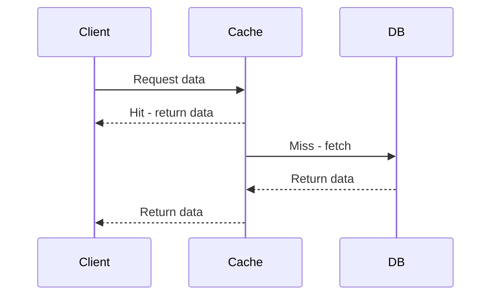

# Overview

Caching stores frequently accessed data in fast storage to reduce latency and database load. This topic covers cache types, strategies, and implementation in distributed systems.

# STAR Summary

**SITUATION:** Slow database queries impact user experience in high-traffic applications.

**TASK:** Implement caching to improve performance without compromising data consistency.

**ACTION:** Choose appropriate cache (in-memory, CDN), strategies (LRU, TTL), and handle invalidation.

**RESULT:** Reduced response times and server load, with reliable data freshness.

# Detailed Explanation

**Types:** In-memory (Redis), CDN (Cloudflare), Browser cache.

**Strategies:** Write-through (update cache on write), Write-behind (async), Cache-aside (lazy loading).

**Invalidation:** TTL, explicit invalidation, versioning.

Benefits: Faster reads, reduced DB load. Drawbacks: Stale data, memory usage.

# Real-world Examples & Use Cases

- **E-commerce:** Cache product details to handle flash sales.
- **Social Media:** Cache user feeds for quick access.

# Message Formats / Data Models

Cache Entry:

| Key | Value | TTL |
|-----|-------|-----|
| user:123 | {"name": "John"} | 3600 |

# Journey of a Cache Request



# Common Pitfalls & Edge Cases

- **Cache Miss Storms:** Thundering herd on expiration.
- **Stale Data:** Not invalidating on updates.

# Tools & Libraries

- **Redis:** In-memory cache.
- **Java:** Caffeine library.

Sample Code:

```java
Cache<String, String> cache = Caffeine.newBuilder()
    .expireAfterWrite(10, TimeUnit.MINUTES)
    .maximumSize(10_000)
    .build();
```

# Github-README Links & Related Topics

[Database Performance Tuning](../../databases/database-performance-tuning/)
[[Distributed Caching]]

# References

- https://redis.io/documentation