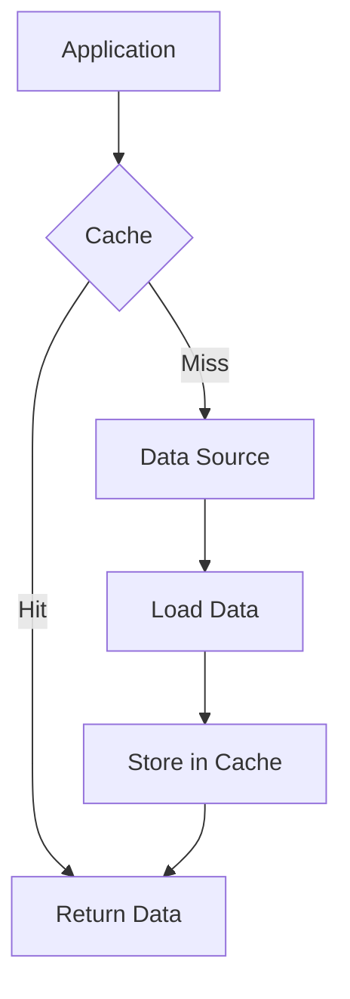

## Overview

Caching is a technique to store frequently accessed data in fast-access storage to improve application performance and reduce load on primary data sources. It acts as a temporary data store that sits between the application and the database or external services.

## Detailed Explanation

### Cache Types
- **In-Memory**: RAM-based (Redis, Memcached)
- **Disk**: File system or SSD-based
- **Distributed**: Across multiple nodes
- **CDN**: Content Delivery Network caching

### Cache Strategies
- **Cache-Aside**: Application checks cache first, loads from source if miss
- **Write-Through**: Write to cache and source simultaneously
- **Write-Behind**: Write to cache first, async to source
- **Read-Through**: Cache handles reads, loads from source on miss



### Cache Invalidation
- **Time-based**: Expire after TTL
- **Event-based**: Invalidate on data changes
- **Size-based**: Evict least recently used (LRU)

### Cache Consistency
- **Strong Consistency**: Immediate updates across cache and source
- **Eventual Consistency**: Updates propagate over time
- **Cache-Aside Pattern**: Application manages consistency

## Real-world Examples & Use Cases

### Web Applications
- **Browser Caching**: HTTP headers for static assets
- **API Response Caching**: Cache REST API responses
- **Session Storage**: User session data in Redis

### E-commerce
- **Product Catalog**: Cache product details and prices
- **User Recommendations**: Cache personalized suggestions
- **Shopping Cart**: Temporary storage during session

### Social Media
- **Timeline Feeds**: Cache recent posts for users
- **User Profiles**: Cache profile data and follower counts
- **Search Results**: Cache frequent search queries

### Microservices
- **Service Discovery**: Cache service locations
- **Configuration**: Cache application config from central store
- **Rate Limiting**: Cache request counts per user

## Code Examples

### Redis Cache Implementation (Node.js)
```javascript
const redis = require('redis');
const client = redis.createClient();

async function getCachedData(key) {
    const cached = await client.get(key);
    if (cached) {
        return JSON.parse(cached);
    }
    
    // Fetch from source
    const data = await fetchFromDatabase(key);
    
    // Cache for 1 hour
    await client.setex(key, 3600, JSON.stringify(data));
    return data;
}

async function setCachedData(key, data) {
    await client.setex(key, 3600, JSON.stringify(data));
}
```

### Spring Boot Cache (Java)
```java
@Service
public class UserService {
    
    @Cacheable(value = "users", key = "#id")
    public User getUserById(Long id) {
        return userRepository.findById(id).orElse(null);
    }
    
    @CachePut(value = "users", key = "#user.id")
    public User updateUser(User user) {
        return userRepository.save(user);
    }
    
    @CacheEvict(value = "users", key = "#id")
    public void deleteUser(Long id) {
        userRepository.deleteById(id);
    }
}
```

### HTTP Caching Headers
```http
HTTP/1.1 200 OK
Cache-Control: public, max-age=3600
ETag: "33a64df551425fcc55e4d42a148795d9f25f89d4"
Last-Modified: Wed, 26 Sep 2025 12:00:00 GMT
```

## Common Pitfalls & Edge Cases

- **Cache Stampede**: Multiple requests for expired key
- **Cache Poisoning**: Stale or incorrect data
- **Memory Pressure**: Cache consuming too much RAM
- **Cache Warming**: Pre-populating cache on startup
- **Distributed Cache Consistency**: Sync issues across nodes

## Tools & Libraries

- **Redis**: In-memory data structure store
- **Memcached**: High-performance distributed memory cache
- **Ehcache**: Java-based cache library
- **Caffeine**: High-performance Java cache
- **Varnish**: HTTP accelerator and reverse proxy

## References

- [Redis Documentation](https://redis.io/documentation)
- [Cache Strategies](https://aws.amazon.com/caching/)
- [HTTP Caching](https://developer.mozilla.org/en-US/docs/Web/HTTP/Caching)
- [Cache-Aside Pattern](https://docs.microsoft.com/en-us/azure/architecture/patterns/cache-aside)

## Github-README Links & Related Topics

- [distributed-caching-with-redis](../distributed-caching-with-redis/)
- [cdn-architecture](../cdn-architecture/)
- [high-scalability-patterns](../high-scalability-patterns/)
- [latency-and-throughput-zero-to-hero](../latency-and-throughput-zero-to-hero/)