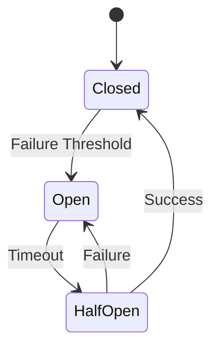
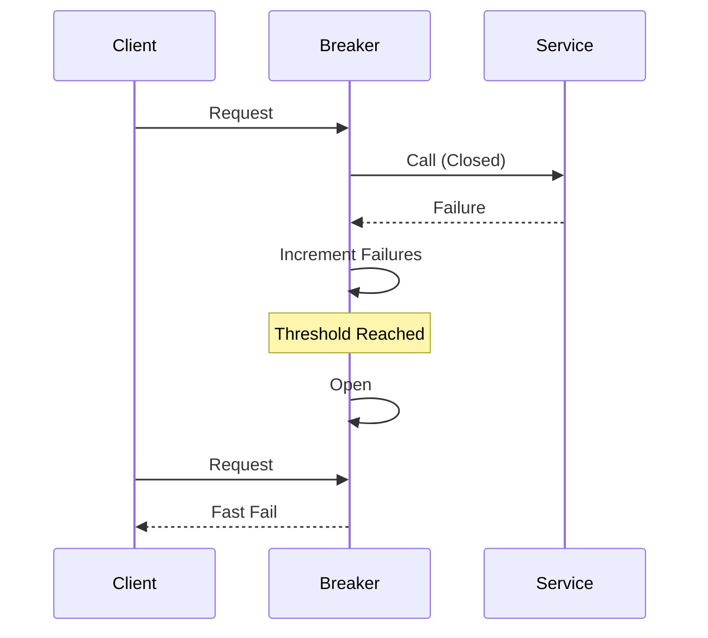

## Overview
The circuit breaker pattern prevents cascading failures by monitoring service calls and failing fast when failures exceed a threshold. States: Closed (normal), Open (fail fast), Half-Open (test recovery). Used in microservices to isolate faults.

## STAR Summary
**Situation:** Payment service failures caused entire e-commerce checkout to fail.  
**Task:** Implement fault isolation to maintain partial functionality.  
**Action:** Added Hystrix circuit breaker with fallback to cached responses.  
**Result:** Reduced downtime by 90%, improved user experience during outages.

## Detailed Explanation
- **States:** Closed: Requests pass through. Open: Fail immediately. Half-Open: Allow limited requests to test.
- **Metrics:** Track success/failure rates, timeouts.
- **Fallbacks:** Return cached data or default responses.

High-Level Design:


Capacity: Handle 10k req/s, with 5% failure rate triggering open.

Tradeoffs:
- Resilience vs Latency: Adds overhead but prevents cascades.
- Complexity: Requires monitoring and tuning.

API Example: Wrap external API calls with breaker.

Deployment: Integrate with service mesh like Istio.

## Real-world Examples & Use Cases
- Netflix Hystrix for API resilience.
- AWS SDK with retry and circuit breaker.
- Banking systems for third-party integrations.

## Code Examples
Java with Resilience4j:

```java
import io.github.resilience4j.circuitbreaker.CircuitBreaker;
import io.github.resilience4j.circuitbreaker.CircuitBreakerConfig;

public class CircuitBreakerExample {
    private static final CircuitBreaker circuitBreaker = CircuitBreaker.of("externalService",
        CircuitBreakerConfig.custom()
            .failureRateThreshold(50)
            .waitDurationInOpenState(Duration.ofMillis(1000))
            .build());

    public String callService() {
        return circuitBreaker.executeSupplier(() -> {
            // Call external service
            return "response";
        });
    }
}
```

Maven:
```xml
<dependency>
    <groupId>io.github.resilience4j</groupId>
    <artifactId>resilience4j-circuitbreaker</artifactId>
    <version>2.0.2</version>
</dependency>
```

## Data Models / Message Formats
| Metric | Type | Description |
|--------|------|-------------|
| state  | Enum | CLOSED, OPEN, HALF_OPEN |
| failureCount | Int | Consecutive failures |

## Journey / Sequence


## Common Pitfalls & Edge Cases
- False Positives: Tune thresholds to avoid premature opens.
- Recovery Delays: Adjust half-open window.
- Shared Breakers: Per service instance.

Common Interview Questions:
1. How does circuit breaker prevent cascading failures?
2. Compare with retry and timeout.
3. Implement in a microservices system.

## Tools & Libraries
- Resilience4j: Java circuit breaker.
- Hystrix: Netflix's library.
- Istio: Envoy-based breakers.

## Github-README Links & Related Topics
Related: [[microservices-architecture]], [[load-balancing-and-routing]], [[fault-tolerance-patterns]]

## References
- https://martinfowler.com/bliki/CircuitBreaker.html
- https://resilience4j.readme.io/
- https://netflix.github.io/Hystrix/