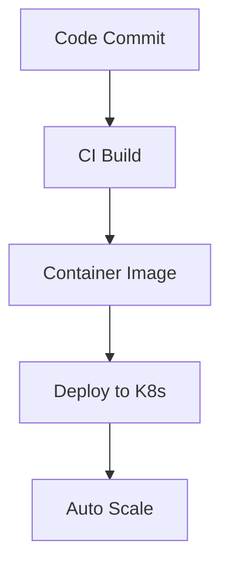

## Overview
Cloud-native architectures leverage cloud capabilities for scalable, resilient applications using microservices, containers, and serverless computing. They enable rapid deployment, auto-scaling, and fault tolerance.

## STAR Summary
**Situation:** Legacy monolithic app had 4-week deployment cycles and frequent outages.  
**Task:** Migrate to cloud-native for daily releases and 99.9% uptime.  
**Action:** Decomposed into microservices, containerized with Docker, orchestrated with Kubernetes, adopted CI/CD.  
**Result:** Deployments reduced to hours, uptime improved to 99.95%, 50% cost savings.

## Detailed Explanation
Key components:

- **Microservices:** Independent services communicating via APIs.
- **Containers:** Package apps with dependencies (Docker).
- **Orchestration:** Manage containers (Kubernetes).
- **Serverless:** Run code without servers (AWS Lambda).
- **DevOps:** CI/CD for automation.

## Real-world Examples & Use Cases
- Netflix: Microservices on AWS for streaming.
- Uber: Serverless for ride matching.

## Code Examples
### Docker Containerization
```dockerfile
FROM openjdk:11
COPY target/app.jar /app.jar
EXPOSE 8080
CMD ["java", "-jar", "/app.jar"]
```

Build: `docker build -t myapp .`, Run: `docker run -p 8080:8080 myapp`.

## Data Models / Message Formats
| Component | Description |
|-----------|-------------|
| Microservice | JSON API responses |
| Event | {"eventType": "orderPlaced", "data": {...}} |

## Journey / Sequence


## Common Pitfalls & Edge Cases
- Service coupling in microservices.
- Cold starts in serverless.
- Complexity in orchestration.

## Tools & Libraries
- Kubernetes, Docker, AWS Lambda.

## Github-README Links & Related Topics
Related: [[microservices-architecture]], [[container-orchestration-k8s]], [[serverless]]

## References
- https://aws.amazon.com/what-is/cloud-native/