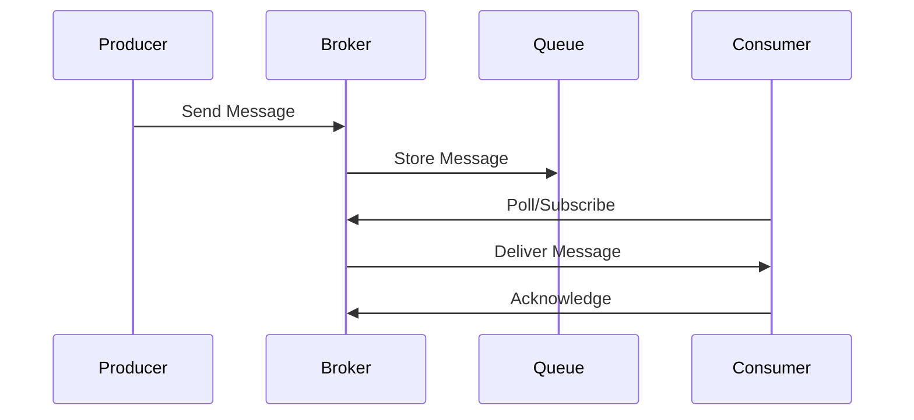

## Overview

Message queues and brokers are middleware systems that enable asynchronous communication between distributed applications. They decouple producers and consumers, allowing for scalable, reliable, and fault-tolerant messaging.

## Detailed Explanation

Message queues store messages until they are consumed. Brokers manage the queues, routing messages, and providing features like persistence, acknowledgments, and load balancing.

Key concepts:
- **Producers**: Send messages to queues.
- **Consumers**: Receive and process messages.
- **Brokers**: Handle delivery guarantees (at-least-once, exactly-once), routing, and clustering.

Common patterns:
- Point-to-point: One consumer per message.
- Publish-subscribe: Multiple consumers receive the same message.

Popular brokers: RabbitMQ, Apache Kafka, Amazon SQS, Redis Pub/Sub.

### Comparison Table

| Feature          | RabbitMQ | Apache Kafka | Amazon SQS |
|------------------|----------|--------------|------------|
| Protocol        | AMQP     | Custom       | HTTP/HTTPS |
| Persistence     | Yes      | Yes          | Yes        |
| Ordering        | No       | Yes          | No         |
| Scalability     | Moderate | High         | High       |

## Real-world Examples & Use Cases

- **E-commerce**: Order processing where inventory updates are queued to prevent overload.
- **Social Media**: Posting updates to followers via publish-subscribe model.
- **IoT**: Sensor data collection and batch processing.
- **Microservices**: Decoupling services for better fault tolerance.

## Code Examples

### Using RabbitMQ with Java

```java
import com.rabbitmq.client.*;

public class Producer {
    public static void main(String[] args) throws Exception {
        ConnectionFactory factory = new ConnectionFactory();
        factory.setHost("localhost");
        try (Connection connection = factory.newConnection();
             Channel channel = connection.createChannel()) {
            channel.queueDeclare("hello", false, false, false, null);
            String message = "Hello World!";
            channel.basicPublish("", "hello", null, message.getBytes());
            System.out.println("Sent: " + message);
        }
    }
}

public class Consumer {
    public static void main(String[] args) throws Exception {
        ConnectionFactory factory = new ConnectionFactory();
        factory.setHost("localhost");
        Connection connection = factory.newConnection();
        Channel channel = connection.createChannel();
        channel.queueDeclare("hello", false, false, false, null);

        DeliverCallback deliverCallback = (consumerTag, delivery) -> {
            String message = new String(delivery.getBody(), "UTF-8");
            System.out.println("Received: " + message);
        };
        channel.basicConsume("hello", true, deliverCallback, consumerTag -> {});
    }
}
```

### Apache Kafka with Java

```java
import org.apache.kafka.clients.producer.*;
import org.apache.kafka.clients.consumer.*;
import java.util.Properties;

public class KafkaExample {
    public static void main(String[] args) {
        // Producer
        Properties props = new Properties();
        props.put("bootstrap.servers", "localhost:9092");
        props.put("key.serializer", "org.apache.kafka.common.serialization.StringSerializer");
        props.put("value.serializer", "org.apache.kafka.common.serialization.StringSerializer");
        Producer<String, String> producer = new KafkaProducer<>(props);
        producer.send(new ProducerRecord<>("test", "key", "value"));
        producer.close();

        // Consumer
        props = new Properties();
        props.put("bootstrap.servers", "localhost:9092");
        props.put("group.id", "test");
        props.put("key.deserializer", "org.apache.kafka.common.serialization.StringDeserializer");
        props.put("value.deserializer", "org.apache.kafka.common.serialization.StringDeserializer");
        Consumer<String, String> consumer = new KafkaConsumer<>(props);
        consumer.subscribe(java.util.Arrays.asList("test"));
        while (true) {
            ConsumerRecords<String, String> records = consumer.poll(java.time.Duration.ofMillis(100));
            for (ConsumerRecord<String, String> record : records) {
                System.out.println(record.value());
            }
        }
    }
}
```

## Journey / Sequence



## Common Pitfalls & Edge Cases

- **Message Loss**: Ensure persistence and acknowledgments.
- **Duplicate Messages**: Handle idempotency in consumers.
- **Scalability Issues**: Monitor queue depth and throughput.
- **Ordering**: Use partitioning in Kafka for ordered delivery.

## Tools & Libraries

- RabbitMQ: Java client library.
- Apache Kafka: Kafka clients for Java.
- Amazon SQS: AWS SDK.

## References

- [RabbitMQ Documentation](https://www.rabbitmq.com/documentation.html)
- [Apache Kafka Documentation](https://kafka.apache.org/documentation/)
- [Amazon SQS Developer Guide](https://docs.aws.amazon.com/sqs/)

## Github-README Links & Related Topics

- [Async Logging](./async-logging/README.md)
- [Event-Driven Systems](./event-driven-systems/README.md)
- [Microservices Communication Patterns](./microservices-communication-patterns/README.md)
- [Concurrency & Parallelism](./concurrency-parallelism/README.md)