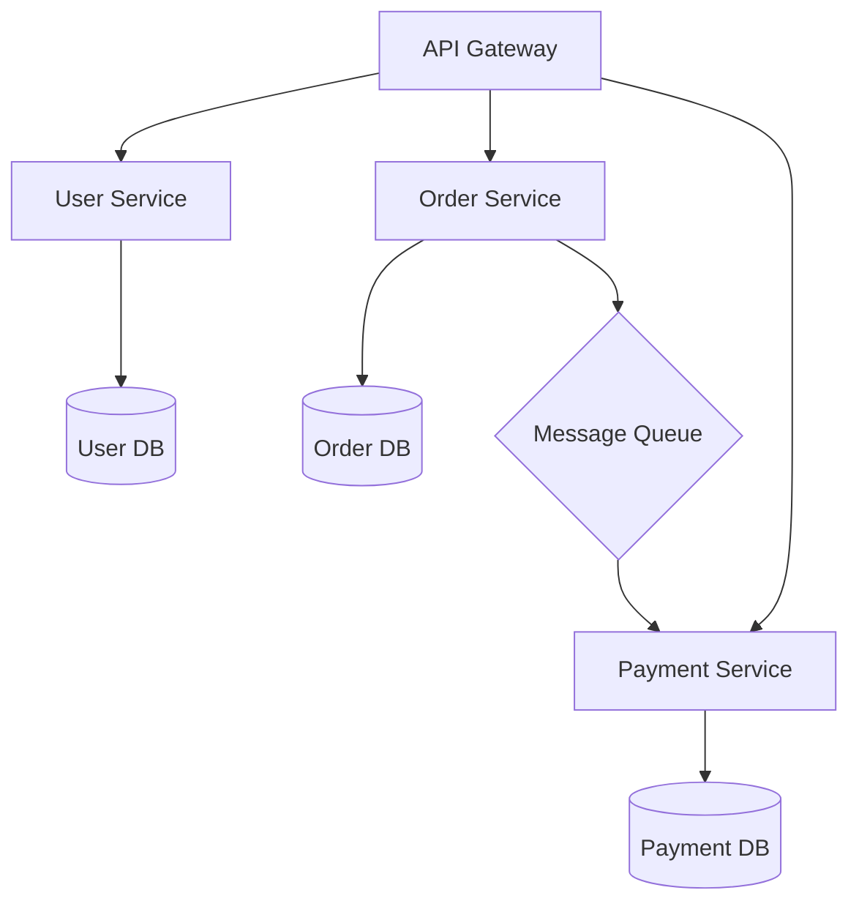
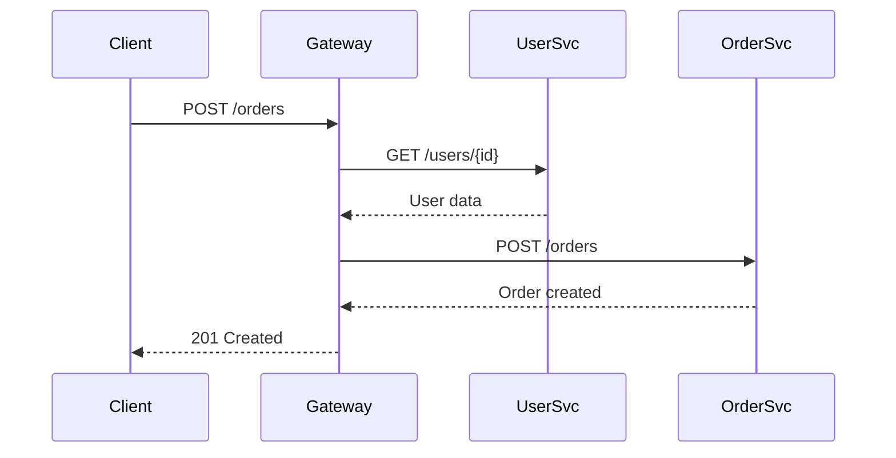

# Overview

Microservices architecture is a design approach where applications are structured as a collection of loosely coupled, independently deployable services. Each service focuses on a specific business capability and communicates via APIs.

## Detailed Explanation

### Key Principles
- **Single Responsibility**: Each service handles one business function.
- **Independence**: Services can be developed, deployed, and scaled independently.
- **Decentralized Data Management**: Each service manages its own data.
- **API-First Design**: Services communicate through well-defined APIs.

### Components
- **Service Registry**: Keeps track of service instances.
- **API Gateway**: Single entry point for clients.
- **Circuit Breaker**: Prevents cascading failures.
- **Distributed Tracing**: Monitors requests across services.

### Communication Patterns
- Synchronous: REST, gRPC
- Asynchronous: Message queues, event-driven

### Architecture Diagram



### Challenges
- Service discovery
- Data consistency
- Testing complexity
- Operational overhead

## Real-world Examples & Use Cases

- **Netflix**: Uses microservices for video streaming, recommendation, and user management.
- **Amazon**: E-commerce platform with services for orders, payments, inventory.
- **Uber**: Separate services for rides, payments, drivers, and users.
- **Spotify**: Music streaming with services for playlists, search, and recommendations.

## Code Examples

### Simple Microservice with Spring Boot
```java
@RestController
@RequestMapping("/api/users")
public class UserController {
    
    @Autowired
    private UserService userService;
    
    @GetMapping("/{id}")
    public User getUser(@PathVariable Long id) {
        return userService.findById(id);
    }
    
    @PostMapping
    public User createUser(@RequestBody User user) {
        return userService.save(user);
    }
}
```

### Service Communication with RestTemplate
```java
@Service
public class OrderService {
    
    @Autowired
    private RestTemplate restTemplate;
    
    public Order createOrder(OrderRequest request) {
        User user = restTemplate.getForObject(
            "http://user-service/api/users/" + request.getUserId(), 
            User.class
        );
        // Create order logic
        return order;
    }
}
```

### Circuit Breaker with Resilience4j
```java
@CircuitBreaker(name = "userService")
public User getUser(Long id) {
    return restTemplate.getForObject(
        "http://user-service/api/users/" + id, 
        User.class
    );
}
```

## Data Models / Message Formats

### User Service API
```json
{
  "id": 1,
  "name": "John Doe",
  "email": "john@example.com"
}
```

### Event-Driven Communication
```java
public class OrderCreatedEvent {
    private Long orderId;
    private Long userId;
    private BigDecimal amount;
    // getters and setters
}
```

## Journey / Sequence



## Common Pitfalls & Edge Cases

- Tight coupling between services
- Distributed transactions complexity
- Service versioning issues
- Monitoring and logging challenges

## References

- [Microservices.io](https://microservices.io/)
- [Martin Fowler: Microservices](https://martinfowler.com/articles/microservices.html)
- [Building Microservices by Sam Newman](https://www.amazon.com/Building-Microservices-Designing-Fine-Grained-Systems/dp/1491950358)

## Github-README Links & Related Topics

- [API Gateway Patterns](./api-gateway-patterns/)
- [Service Mesh Istio](./istio-service-mesh/)
- [Container Orchestration with Kubernetes](./container-orchestration-with-kubernetes/)