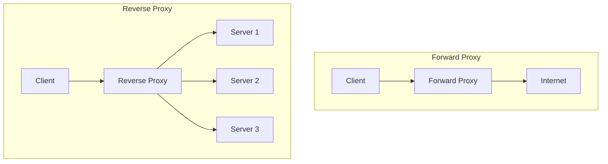

# Proxy Forward and Reverse

## Overview

Proxies act as intermediaries between clients and servers, providing various benefits like security, performance, and anonymity. Forward proxies serve clients by forwarding their requests to the internet, while reverse proxies serve servers by receiving client requests and forwarding them to backend servers.

## Detailed Explanation

### Forward Proxy

A forward proxy sits between clients and the internet. Clients configure their devices to send requests through the proxy, which then forwards them to external servers.

**Key Features:**
- **Anonymity**: Hides client IP addresses from destination servers.
- **Caching**: Stores frequently requested content to reduce bandwidth.
- **Access Control**: Filters content based on policies (e.g., blocking certain sites).
- **Logging**: Monitors and logs client internet usage.

### Reverse Proxy

A reverse proxy sits in front of web servers and forwards client requests to appropriate backend servers. From the client's perspective, it appears as the origin server.

**Key Features:**
- **Load Balancing**: Distributes traffic across multiple servers.
- **Security**: Protects backend servers by hiding their identities and providing DDoS protection.
- **SSL Termination**: Handles SSL encryption/decryption, offloading from servers.
- **Caching**: Caches static content to improve performance.
- **Compression**: Compresses responses to reduce bandwidth usage.



## Real-world Examples & Use Cases

- **Corporate Networks**: Forward proxies for employee internet access control and monitoring.
- **CDNs**: Reverse proxies cache content closer to users for faster delivery.
- **API Gateways**: Reverse proxies manage API traffic, authentication, and rate limiting.
- **Microservices**: Reverse proxies route requests to appropriate services based on paths.

## Code Examples

### Nginx as Reverse Proxy

```nginx
# nginx.conf
events {
    worker_connections 1024;
}

http {
    upstream backend {
        server backend1.example.com:8080;
        server backend2.example.com:8080;
        server backend3.example.com:8080;
    }

    server {
        listen 80;
        server_name api.example.com;

        location / {
            proxy_pass http://backend;
            proxy_set_header Host $host;
            proxy_set_header X-Real-IP $remote_addr;
            proxy_set_header X-Forwarded-For $proxy_add_x_forwarded_for;
            proxy_set_header X-Forwarded-Proto $scheme;
        }
    }
}
```

### Squid as Forward Proxy

```squid
# squid.conf
http_port 3128

acl localnet src 192.168.1.0/24
http_access allow localnet
http_access deny all

cache_dir ufs /var/spool/squid 100 16 256
maximum_object_size 100 MB

# Logging
access_log /var/log/squid/access.log squid
```

### HAProxy for Load Balancing (Reverse Proxy)

```haproxy
# haproxy.cfg
global
    log /dev/log local0
    log /dev/log local1 notice
    chroot /var/lib/haproxy
    stats socket /run/haproxy/admin.sock mode 660 level admin
    stats timeout 30s
    user haproxy
    group haproxy
    daemon

defaults
    log global
    mode http
    option httplog
    option dontlognull
    timeout connect 5000
    timeout client 50000
    timeout server 50000

frontend http_front
    bind *:80
    default_backend http_back

backend http_back
    balance roundrobin
    server server1 127.0.0.1:8080 check
    server server2 127.0.0.1:8081 check
    server server3 127.0.0.1:8082 check
```

## References

- [Nginx Reverse Proxy Documentation](https://docs.nginx.com/nginx/admin-guide/web-server/reverse-proxy/)
- [Squid Proxy Documentation](http://www.squid-cache.org/Doc/)
- [HAProxy Documentation](http://www.haproxy.org/#docs)
- [Forward vs Reverse Proxy](https://www.cloudflare.com/learning/cdn/glossary/reverse-proxy/)

## Github-README Links & Related Topics

- [load-balancing-strategies](load-balancing-strategies/)
- [api-gateway-design](api-gateway-design/)
- [cdn-architecture](cdn-architecture/)