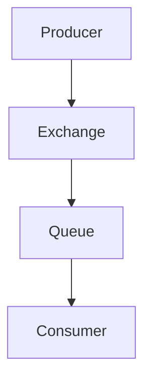

# Overview

RabbitMQ is a message broker: it accepts and forwards messages. You can think about it as a post office: when you put the mail that you want posting in a post box, you can be sure that the letter carrier will eventually deliver the mail to your recipient. In this analogy, RabbitMQ is a post box, a post office, and a letter carrier.

# Detailed Explanation

RabbitMQ implements the Advanced Message Queuing Protocol (AMQP). It provides reliable messaging between applications. Key components:

- **Producer**: Sends messages
- **Consumer**: Receives messages
- **Queue**: Stores messages
- **Exchange**: Routes messages to queues
- **Binding**: Links exchanges to queues

## Message Flow



# Real-world Examples & Use Cases

- **Task Queues**: Distribute work among workers
- **Event Streaming**: Publish-subscribe patterns
- **RPC**: Remote procedure calls
- **Load Balancing**: Distribute requests
- **Decoupling Services**: Asynchronous communication

# Code Examples

## Producer (Send Message)

```python
import pika

connection = pika.BlockingConnection(pika.ConnectionParameters('localhost'))
channel = connection.channel()
channel.queue_declare(queue='hello')
channel.basic_publish(exchange='', routing_key='hello', body='Hello World!')
print(" [x] Sent 'Hello World!'")
connection.close()
```

## Consumer (Receive Message)

```python
import pika

def callback(ch, method, properties, body):
    print(f" [x] Received {body}")

connection = pika.BlockingConnection(pika.ConnectionParameters('localhost'))
channel = connection.channel()
channel.queue_declare(queue='hello')
channel.basic_consume(queue='hello', on_message_callback=callback, auto_ack=True)
print(' [*] Waiting for messages. To exit press CTRL+C')
channel.start_consuming()
```

# References

- [RabbitMQ Tutorials](https://www.rabbitmq.com/tutorials/tutorial-one-python.html)
- [RabbitMQ Documentation](https://www.rabbitmq.com/documentation.html)
- [Pika Python Client](https://pika.readthedocs.io/)

# Github-README Links & Related Topics

- [RabbitMQ GitHub](https://github.com/rabbitmq/rabbitmq-server)
- [Apache Kafka](apache-kafka/)
- [Message Queues](message-queues/)