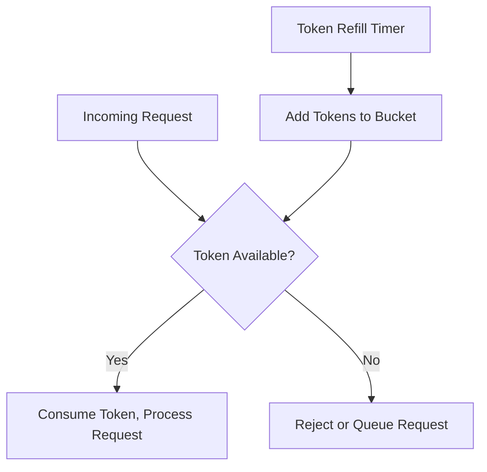
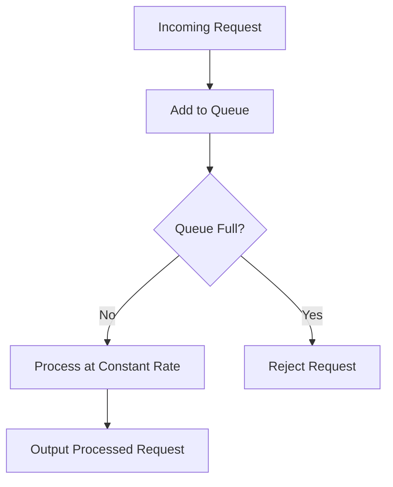
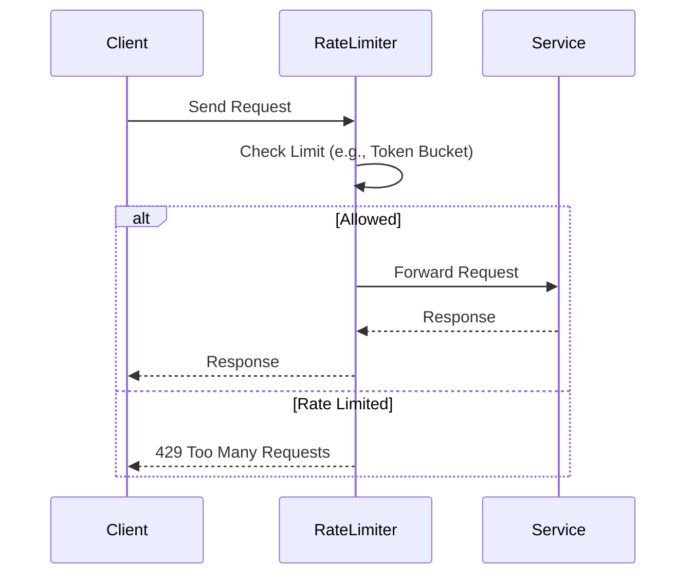

# Rate Limiting

## Overview

Rate limiting is a technique used to control the rate of incoming requests to a system, API, or service. It prevents abuse, ensures fair resource allocation, and protects against overload or denial-of-service (DoS) attacks. By enforcing limits on the number of requests per time window, rate limiting helps maintain system stability, scalability, and security. Common implementations use algorithms like token bucket or leaky bucket to manage request flow.

## Detailed Explanation

Rate limiting operates by tracking requests over time and rejecting or queuing those that exceed predefined thresholds. It can be applied at various layers: network hardware, protocol servers, or application level. Key components include:

- **Identification**: Requests are identified by IP address, user ID, API key, or session.
- **Tracking**: Counters or tokens track usage within time windows.
- **Enforcement**: Exceeding limits results in HTTP 429 (Too Many Requests) or similar responses.

### Common Algorithms

Rate limiting algorithms vary in precision, resource usage, and handling of bursts. Here's a comparison:

| Algorithm          | Description                                                                 | Pros                          | Cons                          | Use Case                  |
|--------------------|-----------------------------------------------------------------------------|-------------------------------|-------------------------------|---------------------------|
| **Fixed Window**   | Counts requests in fixed time intervals (e.g., 100 req/min). Resets at interval end. | Simple, low overhead          | Allows bursts at window edges | Basic API protection      |
| **Sliding Window** | Tracks requests in a moving window, smoothing edges.                        | Smoother, more accurate       | Higher complexity/memory      | High-precision limiting   |
| **Token Bucket**   | Tokens added at a fixed rate; requests consume tokens.                      | Handles bursts, configurable  | Requires storage for tokens   | Variable traffic APIs     |
| **Leaky Bucket**   | Requests queued and processed at a constant rate.                           | Smooth output, prevents floods| Queues can overflow           | Traffic shaping           |

#### Token Bucket Diagram



#### Leaky Bucket Diagram



### Implementation Considerations

- **Distributed Systems**: Use shared storage like Redis for counters across instances.
- **Precision vs. Performance**: Sliding window offers better accuracy but uses more memory.
- **Concurrency**: Handle race conditions in counters with atomic operations.

## Real-world Examples & Use Cases

- **API Protection**: Stripe limits API calls to 100/sec in live mode, preventing abuse and ensuring fair access.
- **DDoS Mitigation**: Cloudflare uses rate limiting to block excessive requests from IPs, protecting websites from floods.
- **Billing & Quotas**: AWS API Gateway enforces per-user limits to manage costs and prevent overuse.
- **Microservices**: In distributed systems, rate limiting prevents cascading failures by isolating services.
- **Web Scraping Prevention**: Sites like Parler (as noted in incidents) could benefit from stricter limits to avoid data leaks.

## Code Examples

### Python: Token Bucket Implementation

```python
import time
from threading import Lock

class TokenBucket:
    def __init__(self, capacity, refill_rate):
        self.capacity = capacity
        self.refill_rate = refill_rate
        self.tokens = capacity
        self.last_refill = time.time()
        self.lock = Lock()

    def allow_request(self):
        with self.lock:
            now = time.time()
            elapsed = now - self.last_refill
            self.tokens = min(self.capacity, self.tokens + elapsed * self.refill_rate)
            self.last_refill = now
            if self.tokens >= 1:
                self.tokens -= 1
                return True
            return False

# Usage
bucket = TokenBucket(capacity=10, refill_rate=1)  # 10 tokens, 1 per second
if bucket.allow_request():
    print("Request allowed")
else:
    print("Rate limited")
```

### Java: Fixed Window Counter

```java
import java.util.concurrent.ConcurrentHashMap;
import java.util.concurrent.atomic.AtomicInteger;

public class FixedWindowRateLimiter {
    private final int maxRequests;
    private final long windowMs;
    private final ConcurrentHashMap<String, Window> windows = new ConcurrentHashMap<>();

    public FixedWindowRateLimiter(int maxRequests, long windowMs) {
        this.maxRequests = maxRequests;
        this.windowMs = windowMs;
    }

    public boolean allow(String key) {
        long now = System.currentTimeMillis();
        Window window = windows.computeIfAbsent(key, k -> new Window(now));
        if (now - window.startTime >= windowMs) {
            window.startTime = now;
            window.count.set(0);
        }
        return window.count.incrementAndGet() <= maxRequests;
    }

    private static class Window {
        long startTime;
        AtomicInteger count = new AtomicInteger(0);

        Window(long startTime) {
            this.startTime = startTime;
        }
    }
}

// Usage
FixedWindowRateLimiter limiter = new FixedWindowRateLimiter(100, 60000); // 100 req/min
if (limiter.allow("user123")) {
    System.out.println("Allowed");
} else {
    System.out.println("Rate limited");
}
```

### Node.js: Sliding Window with Redis

```javascript
const redis = require('redis');
const client = redis.createClient();

async function isAllowed(key, maxRequests, windowSeconds) {
    const now = Date.now();
    const windowStart = now - (windowSeconds * 1000);
    const score = now;

    // Add current request
    await client.zadd(key, score, score);

    // Remove old requests
    await client.zremrangebyscore(key, 0, windowStart);

    // Count requests in window
    const count = await client.zcard(key);

    // Expire key after window
    await client.expire(key, windowSeconds);

    return count <= maxRequests;
}

// Usage
(async () => {
    const allowed = await isAllowed('user:123', 10, 60); // 10 req/min
    console.log(allowed ? 'Allowed' : 'Rate limited');
})();
```

## STAR Summary

- **Situation**: High-traffic APIs face abuse or overload without controls.
- **Task**: Implement rate limiting to enforce fair usage and protect resources.
- **Action**: Choose algorithm (e.g., token bucket), integrate with storage (Redis), and handle rejections gracefully.
- **Result**: Reduced abuse, improved stability, and better user experience with retries.

## Journey / Sequence



## Data Models / Message Formats

Rate limiting configurations can be stored as JSON objects:

```json
{
  "key": "user:123",
  "algorithm": "token_bucket",
  "capacity": 100,
  "refillRate": 10,
  "windowSeconds": 60,
  "lastRefill": 1695600000
}
```

HTTP Response for Rate Limited:

```http
HTTP/1.1 429 Too Many Requests
Retry-After: 60
X-RateLimit-Remaining: 0
X-RateLimit-Reset: 1695600060
```

## Common Pitfalls & Edge Cases

- **Burstiness in Fixed Window**: Requests pile up at window resets; use sliding window for smoother limits.
- **Distributed Counters**: Race conditions in multi-instance setups; use atomic operations or locks.
- **IP Spoofing**: Malicious users can rotate IPs; combine with user authentication.
- **Queue Overflow**: In leaky bucket, unbounded queues can cause memory issues; set limits.
- **False Positives**: Legitimate bursts (e.g., flash sales) trigger limits; monitor and adjust thresholds.
- **Global vs. Per-Endpoint Limits**: Enforce both to prevent single endpoint abuse.

## Tools & Libraries

- **Redis**: For distributed counters and sliding windows.
- **Nginx**: Module for HTTP rate limiting.
- **Envoy Proxy**: Built-in rate limiting filters.
- **Libraries**:
  - Python: `ratelimit` library.
  - Java: `Bucket4j` for token/leaky buckets.
  - Node.js: `express-rate-limit` middleware.
  - Go: `golang.org/x/time/rate` for token bucket.

## References

- [Rate Limiting - Wikipedia](https://en.wikipedia.org/wiki/Rate_limiting)
- [What is Rate Limiting? - Cloudflare](https://www.cloudflare.com/learning/security/what-is-rate-limiting/)
- [Implementing Rate Limiting with API Gateway - AWS](https://aws.amazon.com/blogs/architecture/implementing-rate-limiting-with-api-gateway/)
- [Rate Limits - Stripe Documentation](https://stripe.com/docs/rate-limits)

## Github-README Links & Related Topics

- [API Design](api-design-rest-grpc-openapi/README.md)
- [Load Balancing and Routing](load-balancing-and-routing/README.md)
- [Circuit Breaker Pattern](circuit-breaker-pattern/README.md)
- [API Rate Limiting](api-rate-limiting/README.md)
- [Fault Tolerance Patterns](fault-tolerance-patterns/README.md)