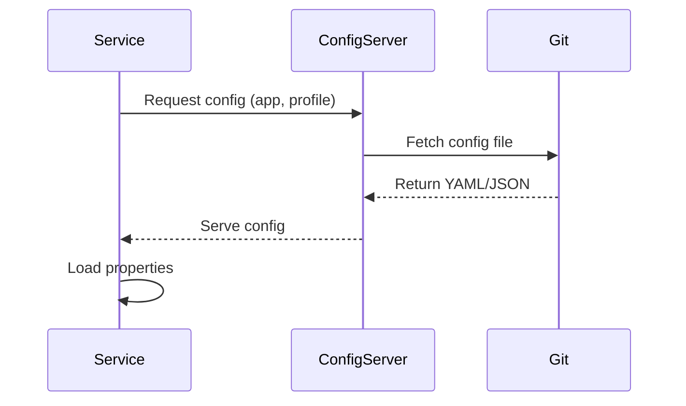

## Overview
Configuration management in distributed systems involves centralizing application settings to enable dynamic updates, versioning, and consistency across services. Tools like Spring Cloud Config, Consul, and Kubernetes ConfigMaps allow services to pull configs at runtime without redeployment.

## STAR Summary
**Situation:** Managing configuration for 20+ microservices in a Kubernetes cluster, leading to frequent redeployments for config changes.  
**Task:** Implement centralized config to allow runtime updates.  
**Action:** Deployed Spring Cloud Config Server with Git as backend, integrated clients with @RefreshScope.  
**Result:** Reduced redeployment incidents by 60%, enabled A/B testing via config toggles.

## Detailed Explanation
Centralized configuration separates config from code, stored in external stores like Git, databases, or key-value stores. Services fetch configs on startup or via refresh endpoints. Supports environments (dev, prod), encryption for secrets, and change notifications.

Key principles:
- **Separation of concerns:** Config external to application binaries.
- **Dynamic updates:** Refresh mechanisms without restarts.
- **Versioning:** Track config changes with Git history.

## Real-world Examples & Use Cases
- Microservices needing environment-specific settings (DB URLs, API keys).
- Feature flags for canary releases.
- Scaling configs across multiple instances.

## Code Examples
### Spring Cloud Config Client
```java
@SpringBootApplication
@EnableConfigServer
public class ConfigServerApplication {
    public static void main(String[] args) {
        SpringApplication.run(ConfigServerApplication.class, args);
    }
}
```

### Client Service
```java
@RestController
@RefreshScope
public class ConfigController {
    @Value("${app.message}")
    private String message;

    @GetMapping("/message")
    public String getMessage() {
        return message;
    }
}
```

application.yml:
```yaml
spring:
  cloud:
    config:
      uri: http://config-server:8888
```

Run: `mvn spring-boot:run` for both server and client.

## Data Models / Message Formats
| Field | Type | Description |
|-------|------|-------------|
| application | string | Service name |
| profile | string | Environment (default, prod) |
| label | string | Git branch/tag |
| Config | JSON/YAML | Key-value pairs |

Sample config file (application-prod.yml):
```yaml
app:
  database:
    url: jdbc:mysql://prod-db:3306/app
  features:
    new-ui: true
```

## Journey / Sequence


## Common Pitfalls & Edge Cases
- **Config drift:** Ensure all instances pull latest config.
- **Security:** Encrypt sensitive values.
- **Refresh failures:** Handle partial updates gracefully.
- **Network issues:** Cache configs locally.

## Tools & Libraries
- **Spring Cloud Config:** For Spring ecosystems.
- **Consul:** Key-value store with watches.
- **Kubernetes ConfigMaps/Secrets:** Native to K8s.
- **Vault:** For secret management.

## Github-README Links & Related Topics
Related: [[service-discovery]], [[microservices-architecture]], [[security-in-distributed-systems]]

## References
- https://spring.io/projects/spring-cloud-config
- https://www.consul.io/docs/dynamic-app-config
- https://kubernetes.io/docs/concepts/configuration/configmap/