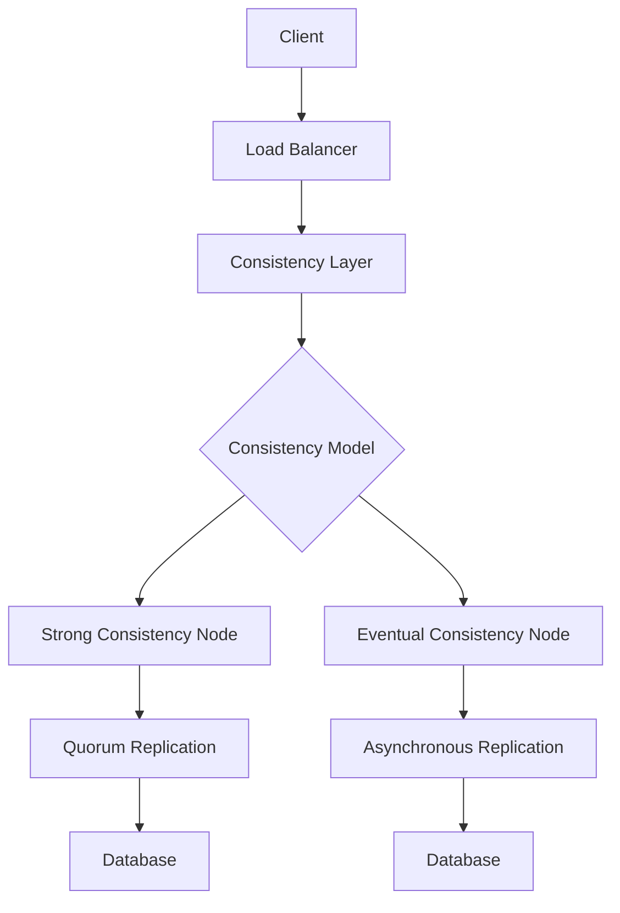

## Overview
Consistency and availability are core tradeoffs in distributed systems, formalized in the CAP theorem. You can't achieve all three: Consistency (all nodes see the same data), Availability (system responds to requests), and Partition Tolerance (system works despite network failures). PACELC extends this to latency tradeoffs. Understanding these is crucial for designing resilient systems and common in interviews.

## STAR Summary
**Situation:** A global payment system faced data inconsistencies during network partitions, leading to duplicate transactions.  
**Task:** Ensure transaction integrity while maintaining high availability.  
**Action:** Adopted eventual consistency with conflict resolution for non-critical data, strong consistency for payments using 2PC.  
**Result:** Reduced inconsistencies by 90%, maintained 99.99% availability, and improved user trust.

## Detailed Explanation
- **CAP Theorem:** Pick 2 out of 3. CA (traditional DBs, no partitions), CP (e.g., HBase), AP (e.g., DynamoDB).
- **PACELC:** If Partition (P), choose Availability or Consistency; Else (E), choose Latency or Consistency.
- **Consistency Models:** Strong (linearizability), Eventual, Causal, Weak.
- **Availability Patterns:** Replication, load balancing, circuit breakers.
- **Tradeoffs:** Strong consistency reduces availability during partitions; eventual consistency allows stale reads.

### High-Level Design (HLD)


### Capacity and Throughput Targets
- **Throughput:** 50,000 reads/sec, 10,000 writes/sec with eventual consistency; lower for strong.
- **Dimensioning:** 3 replicas for quorum (2/3 for reads/writes).
- **Latency:** <5ms for local, <100ms for global consistency.

### API Design Examples
- `GET /data?consistency=strong` - Wait for quorum
- `POST /data` - Asynchronous write with eventual consistency

### Deployment and Scaling Strategies
- Deploy across regions with geo-replication; use Kubernetes for auto-healing.

## Real-world Examples & Use Cases
- **Banking:** Strong consistency for account balances (CP).
- **Social Media:** Eventual consistency for timelines (AP).
- **E-commerce:** Causal consistency for shopping carts.

## Code Examples
### Eventual Consistency with Version Vectors in Java
```java
import java.util.*;

class VersionVector {
    Map<String, Integer> versions = new HashMap<>();

    public void update(String node, int version) {
        versions.put(node, Math.max(versions.getOrDefault(node, 0), version));
    }

    public boolean isCausallyConsistent(VersionVector other) {
        for (String node : versions.keySet()) {
            if (other.versions.getOrDefault(node, 0) < versions.get(node)) return false;
        }
        return true;
    }
}
```

## Data Models / Message Formats
| Operation | Timestamp | Version Vector | Data |
|-----------|-----------|----------------|------|
| Write     | 123456789 | {node1:1, node2:2} | {"balance": 100} |

## Journey / Sequence


## Common Pitfalls & Edge Cases
- Assuming CA in partitioned environments.
- Ignoring latency in PACELC.
- Edge case: Network partition during leader election causing split-brain.

## Common Interview Questions
- Explain CAP theorem with examples.
- When to choose AP over CP?
- How does PACELC affect design?
- Design a system for high availability with eventual consistency.

## Tools & Libraries
- **Databases:** Cassandra (tunable consistency), ZooKeeper (CP).
- **Frameworks:** Akka for actor-based consistency.

## Github-README Links & Related Topics
- [[partitioning-and-sharding]]
- [[message-queues-and-kafka]]
- [[raft-consensus-and-leader-election]]

## References
- Brewer's CAP Theorem: https://www.infoq.com/articles/cap-twelve-years-later/
- PACELC: https://www.cs.umd.edu/~abadi/papers/abadi-pacelc.pdf
- "Distributed Systems" by Maarten van Steen</content>
</xai:function_call ><xai:function_call name="todowrite">
<parameter name="todos">[{"content":"Write comprehensive README.md for consistency-and-availability topic","status":"completed","priority":"high","id":"write_consistency"}]