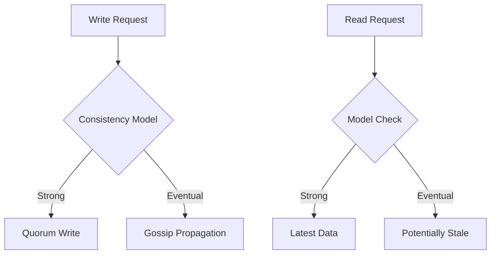
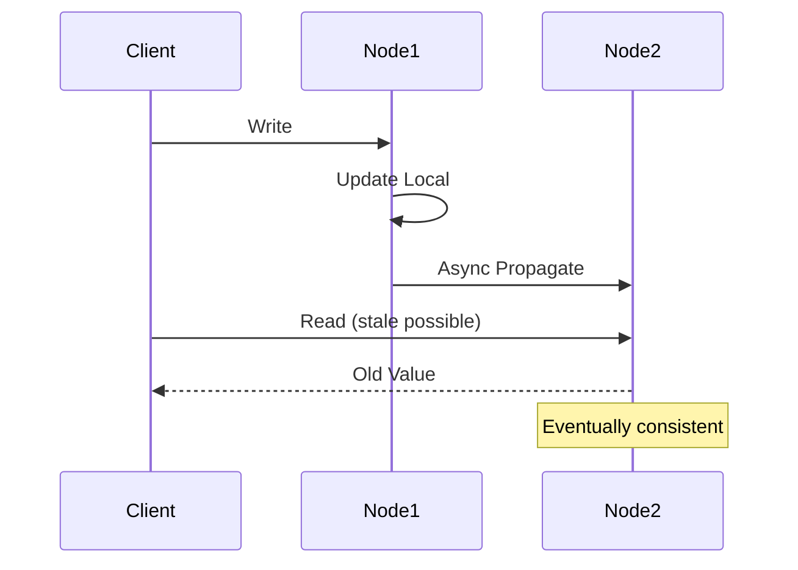

## Overview
Consistency models define guarantees for data visibility across distributed systems. Strong consistency ensures immediate visibility of writes, while eventual consistency allows temporary inconsistencies for better performance. Key models include linearizability, sequential consistency, causal consistency, and eventual consistency.

## STAR Summary
**Situation:** Global e-commerce site faced data inconsistency issues during high traffic, leading to overselling.  
**Task:** Choose appropriate consistency model to balance availability and correctness.  
**Action:** Implemented eventual consistency with conflict resolution for inventory, using DynamoDB.  
**Result:** Improved availability by 99.9%, reduced conflicts via vector clocks, and maintained user trust.

## Detailed Explanation
- **Strong Consistency:** All reads see the latest write (e.g., linearizability).
- **Eventual Consistency:** Writes propagate asynchronously; reads may see stale data.
- **Causal Consistency:** Causally related operations are ordered.
- **Tradeoffs:** Strong consistency via quorum (e.g., Paxos) increases latency; eventual via gossip reduces it but risks conflicts.

High-Level Design:


Capacity: For 1B operations/day, eventual consistency handles 100k ops/s with <1s eventual convergence.

Tradeoffs:
- Consistency vs Availability: CAP theorem - choose based on domain (e.g., banking needs strong).
- Performance vs Correctness: Eventual allows higher throughput but requires reconciliation.

API Example:
- PUT /data - Strong consistency for critical updates.
- GET /data - Eventual for non-critical reads.

Deployment: Use Cassandra for eventual, PostgreSQL for strong.

## Real-world Examples & Use Cases
- DNS propagation (eventual).
- Social media timelines (causal).
- Banking transactions (strong).

## Code Examples
Java example with eventual consistency simulation:

```java
import java.util.concurrent.ConcurrentHashMap;
import java.util.concurrent.ExecutorService;
import java.util.concurrent.Executors;

public class EventualConsistencyExample {
    private final ConcurrentHashMap<String, String> data = new ConcurrentHashMap<>();
    private final ExecutorService executor = Executors.newFixedThreadPool(4);

    public void write(String key, String value) {
        data.put(key, value);
        // Simulate async propagation
        executor.submit(() -> propagateToReplicas(key, value));
    }

    public String read(String key) {
        return data.get(key); // May be stale
    }

    private void propagateToReplicas(String key, String value) {
        // Simulate network delay
        try { Thread.sleep(100); } catch (InterruptedException e) {}
        // In real system, send to other nodes
    }
}
```

## Data Models / Message Formats
| Field | Type | Description |
|-------|------|-------------|
| key   | String | Data key |
| value | String | Data value |
| version | VectorClock | For conflict resolution |

Example payload:
```json
{
  "key": "user:123",
  "value": "active",
  "version": {"node1": 5, "node2": 4}
}
```

## Journey / Sequence


## Common Pitfalls & Edge Cases
- Write Conflicts: Resolve with last-write-wins or CRDTs.
- Network Partitions: Eventual may lose data; strong blocks.
- Read-your-writes: Ensure user sees own changes.

Common Interview Questions:
1. Explain CAP theorem with examples.
2. When to use eventual vs strong consistency?
3. Handle conflicts in eventual consistency.

## Tools & Libraries
- Cassandra: Eventual consistency DB.
- DynamoDB: Configurable consistency.
- Akka: Actor-based consistency.

## Github-README Links & Related Topics
Related: [[consistency-and-availability]], [[partitioning-and-sharding]], [[distributed-tracing-and-observability]]

## References
- https://jepsen.io/consistency
- https://www.allthingsdistributed.com/2008/12/eventually_consistent.html
- https://en.wikipedia.org/wiki/Consistency_model