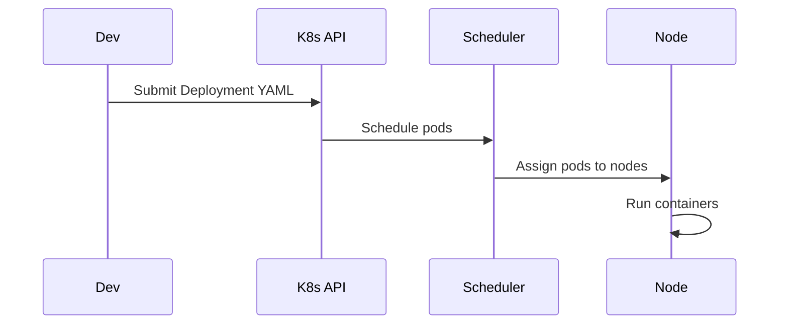

# Overview

Kubernetes (K8s) is an open-source platform for automating deployment, scaling, and management of containerized applications. It provides a framework for running distributed systems resiliently, handling service discovery, load balancing, storage orchestration, and automated rollouts/rollbacks.

# STAR Summary

**Situation:** In a microservices architecture, manual deployment of containers across multiple servers led to inconsistencies and downtime.

**Task:** Implement automated container orchestration to ensure high availability and scalability.

**Action:** Deployed Kubernetes cluster with pods, services, and deployments; used Helm for templating.

**Result:** Reduced deployment time by 80%, improved uptime to 99.9%, and enabled auto-scaling.

# Detailed Explanation

Kubernetes abstracts infrastructure, allowing developers to focus on applications. Key components:

- **Pods:** Smallest deployable units, containing one or more containers.

- **Services:** Abstractions for pod networking, providing stable IPs.

- **Deployments:** Manage replica sets for stateless apps.

- **ConfigMaps/Secrets:** Manage configuration and sensitive data.

- **Namespaces:** Isolate resources.

For scaling, use HorizontalPodAutoscaler based on CPU/memory metrics.

# Real-world Examples & Use Cases

- Scaling web services during traffic spikes.

- Blue-green deployments for zero-downtime updates.

- Multi-cloud deployments for resilience.

# Code Examples

```yaml
apiVersion: apps/v1
kind: Deployment
metadata:
  name: my-app
spec:
  replicas: 3
  selector:
    matchLabels:
      app: my-app
  template:
    metadata:
      labels:
        app: my-app
    spec:
      containers:
      - name: my-app
        image: my-app:1.0
        ports:
        - containerPort: 8080
```

Run with `kubectl apply -f deployment.yaml`

# Data Models / Message Formats

Pod spec JSON:

```json
{
  "apiVersion": "v1",
  "kind": "Pod",
  "metadata": {"name": "my-pod"},
  "spec": {
    "containers": [{
      "name": "my-container",
      "image": "nginx",
      "ports": [{"containerPort": 80}]
    }]
  }
}
```

# Journey / Sequence



# Common Pitfalls & Edge Cases

- Resource limits not set, leading to OOM kills.

- Networking issues with service discovery.

- Persistent volumes for stateful apps.

# Tools & Libraries

- kubectl: CLI for interacting with clusters.

- Helm: Package manager for K8s apps.

- Prometheus: Monitoring.

# Github-README Links & Related Topics

Related: [[microservices-architecture]], [[load-balancing-and-routing]], [[service-mesh-istio]]

# References

- https://kubernetes.io/docs/

- https://helm.sh/docs/