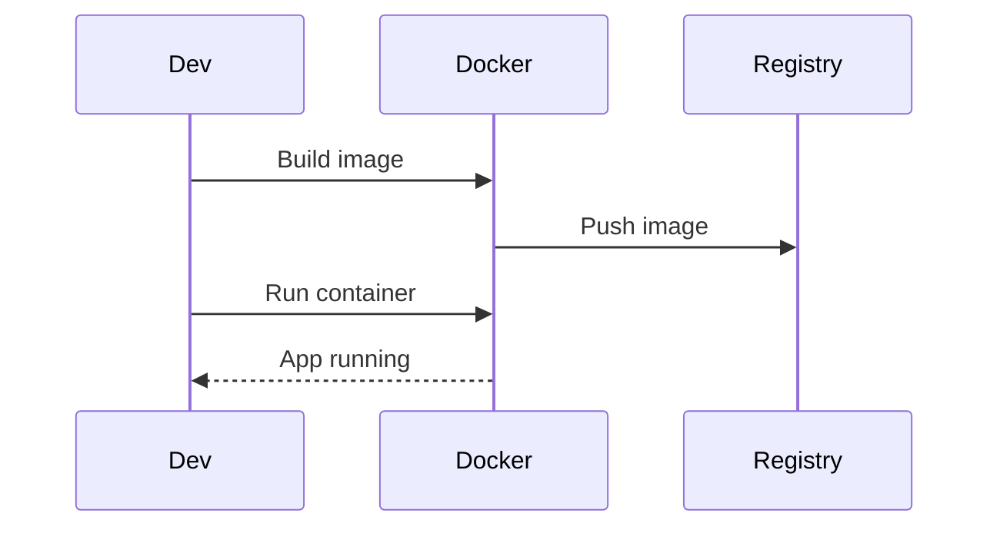

## Overview
Docker enables containerization, packaging applications with dependencies into portable images. Containers run consistently across environments, improving deployment and scaling.

## STAR Summary
**Situation:** Inconsistent deployments across dev, staging, prod.  
**Task:** Standardize environments.  
**Action:** Containerized apps with Docker, used multi-stage builds.  
**Result:** Eliminated "works on my machine", 50% faster deployments.

## Detailed Explanation
- **Images:** Immutable snapshots of app and deps.
- **Containers:** Running instances of images.
- **Dockerfile:** Instructions to build images.
- **Volumes:** Persistent data outside containers.

## Real-world Examples & Use Cases
- Microservices deployment.
- CI/CD pipelines.
- Local development environments.

## Code Examples
### Dockerfile
```dockerfile
FROM openjdk:11-jre-slim
COPY target/app.jar /app.jar
EXPOSE 8080
CMD ["java", "-jar", "/app.jar"]
```

### Docker Compose
```yaml
version: '3.8'
services:
  app:
    build: .
    ports:
      - "8080:8080"
  db:
    image: mysql:5.7
    environment:
      MYSQL_ROOT_PASSWORD: root
```

Run: `docker build -t myapp . && docker run -p 8080:8080 myapp`

## Data Models / Message Formats
| Component | Description |
|-----------|-------------|
| Image | Layered filesystem |
| Container | Running process |
| Volume | Mounted directory |

## Journey / Sequence


## Common Pitfalls & Edge Cases
- **Image bloat:** Use multi-stage builds.
- **Security:** Scan images for vulnerabilities.
- **Networking:** Expose ports correctly.
- **Volumes:** Handle data persistence.

## Tools & Libraries
- **Docker:** Core tool.
- **Docker Compose:** Multi-container apps.
- **Kubernetes:** Orchestration.
- **Podman:** Alternative runtime.

## Github-README Links & Related Topics
Related: [container-orchestration-k8s](../container-orchestration-k8s/), [microservices-architecture](../microservices-architecture/), [cloud-native-architectures](../cloud-native-architectures/)

## References
- https://docs.docker.com/
- https://docs.docker.com/compose/