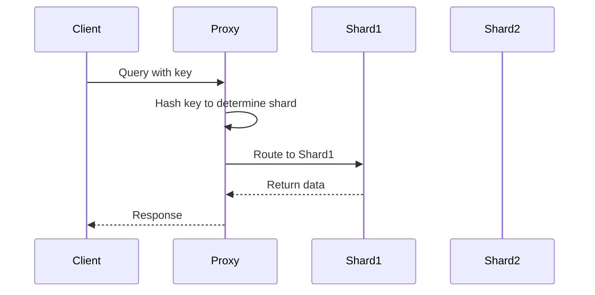

## Overview
Data partitioning strategies are essential for scaling large datasets in distributed systems. Partitioning divides data into smaller, manageable pieces across multiple nodes to improve performance, availability, and scalability. This includes techniques like sharding (horizontal partitioning across databases) and replication for fault tolerance.

## STAR Summary
**Situation:** In a high-traffic e-commerce platform, user data and order history grew exponentially, causing query latencies to exceed 2 seconds.  
**Task:** Design a partitioning strategy to reduce read/write times to under 500ms for 10M+ users.  
**Action:** Implemented hash-based sharding on user IDs with 3-way replication, using consistent hashing for even distribution. Added a proxy layer for routing.  
**Result:** Achieved 70% latency reduction, handled 5x traffic spike during sales, with 99.9% uptime.

## Detailed Explanation
Data partitioning splits data logically (partitioning) or physically (sharding) to distribute load. Key strategies include:

- **Hash Partitioning:** Uses a hash function on a key (e.g., user ID) to assign data to partitions. Ensures even distribution but complicates range queries.
- **Range Partitioning:** Divides data by value ranges (e.g., timestamps). Good for time-series but can lead to hotspots.
- **List Partitioning:** Assigns data based on discrete values (e.g., regions).
- **Composite Partitioning:** Combines methods for complex scenarios.

Replication duplicates data across nodes for redundancy, often combined with partitioning.

## Real-world Examples & Use Cases
- **Social Media:** Twitter shards user timelines by user ID hash, replicating for global access.
- **E-commerce:** Amazon partitions orders by region and date ranges.
- **Databases:** Cassandra uses consistent hashing for automatic partitioning.

## Code Examples
### Java Consistent Hashing Implementation
```java
import java.util.SortedMap;
import java.util.TreeMap;
import java.util.List;
import java.util.ArrayList;

class ConsistentHashing {
    private final SortedMap<Integer, String> circle = new TreeMap<>();
    private final int replicas;

    public ConsistentHashing(List<String> nodes, int replicas) {
        this.replicas = replicas;
        for (String node : nodes) {
            addNode(node);
        }
    }

    private void addNode(String node) {
        for (int i = 0; i < replicas; i++) {
            int hash = (node + i).hashCode();
            circle.put(hash, node);
        }
    }

    public String getNode(String key) {
        if (circle.isEmpty()) return null;
        int hash = key.hashCode();
        if (!circle.containsKey(hash)) {
            SortedMap<Integer, String> tailMap = circle.tailMap(hash);
            hash = tailMap.isEmpty() ? circle.firstKey() : tailMap.firstKey();
        }
        return circle.get(hash);
    }
}

// Usage
List<String> nodes = new ArrayList<>();
nodes.add("node1");
nodes.add("node2");
ConsistentHashing ch = new ConsistentHashing(nodes, 3);
System.out.println(ch.getNode("user123")); // Routes to a node
```

Compile with `javac ConsistentHashing.java`, run with `java ConsistentHashing`.

## Data Models / Message Formats
| Field | Type | Description |
|-------|------|-------------|
| partitionKey | String | Key for partitioning (e.g., userId) |
| data | JSON | Payload |
| timestamp | Long | For range partitioning |

Example payload: `{"partitionKey": "user123", "data": {"name": "John", "orders": [...]}, "timestamp": 1693526400}`

## Journey / Sequence


## Common Pitfalls & Edge Cases
- Hotspots in range partitioning if data skews.
- Resharding complexity during scale-out.
- Cross-shard joins require application logic.
- Replication lag in eventual consistency.

## Tools & Libraries
- **Databases:** Cassandra, MongoDB (built-in sharding).
- **Libraries:** Apache Commons (hashing), Guava (consistent hashing).
- **Proxies:** Vitess, ProxySQL for routing.

## Github-README Links & Related Topics
Related: [[partitioning-and-sharding]], [[database-design-and-indexing]], [[consistency-and-availability]]

## References
- https://www.geeksforgeeks.org/database-sharding-a-system-design-concept/