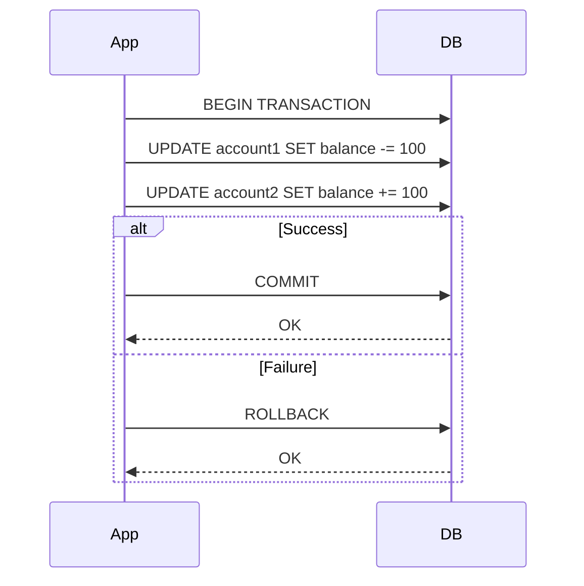

## Overview
ACID (Atomicity, Consistency, Isolation, Durability) properties define the reliability guarantees of database transactions, ensuring data integrity even in failure scenarios. Essential for applications requiring strong consistency.

## STAR Summary
**Situation:** An e-commerce platform experienced inventory discrepancies during high-traffic sales, leading to overselling.  
**Task:** Implement ACID-compliant transactions to prevent inconsistencies.  
**Action:** Configured PostgreSQL with explicit transactions and isolation levels.  
**Result:** Achieved 100% transactional integrity, eliminated overselling, and improved customer trust.

## Detailed Explanation
- **Atomicity:** All operations in a transaction succeed or none do (all-or-nothing).
- **Consistency:** Transactions bring the database from one valid state to another.
- **Isolation:** Concurrent transactions don't interfere; each sees a consistent snapshot.
- **Durability:** Committed changes persist despite failures.

Isolation levels: Read Uncommitted, Read Committed, Repeatable Read, Serializable – trade consistency for performance.

## Real-world Examples & Use Cases
- **Banking:** Transfer money atomically between accounts.
- **E-commerce:** Update inventory and order status together.
- **Distributed Systems:** Two-phase commit for multi-database transactions.

## Code Examples
Java JDBC transaction example:

```java
import java.sql.Connection;
import java.sql.DriverManager;
import java.sql.PreparedStatement;
import java.sql.SQLException;

public class AcidExample {
    public void transferMoney(int fromAccount, int toAccount, double amount) throws SQLException {
        String url = "jdbc:postgresql://localhost:5432/mydb";
        try (Connection conn = DriverManager.getConnection(url, "user", "pass")) {
            conn.setAutoCommit(false); // Start transaction
            try (PreparedStatement debit = conn.prepareStatement(
                    "UPDATE accounts SET balance = balance - ? WHERE id = ?");
                 PreparedStatement credit = conn.prepareStatement(
                    "UPDATE accounts SET balance = balance + ? WHERE id = ?")) {
                
                debit.setDouble(1, amount);
                debit.setInt(2, fromAccount);
                debit.executeUpdate();
                
                credit.setDouble(1, amount);
                credit.setInt(2, toAccount);
                credit.executeUpdate();
                
                conn.commit(); // Atomic commit
            } catch (SQLException e) {
                conn.rollback(); // Rollback on failure
                throw e;
            }
        }
    }
}
```

## Data Models / Message Formats
Accounts table:

| id | balance |
|----|---------|
| 1  | 1000.0  |
| 2  | 500.0   |

Transaction log:

| tx_id | operation | account_id | amount | timestamp |
|-------|-----------|------------|--------|-----------|
| 123   | debit     | 1          | 100.0  | 1634567890|

## Journey / Sequence


## Common Pitfalls & Edge Cases
- **Long-Running Transactions:** Can cause locks and deadlocks.
- **Isolation Level Mismatch:** Read Committed may allow dirty reads.
- **Distributed ACID:** CAP theorem limits in distributed DBs.
- **Edge Case:** Partial failures in multi-statement transactions.

## Tools & Libraries
- **Databases:** PostgreSQL, MySQL (InnoDB), Oracle
- **Frameworks:** Spring Transaction Management, Hibernate
- **Distributed:** XA transactions for multi-resource

## Github-README Links & Related Topics
Related: [[database-design-and-indexing]], [[consistency-models]], [[partitioning-and-sharding]], [[event-sourcing-and-cqrs]]

## References
- https://en.wikipedia.org/wiki/ACID
- https://www.postgresql.org/docs/current/transaction-iso.html
- https://dev.mysql.com/doc/refman/8.0/en/innodb-acid.html