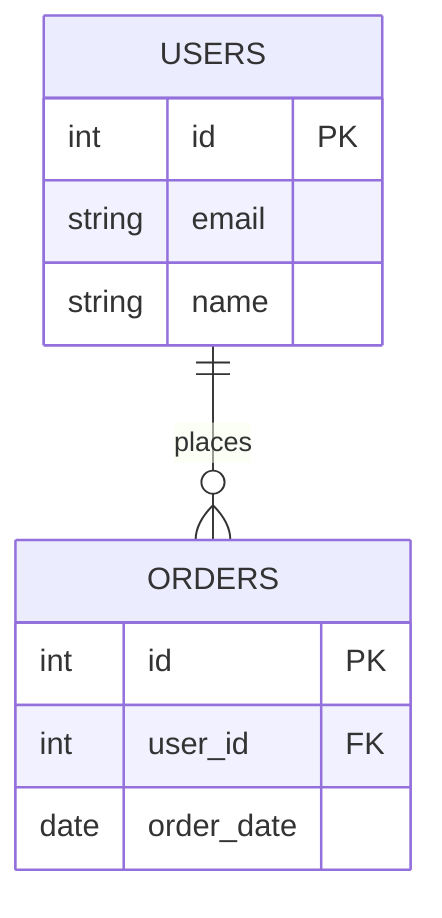

## Overview
Database design involves structuring data for efficiency. Indexing speeds up queries but impacts write performance. Normalization vs denormalization trade-offs.

## STAR Summary
**Situation:** Slow queries in a user database.  
**Task:** Optimize read performance.  
**Action:** Added B-tree indexes on frequently queried columns.  
**Result:** Query time reduced from 5s to 0.1s.

## Detailed Explanation
- **Normalization:** Reduce redundancy (1NF to 3NF).
- **Denormalization:** For read-heavy systems.
- **Indexing:** B-tree, Hash, Full-text.
- **Partitioning:** Horizontal, vertical.

## Real-world Examples
- E-commerce: Product tables with indexes on category.
- Social media: User tables with composite indexes.

## Code Examples
### SQL Index Creation
```sql
CREATE INDEX idx_user_email ON users(email);
SELECT * FROM users WHERE email = 'test@example.com';
```

## Data Models


## Journey Sequence
1. Analyze query patterns.
2. Design schema with normalization.
3. Add indexes on WHERE clauses.
4. Test performance.
5. Monitor and adjust.

## Common Pitfalls
- Over-indexing slowing writes.
- Ignoring cardinality.
- Poor key choices.

## Tools & Libraries
- MySQL Workbench: For design.
- EXPLAIN: Query analysis.

## Related Topics
- [partitioning-and-sharding](../partitioning-and-sharding/)
- [nosql-vs-sql-tradeoffs](../nosql-vs-sql-tradeoffs/)

## Common Interview Questions
- Explain normalization and its forms (1NF, 2NF, 3NF).
- What are the differences between clustered and non-clustered indexes?
- How does indexing affect insert/update performance?
- Describe composite indexes and their usage.
- When to use denormalization in database design?

## References
- "Database System Concepts" by Silberschatz.
- PostgreSQL indexing guide.
- https://dev.mysql.com/doc/refman/8.0/en/optimization-indexes.html