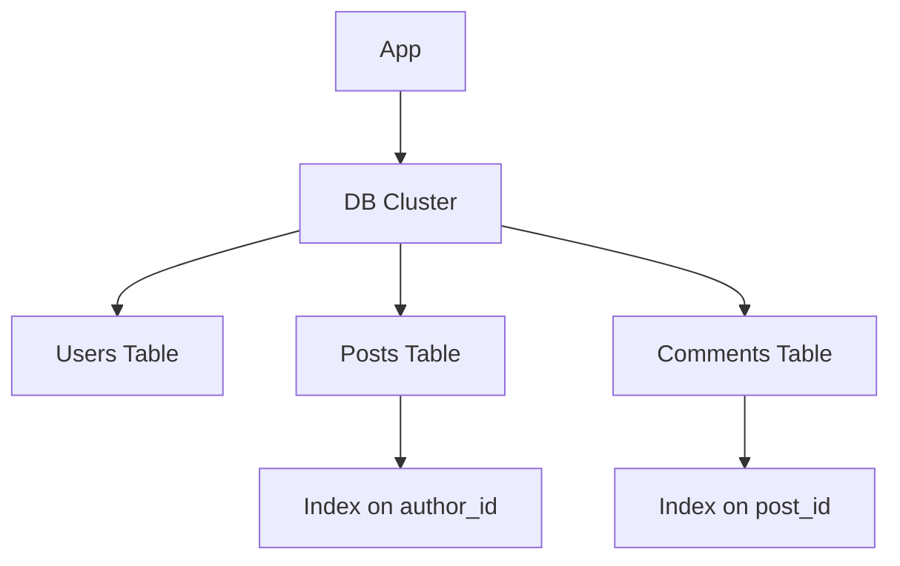
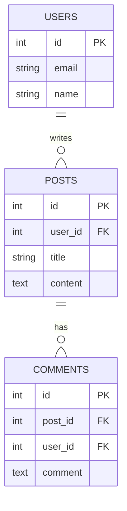
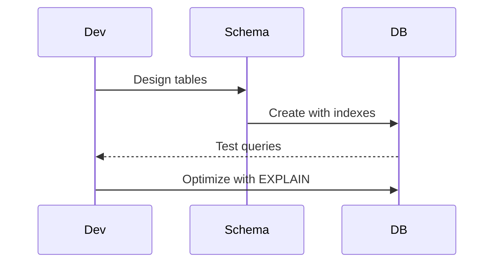

## Overview
Database design involves structuring data for efficiency. Indexing speeds up queries but impacts write performance. Normalization vs denormalization trade-offs.

## STAR Summary
**Situation:** Slow queries in a user database.  
**Task:** Optimize read performance.  
**Action:** Added B-tree indexes on frequently queried columns.  
**Result:** Query time reduced from 5s to 0.1s.

## Detailed Explanation
- **Normalization:** Reduce redundancy (1NF to 3NF).
- **Denormalization:** For read-heavy systems.
- **Indexing:** B-tree, Hash, Full-text.
- **Partitioning:** Horizontal, vertical.

### Canonical Interview Prompt
**Design the Database Schema for a Blogging Platform**

- **Functional Requirements:** Store users, posts, comments, support search and analytics.
- **Non-Functional Requirements:** High read throughput (10k RPS), data durability, scalable to 100M posts.
- **High-Level Design (HLD):**



- **Capacity Estimation:** 100M posts, each 1KB, total 100GB. Indexes add 50% overhead. Read/write ratio 100:1.
- **Tradeoffs:** Normalization vs Performance - denormalize for reads to avoid joins. Scalability vs Consistency - use sharding for horizontal scaling, accepting eventual consistency.
- **API Design (OpenAPI-style minimal):**
  - `GET /posts?author_id=123` -> indexed query
- **Deployment Notes:** Use PostgreSQL with partitioning by date, indexes on frequently queried columns, backup to S3.

## Real-world Examples & Use Cases
- E-commerce: Product tables with indexes on category for fast searches.
- Social media: User tables with composite indexes on name and location.
- Use case: Blog platform with full-text search on posts.

## Code Examples
### SQL Index Creation
```sql
CREATE INDEX idx_user_email ON users(email);
SELECT * FROM users WHERE email = 'test@example.com';
```

## Data Models / Message Formats


| Table | Field | Type | Index |
|-------|-------|------|-------|
| users | email | varchar | UNIQUE |
| posts | user_id | int | INDEX |
| comments | post_id | int | INDEX |

## Journey / Sequence


## Common Pitfalls & Edge Cases
- Over-indexing slowing writes; edge case: index maintenance overhead.
- Ignoring cardinality; edge case: low-selectivity indexes.
- Poor key choices; edge case: hot keys in sharded DB.

## Tools & Libraries
- MySQL Workbench: For design.
- EXPLAIN: Query analysis.

## Github-README Links & Related Topics
Related: [[partitioning-and-sharding]], [[nosql-vs-sql-tradeoffs]], [[caching-strategies]], [[consistency-and-availability]]

## Common Interview Questions
- Explain normalization and its forms (1NF, 2NF, 3NF).
- What are the differences between clustered and non-clustered indexes?
- How does indexing affect insert/update performance?
- Describe composite indexes and their usage.
- When to use denormalization in database design?

## References
- "Database System Concepts" by Silberschatz.
- PostgreSQL indexing guide.
- https://dev.mysql.com/doc/refman/8.0/en/optimization-indexes.html