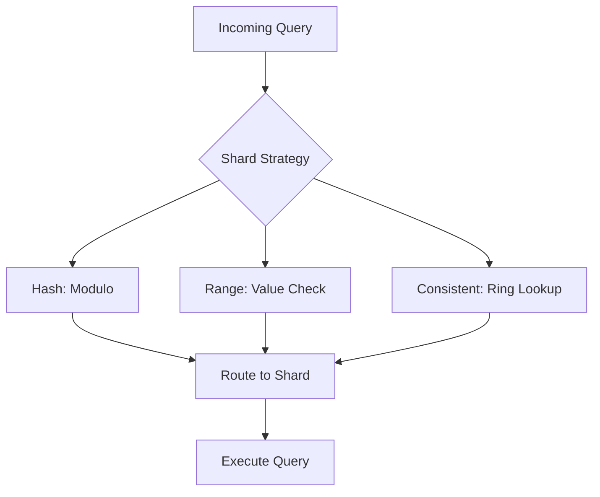

## Overview
Database sharding distributes data across multiple databases to improve scalability and performance. Strategies include hash-based, range-based, and consistent hashing, balancing load while managing complexity.

## STAR Summary
**Situation:** User database grew to 1B records, causing slow queries.  
**Task:** Shard data to reduce query time.  
**Action:** Implemented consistent hashing with virtual nodes.  
**Result:** Query latency dropped 60%, with even distribution.

## Detailed Explanation
- **Hash Sharding:** Modulo hash for even distribution; simple but inflexible.
- **Range Sharding:** Partition by value ranges; efficient for ordered queries but uneven load.
- **Consistent Hashing:** Ring-based for dynamic scaling; minimizes data movement.
- Tradeoffs: Hash for uniformity; range for locality.

## Real-world Examples & Use Cases
- Social media: Shard user posts by user ID hash.
- E-commerce: Range shard orders by date for analytics.
- Gaming: Consistent hashing for player data in global clusters.

## Code Examples
Java sharding logic with consistent hashing:
```java
import java.util.SortedMap;
import java.util.TreeMap;

class ConsistentHash {
    private final SortedMap<Integer, String> ring = new TreeMap<>();
    private final int replicas;

    public ConsistentHash(int replicas) {
        this.replicas = replicas;
    }

    public void addNode(String node) {
        for (int i = 0; i < replicas; i++) {
            int hash = (node + i).hashCode();
            ring.put(hash, node);
        }
    }

    public String getNode(String key) {
        int hash = key.hashCode();
        SortedMap<Integer, String> tailMap = ring.tailMap(hash);
        return tailMap.isEmpty() ? ring.get(ring.firstKey()) : tailMap.get(tailMap.firstKey());
    }
}
```

Usage:
```java
ConsistentHash ch = new ConsistentHash(3);
ch.addNode("db1");
ch.addNode("db2");
String node = ch.getNode("user123"); // Gets shard
```

## Data Models / Message Formats
| Shard Key | Shard ID | Data |
|-----------|----------|------|
| userId | hash(userId) % 10 | User profile JSON |

## Journey / Sequence


## Common Pitfalls & Edge Cases
- Hotspots in range sharding; monitor and rebalance.
- Cross-shard queries; denormalize or use secondary indexes.
- Node failures; implement replication.

## Tools & Libraries
- Vitess for MySQL sharding.
- Cassandra for built-in partitioning.
- Redis Cluster for consistent hashing.

## Github-README Links & Related Topics
Related: [[partitioning-and-sharding]], [[database-design-and-indexing]], [[nosql-vs-sql-tradeoffs]]

## References
- https://en.wikipedia.org/wiki/Shard_(database_architecture)
- https://www.cockroachlabs.com/docs/stable/partitioning.html