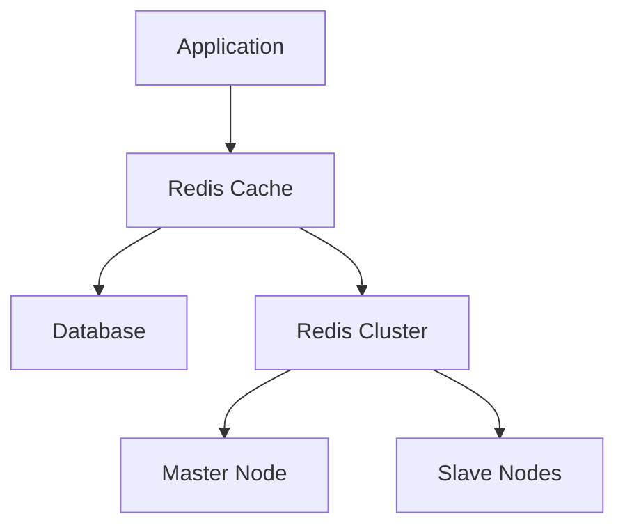
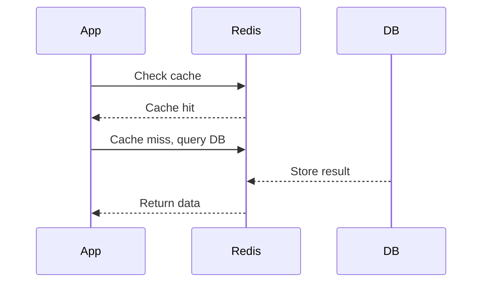

# Overview

Redis is an in-memory data structure store used as a distributed cache, database, and message broker. It provides high-performance caching with data structures like strings, hashes, lists, sets, and more.

# Detailed Explanation

Redis stores data in memory for fast access, supporting persistence, replication, and clustering. As a cache, it reduces database load and improves response times.

## Key Features

- **Data Structures**: Strings, hashes, lists, sets, sorted sets, bitmaps, hyperloglogs, geospatial, streams.
- **Persistence**: RDB snapshots and AOF logs.
- **Replication**: Master-slave with Sentinel for HA.
- **Clustering**: Sharding for scalability.
- **Pub/Sub**: Messaging capabilities.



## Journey / Sequence



# Real-world Examples & Use Cases

- **Session Storage**: Store user sessions in web apps.
- **API Rate Limiting**: Track requests per user.
- **Leaderboard**: Sorted sets for gaming scores.
- **Real-time Analytics**: Counters and hyperloglogs.
- **Pub/Sub Messaging**: Event notifications.

# Code Examples

## Java with Jedis

```java
Jedis jedis = new Jedis("localhost");
jedis.set("key", "value");
String value = jedis.get("key");
jedis.expire("key", 3600); // TTL
jedis.close();
```

## Python with redis-py

```python
import redis

r = redis.Redis(host='localhost', port=6379, db=0)
r.set('foo', 'bar')
print(r.get('foo'))
r.expire('foo', 3600)
```

## Redis Cluster Setup

```yaml
# docker-compose.yml
version: '3.8'
services:
  redis:
    image: redis:alpine
    command: redis-server --appendonly yes
    ports:
      - "6379:6379"
    volumes:
      - redis-data:/data
volumes:
  redis-data:
```

# Common Pitfalls & Edge Cases

- **Memory Limits**: Eviction policies (LRU, LFU).
- **Persistence Trade-offs**: Performance vs durability.
- **Network Latency**: In distributed setups.
- **Data Consistency**: In clusters with replication lag.
- **Security**: Default no auth; use TLS.

# Tools & Libraries

- **Redis CLI**: Command-line interface.
- **Redis Insight**: GUI for management.
- **Jedis**: Java client.
- **redis-py**: Python client.
- **Redis Cluster**: Built-in sharding.

# References

- [Redis Introduction](https://redis.io/topics/introduction)
- [Redis Documentation](https://redis.io/documentation)
- [Redis Data Types](https://redis.io/topics/data-types)

# Github-README Links & Related Topics

- [Caching](../caching/README.md)
- [Distributed Systems](../cap-theorem-and-distributed-systems/README.md)
- [NoSQL Databases](../nosql-databases/README.md)