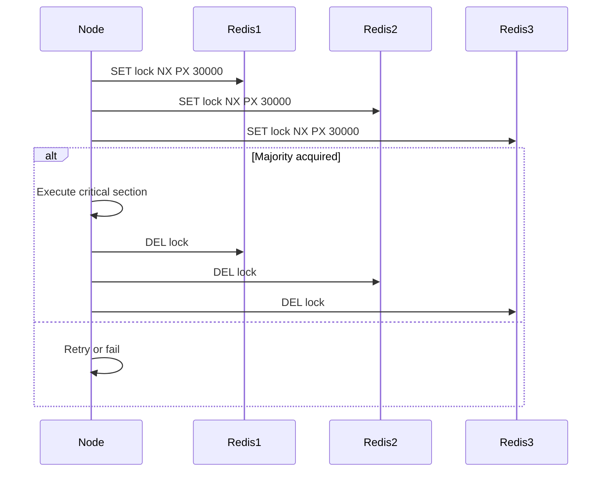

## Overview
Distributed locks synchronize access to shared resources across multiple processes or nodes, preventing race conditions in distributed systems. Essential for operations like leader election or critical section execution.

## STAR Summary
**Situation:** A microservices architecture had concurrent updates to inventory, causing overselling.  
**Task:** Implement distributed locking for atomic inventory decrements.  
**Action:** Deployed Redlock algorithm using Redis cluster.  
**Result:** Achieved mutual exclusion, reduced errors by 99%, maintained high availability.

## Detailed Explanation
- **Redlock Algorithm:** Acquires locks on majority of Redis instances; uses fencing tokens to prevent stale locks.
- **Alternatives:** ZooKeeper ephemeral nodes, etcd leases.
- **Properties:** Mutual exclusion, deadlock freedom (with timeouts), fault tolerance.

## Real-world Examples & Use Cases
- **Leader Election:** Raft uses locks for electing leaders.
- **Resource Allocation:** Prevent double-booking in ride-sharing apps.
- **Batch Processing:** Ensure idempotent job execution.

## Code Examples
Java with Redisson (Redis-based):

```java
import org.redisson.Redisson;
import org.redisson.api.RLock;
import java.util.concurrent.TimeUnit;

public class DistributedLockExample {
    private final RedissonClient redisson = Redisson.create();

    public void criticalSection() {
        RLock lock = redisson.getLock("myLock");
        try {
            if (lock.tryLock(10, 30, TimeUnit.SECONDS)) { // Wait 10s, hold 30s
                // Critical section
                System.out.println("Locked and executing");
            } else {
                System.out.println("Failed to acquire lock");
            }
        } catch (InterruptedException e) {
            Thread.currentThread().interrupt();
        } finally {
            lock.unlock();
        }
    }
}
```

## Data Models / Message Formats
Lock metadata in Redis:

| Key       | Value                  |
|-----------|------------------------|
| lock:myLock | "owner:node1:token:12345:expiry:1634567890" |

## Journey / Sequence


## Common Pitfalls & Edge Cases
- **Clock Drift:** Redlock assumes synchronized clocks.
- **Network Partitions:** May lead to split-brain.
- **Timeouts:** Lock expiry can cause premature release.
- **Edge Case:** Node failure during lock hold; fencing prevents invalid access.

## Tools & Libraries
- **Redis:** Redisson, Lettuce
- **ZooKeeper:** Curator
- **etcd:** Client libraries

## Github-README Links & Related Topics
Related: [raft-and-leader-election](../raft-and-leader-election/), [consistency-models](../concepts/consistency-models/), [partitioning-and-sharding](../partitioning-and-sharding/), [microservices-architecture](../microservices-architecture/)

## References
- https://redis.io/topics/distlock
- https://martin.kleppmann.com/2016/02/08/how-to-do-distributed-locking.html
- https://zookeeper.apache.org/doc/current/recipes.html#sc_recipes_Locks