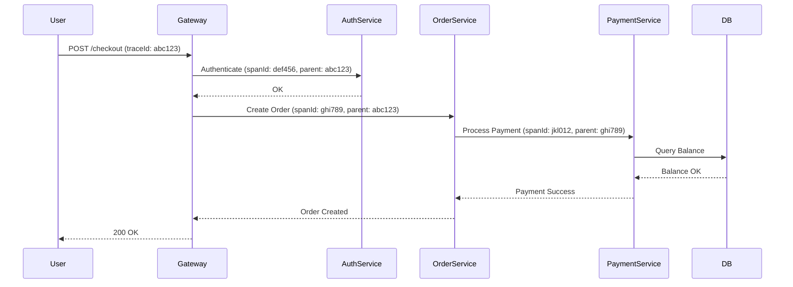

# Distributed Tracing and Observability

## Overview

Distributed tracing and observability are critical components in modern microservices architectures, enabling engineers to monitor, debug, and optimize complex systems. Distributed tracing tracks the flow of requests across multiple services, providing visibility into latency, errors, and dependencies. Observability extends this by incorporating logs, metrics, and traces to give a holistic view of system health and performance. This topic covers the principles, tools, and best practices for implementing observability in distributed systems, with a focus on interview-relevant scenarios.

## STAR Summary

**Situation:** At a large e-commerce platform, user checkout failures spiked during peak traffic, affecting revenue.

**Task:** Diagnose and resolve intermittent failures in the order processing pipeline involving 15 microservices.

**Action:** Implemented distributed tracing using OpenTelemetry and Jaeger, added structured logging with correlation IDs, and set up real-time dashboards with Prometheus and Grafana for metrics visualization.

**Result:** Identified a bottleneck in the payment service due to database connection pooling issues, reduced checkout failure rate by 75%, and improved average response time by 40%.

## Interview Design Case

**Prompt:** Design a distributed tracing system for a microservices architecture handling 10,000 requests per second (RPS) with low latency requirements.

**High-Level Design (HLD):**

```mermaid
graph TD
    A[Client] --> B[API Gateway]
    B --> C[Service 1]
    B --> D[Service 2]
    C --> E[Collector]
    D --> E
    E --> F[Storage (e.g., Elasticsearch)]
    F --> G[UI (e.g., Jaeger)]
```

**Capacity Calculations:**
- Trace size: ~1KB per request (headers, spans).
- Sampling rate: 10% to reduce load.
- Daily traces: 10,000 RPS * 0.1 * 86400 seconds = 86.4 million traces/day.
- Storage: 86.4M * 1KB = ~86GB/day; for 30 days: ~2.6TB (compressed).
- Network: 86.4M * 1KB = 86GB/day ingress to collector.

**Tradeoffs:**
- Sampling: Reduces storage and performance impact but may miss rare issues.
- Centralized vs Decentralized: Centralized easier to query but single point of failure.
- Cost: High storage for full traces vs. performance for sampled.

**STAR Case Study:** (See STAR Summary above for a real-world application.)

## Detailed Explanation

### Distributed Tracing

Distributed tracing involves capturing and visualizing the path of a request as it traverses through various services. Each service operation is represented as a "span," and related spans form a "trace." Key concepts include:

- **Trace ID:** A unique identifier for the entire request flow.
- **Span ID:** Identifies individual operations within a trace.
- **Span Context:** Includes trace ID, span ID, and metadata like baggage for custom data.
- **Sampling:** Decides which traces to capture to balance performance and visibility (e.g., probabilistic sampling).

Propagation is typically done via headers (e.g., W3C Trace Context or B3).

### Observability Pillars

- **Logs:** Detailed records of events, errors, and state changes. Use structured logging (JSON) for searchability.
- **Metrics:** Aggregated data like request count, latency percentiles, error rates. Tools like Prometheus use time-series databases.
- **Traces:** End-to-end request paths for causality analysis.

### Instrumentation

Automatic instrumentation (e.g., via OpenTelemetry agents) or manual span creation. For Java, use libraries like Micrometer for metrics and OpenTelemetry for tracing.

## Real-world Examples & Use Cases

- **Microservices Debugging:** Trace a user login request through authentication, user service, and database layers to pinpoint slow queries.
- **Incident Response:** During outages, traces help isolate failing components (e.g., a downstream API timeout).
- **Performance Optimization:** Identify hot paths in code causing latency spikes.
- **Compliance:** In finance, traces ensure audit trails for transactions.

## Common Interview Questions

- How do you propagate trace context across service boundaries?
- What is the difference between tracing and logging?
- How do you handle high-volume tracing without impacting performance?
- Explain sampling strategies in distributed tracing.

## Code Examples

### Java Tracing with OpenTelemetry

```java
import io.opentelemetry.api.trace.Span;
import io.opentelemetry.api.trace.Tracer;
import io.opentelemetry.context.Scope;

public class OrderService {

    private static final Tracer tracer = OpenTelemetry.getGlobalTracer("order-service");

    public Order processOrder(String orderId) {
        Span span = tracer.spanBuilder("processOrder")
                .setAttribute("order.id", orderId)
                .startSpan();
        try (Scope scope = span.makeCurrent()) {
            // Simulate business logic
            validateOrder(orderId);
            span.addEvent("Order validated");
            return new Order(orderId);
        } catch (Exception e) {
            span.recordException(e);
            span.setStatus(StatusCode.ERROR, e.getMessage());
            throw e;
        } finally {
            span.end();
        }
    }

    private void validateOrder(String orderId) {
        // Validation logic
    }
}
```

### Maven Setup

```xml
<dependencies>
    <dependency>
        <groupId>io.opentelemetry</groupId>
        <artifactId>opentelemetry-api</artifactId>
        <version>1.15.0</version>
    </dependency>
    <dependency>
        <groupId>io.opentelemetry</groupId>
        <artifactId>opentelemetry-sdk</artifactId>
        <version>1.15.0</version>
    </dependency>
    <dependency>
        <groupId>io.micrometer</groupId>
        <artifactId>micrometer-registry-prometheus</artifactId>
        <version>1.9.0</version>
    </dependency>
</dependencies>
```

Run with: `mvn compile exec:java -Dexec.mainClass="com.example.OrderService"`

## Data Models / Message Formats

### Trace Span Model

| Field | Type | Description |
|-------|------|-------------|
| traceId | String (UUID) | Unique trace identifier |
| spanId | String (UUID) | Unique span identifier |
| parentSpanId | String | Parent span ID (null for root) |
| name | String | Operation name (e.g., "http_request") |
| startTime | Long (Unix timestamp) | Start time in nanoseconds |
| endTime | Long | End time in nanoseconds |
| attributes | Map<String, Object> | Key-value metadata (e.g., {"http.method": "GET"}) |
| events | List<Event> | Timed events within span |
| status | Status | OK, ERROR, etc. |

### Sample Trace JSON

```json
{
  "traceId": "12345678-1234-1234-1234-123456789abc",
  "spans": [
    {
      "spanId": "abcd1234-5678-9012-3456-789abcdef012",
      "name": "checkout",
      "startTime": 1640995200000000000,
      "endTime": 1640995201000000000,
      "attributes": {"user.id": "user123"}
    }
  ]
}
```

## Journey / Sequence



## Common Pitfalls & Edge Cases

- **Header Propagation Failures:** Missing trace context in async calls or third-party integrations leads to broken traces.
- **High Cardinality Metrics:** Too many unique tag combinations in metrics can overwhelm storage.
- **Sampling Bias:** Fixed sampling rates may miss rare but critical errors.
- **Clock Synchronization:** Distributed clocks can cause inaccurate span timings; use NTP.
- **Security:** Traces may contain sensitive data; sanitize before storage.

## Tools & Libraries

- **OpenTelemetry:** Open-source instrumentation for traces, metrics, logs.
- **Jaeger:** Distributed tracing backend with UI for visualization.
- **Zipkin:** Alternative tracing system.
- **Prometheus + Grafana:** Metrics collection and dashboards.
- **ELK Stack (Elasticsearch, Logstash, Kibana):** Log aggregation and analysis.
- **Datadog, New Relic:** Commercial observability platforms.

## Github-README Links & Related Topics

[System Design Basics](../system-design-basics/README.md), [Load Balancing and Routing](../load-balancing-and-routing/README.md), [Message Queues and Kafka](../message-queues-and-kafka/README.md), [Event Sourcing and CQRS](../event-sourcing-and-cqrs/README.md)

Related: [Consistency and Availability](../consistency-and-availability/README.md), [Partitioning and Sharding](../partitioning-and-sharding/README.md)

## References

- https://opentelemetry.io/docs/concepts/observability-primer/
- https://www.jaegertracing.io/docs/
- https://prometheus.io/docs/introduction/overview/
- https://grafana.com/docs/grafana/latest/
</content>
</xai:function_call name="write">
<parameter name="filePath">networking/networking-tcp-ip-http2-tls/README.md