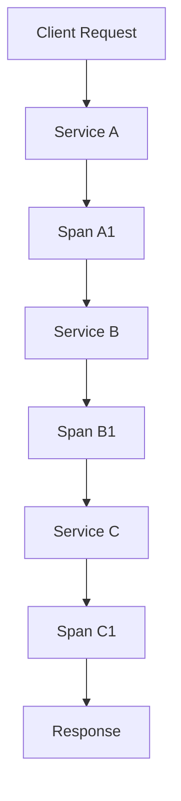

# Overview

Distributed tracing tracks requests as they flow through microservices, providing end-to-end visibility into application performance and errors. OpenTelemetry is an open-source observability framework that standardizes the collection and export of telemetry data including traces, metrics, and logs.

# Detailed Explanation

Key components:

- **Traces**: Represent the path of a request through the system.
- **Spans**: Individual units of work within a trace, with start/end times and metadata.
- **Context Propagation**: Passing trace context between services.

OpenTelemetry supports auto-instrumentation for many languages and frameworks, as well as manual instrumentation. Traces can be exported to backends like Jaeger, Zipkin, or cloud services.



# Real-world Examples & Use Cases

- Debugging latency issues in complex microservices architectures.
- Monitoring user journeys across multiple services in e-commerce platforms.
- Performance analysis in distributed systems like ride-sharing apps.

# Code Examples

```java
// OpenTelemetry Java example
OpenTelemetry openTelemetry = OpenTelemetrySdk.builder()
    .setTracerProvider(tracerProvider)
    .build();

Tracer tracer = openTelemetry.getTracer("example");

Span span = tracer.spanBuilder("operation").startSpan();
try (Scope scope = span.makeCurrent()) {
    // Your code here
} finally {
    span.end();
}
```

```python
# Python OpenTelemetry
from opentelemetry import trace
from opentelemetry.sdk.trace import TracerProvider
from opentelemetry.sdk.trace.export import BatchSpanProcessor, ConsoleSpanExporter

trace.set_tracer_provider(TracerProvider())
tracer = trace.get_tracer(__name__)

with tracer.start_as_span("operation") as span:
    span.set_attribute("key", "value")
    # Your code here
```

# References

- [OpenTelemetry](https://opentelemetry.io/)
- [Distributed Tracing](https://opentracing.io/)

# Github-README Links & Related Topics

- [Distributed Tracing](./distributed-tracing/README.md)
- [Microservices Communication Patterns](./microservices-communication-patterns/README.md)
- [Event Driven Architecture](./event-driven-architecture/README.md)