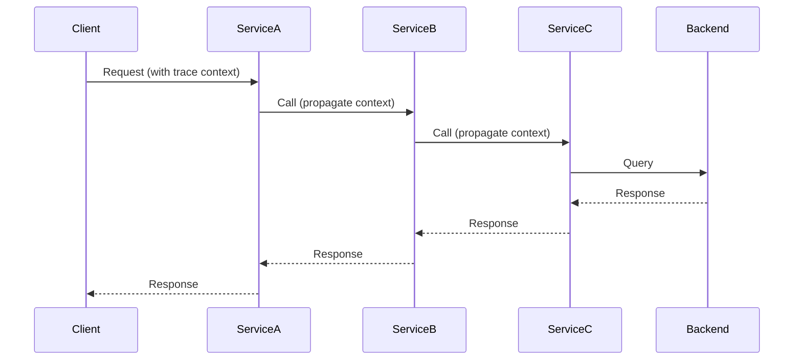

# Distributed Tracing

## Overview

Distributed tracing is a method for monitoring and troubleshooting applications, particularly in microservices architectures. It tracks requests as they propagate through multiple services, providing visibility into performance bottlenecks, latency issues, and error paths. By correlating spans across services, distributed tracing enables end-to-end observability of complex, distributed systems.

Key components include traces, spans, context propagation, and exporters. Traces represent the full journey of a request, composed of spans that denote individual operations. Context propagation ensures trace continuity across service boundaries.

## Detailed Explanation

### Core Concepts

- **Trace**: A collection of spans representing the end-to-end path of a request through a distributed system.
- **Span**: A unit of work within a trace, with attributes like name, start/end times, and metadata.
- **Context Propagation**: Mechanism to pass trace context (e.g., trace ID, span ID) between services, often via headers like `traceparent`.
- **Sampling**: Strategy to decide which traces to collect, balancing observability with performance overhead.

### How It Works

When a request enters the system, a root span is created. As the request flows through services, child spans are generated, forming a hierarchical structure. Each span captures timing, attributes, and events. Exporters send trace data to backends like Jaeger or Zipkin for visualization and analysis.

### Journey / Sequence



This sequence shows context propagation across services, enabling trace correlation.

### Data Models / Message Formats

Spans include:
- Trace ID (128-bit, unique per trace)
- Span ID (64-bit, unique per span)
- Parent Span ID
- Timestamps
- Attributes (key-value pairs)
- Events (timestamped logs)
- Status (OK, ERROR, UNSET)

Example span in JSON:

```json
{
  "trace_id": "5b8aa5a2d2c872e8321cf37308d69df2",
  "span_id": "051581bf3cb55c13",
  "name": "http_request",
  "start_time": "2023-01-01T00:00:00Z",
  "end_time": "2023-01-01T00:00:01Z",
  "attributes": {
    "http.method": "GET",
    "http.url": "https://api.example.com/users"
  },
  "status": "OK"
}
```

## Real-world Examples & Use Cases

- **Microservices Debugging**: Identify slow database queries in a chain of services.
- **Error Root Cause Analysis**: Trace errors from user-facing API to backend failures.
- **Performance Monitoring**: Measure latency across service boundaries in e-commerce checkouts.
- **Dependency Mapping**: Visualize service interactions in Kubernetes deployments.

In a typical e-commerce scenario, a user adds an item to cart. The trace spans frontend, cart service, inventory check, and payment gateway, highlighting bottlenecks.

## Code Examples

Using OpenTelemetry Java SDK for manual instrumentation.

### Basic Span Creation

```java
import io.opentelemetry.api.trace.Span;
import io.opentelemetry.api.trace.Tracer;

Tracer tracer = GlobalOpenTelemetry.getTracer("example");
Span span = tracer.spanBuilder("operation").startSpan();
try {
    // Your code here
} finally {
    span.end();
}
```

### Context Propagation

```java
import io.opentelemetry.context.Context;
import io.opentelemetry.context.propagation.TextMapPropagator;

TextMapPropagator propagator = GlobalOpenTelemetry.getPropagators().getTextMapPropagator();
Map<String, String> headers = new HashMap<>();
propagator.inject(Context.current(), headers, Map::put);
// Send headers with request
```

### Auto-Instrumentation with Agent

Run JVM with agent:

```bash
java -javaagent:opentelemetry-javaagent.jar \
     -Dotel.traces.exporter=jaeger \
     -Dotel.service.name=my-service \
     -jar my-app.jar
```

This instruments HTTP libraries, databases, etc., automatically.

## STAR Summary

**Situation**: In a microservices architecture, requests fail intermittently without clear root causes.

**Task**: Implement distributed tracing to monitor request flows and identify failures.

**Action**: Instrument services with OpenTelemetry, configure Jaeger backend, and analyze traces for error patterns.

**Result**: Reduced MTTR by 50% through pinpointing faulty services and optimizing slow paths.

## Common Pitfalls & Edge Cases

- **Sampling Overhead**: High sampling rates can impact performance; use adaptive sampling.
- **Context Loss**: Ensure propagation in async calls; avoid thread-local issues.
- **Clock Skew**: Synchronize clocks across services for accurate timing.
- **High Cardinality**: Limit unique attribute values to prevent storage bloat.
- **Vendor Lock-in**: Use OpenTelemetry for portability across backends.

## Tools & Libraries

| Tool/Library | Description | Language Support | Backend |
|--------------|-------------|------------------|---------|
| OpenTelemetry SDK | Instrumentation framework | Multi-language | Various |
| Jaeger | Tracing backend with UI | N/A | Cassandra, Elasticsearch |
| Zipkin | Distributed tracing system | N/A | In-memory, MySQL |
| Spring Cloud Sleuth | Spring integration | Java | Compatible with Zipkin/Jaeger |

Comparison: Jaeger offers advanced features like service performance monitoring; Zipkin is simpler for basic tracing.

## References

- [OpenTelemetry Observability Primer](https://opentelemetry.io/docs/concepts/observability-primer/)
- [OpenTelemetry Traces](https://opentelemetry.io/docs/concepts/signals/traces/)
- [Jaeger Documentation](https://www.jaegertracing.io/docs/)
- [Zipkin](https://zipkin.io/)
- [Mastering Distributed Tracing](https://shkuro.com/books/2019-mastering-distributed-tracing/) by Yuri Shkuro

## Github-README Links & Related Topics

- [Monitoring and Logging](../monitoring-and-logging/README.md)
- [Microservices Architecture](../microservices-architecture/README.md)
- [Observability](../monitoring-and-logging/README.md) (assuming related)
- [OpenTelemetry Collector](../opentelemetry-collector/README.md) (if exists)
- [Performance Optimization Techniques](../performance-optimization-techniques/README.md)