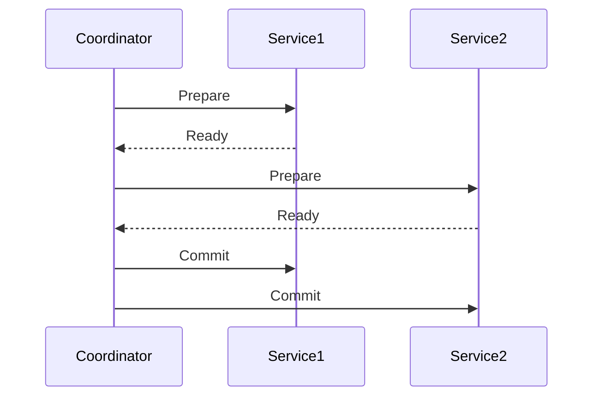

## Overview
Distributed transactions ensure consistency across multiple services or databases. Patterns like 2PC and Saga handle commits and rollbacks in distributed environments.

## STAR Summary
**Situation:** E-commerce checkout failed mid-transaction, leaving inconsistent state.  
**Task:** Ensure atomicity across payment and inventory.  
**Action:** Implemented Saga pattern with compensating actions.  
**Result:** Eliminated partial failures, improved reliability.

## Detailed Explanation
- **2PC:** Coordinator ensures all participants commit or abort; blocking but consistent.
- **Saga:** Sequence of local transactions with compensations; non-blocking but complex.
- Tradeoffs: 2PC for strong consistency; Saga for availability.

## Real-world Examples & Use Cases
- Banking: Transfer money between accounts.
- Travel booking: Reserve flight and hotel atomically.
- Microservices: Order processing with payment and shipping.

## Code Examples
Saga with Spring Boot:
```java
@Service
public class OrderSaga {
    @Autowired
    private InventoryService inventory;
    @Autowired
    private PaymentService payment;

    @Transactional
    public void processOrder(Order order) {
        try {
            inventory.reserve(order);
            payment.charge(order);
            // Commit
        } catch (Exception e) {
            // Compensate
            inventory.release(order);
            payment.refund(order);
        }
    }
}
```

## Data Models / Message Formats
| Transaction ID | Steps | Status |
|----------------|-------|--------|
| tx123 | reserve, charge | committed |

## Journey / Sequence


## Common Pitfalls & Edge Cases
- Network failures; implement timeouts.
- Partial commits; ensure idempotency.
- Saga orchestration vs choreography complexity.

## Tools & Libraries
- Atomikos for JTA.
- Eventuate for Saga framework.
- Kafka for event-driven Sagas.

## Github-README Links & Related Topics
Related: [database-acid-properties](../database-acid-properties/), [event-sourcing-and-cqrs](../event-sourcing-and-cqrs/), [consistency-and-availability](../consistency-and-availability/)

## References
- https://microservices.io/patterns/data/saga.html
- https://en.wikipedia.org/wiki/Two-phase_commit_protocol