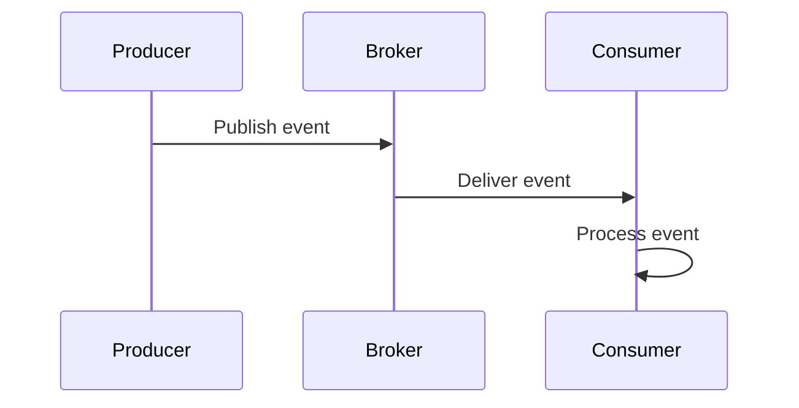

# Overview

Event-Driven Architecture (EDA) decouples services by using events as the primary means of communication. Producers emit events to a broker, and consumers react asynchronously, enabling scalability and resilience.

# STAR Summary

**Situation:** Monolithic app with tight coupling caused cascading failures.

**Task:** Refactor to microservices with loose coupling.

**Action:** Introduced event-driven communication using Kafka for pub-sub.

**Result:** Improved fault isolation, 50% faster feature delivery.

# Detailed Explanation

Core components:

- **Events:** Immutable messages representing state changes.

- **Producers:** Services that publish events.

- **Consumers:** Services that subscribe and process events.

- **Brokers:** Middleware like Kafka for event routing.

Benefits: Asynchronous processing, scalability, real-time capabilities.

# Real-world Examples & Use Cases

- E-commerce: Order placed event triggers inventory update, shipping notification.

- IoT: Sensor data events for analytics.

- Financial: Trade events for risk calculation.

# Code Examples

Java Kafka Producer:

```java
Properties props = new Properties();
props.put("bootstrap.servers", "localhost:9092");
props.put("key.serializer", "org.apache.kafka.common.serialization.StringSerializer");
props.put("value.serializer", "org.apache.kafka.common.serialization.StringSerializer");

Producer<String, String> producer = new KafkaProducer<>(props);
producer.send(new ProducerRecord<>("topic", "key", "value"));
producer.close();
```

Consumer:

```java
Properties props = new Properties();
props.put("bootstrap.servers", "localhost:9092");
props.put("group.id", "group");
props.put("key.deserializer", "org.apache.kafka.common.serialization.StringDeserializer");
props.put("value.deserializer", "org.apache.kafka.common.serialization.StringDeserializer");

KafkaConsumer<String, String> consumer = new KafkaConsumer<>(props);
consumer.subscribe(Arrays.asList("topic"));
while (true) {
    ConsumerRecords<String, String> records = consumer.poll(Duration.ofMillis(100));
    for (ConsumerRecord<String, String> record : records) {
        System.out.println(record.value());
    }
}
```

# Data Models / Message Formats

Event JSON:

```json
{
  "eventType": "OrderPlaced",
  "orderId": "123",
  "timestamp": "2023-09-25T10:00:00Z",
  "payload": {
    "userId": "456",
    "items": ["item1", "item2"]
  }
}
```

# Journey / Sequence



# Common Pitfalls & Edge Cases

- Event ordering not guaranteed.

- Duplicate events; use idempotency.

- Backpressure in high-volume scenarios.

# Tools & Libraries

- Apache Kafka: Distributed event streaming.

- RabbitMQ: Message broker.

- Spring Cloud Stream: Java framework for EDA.

# Github-README Links & Related Topics

Related: [[message-queues-and-kafka]], [[event-sourcing-and-cqrs]], [[microservices-architecture]]

# References

- https://kafka.apache.org/documentation/

- https://www.rabbitmq.com/