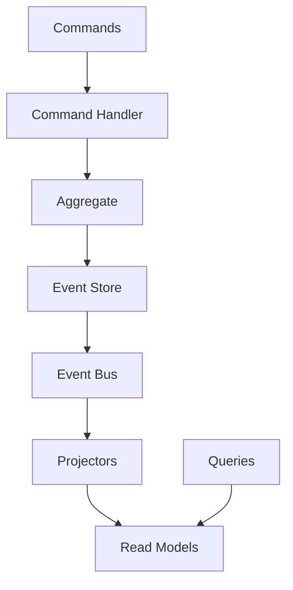
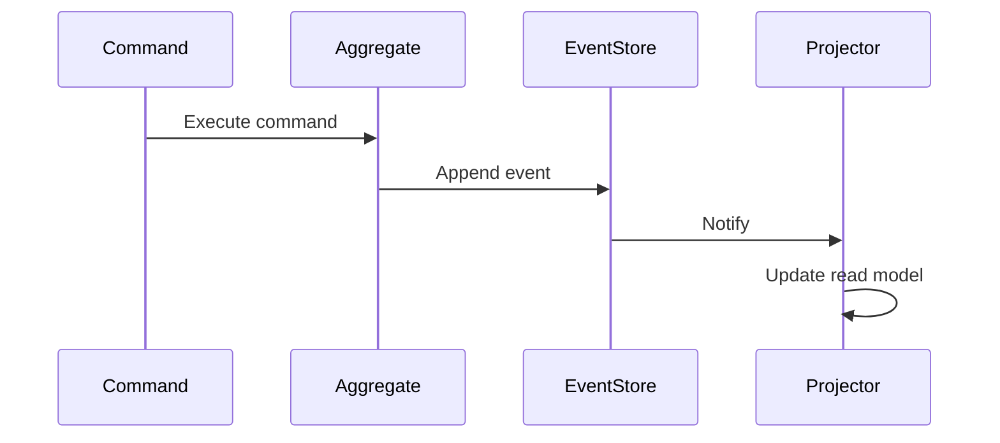

## Overview
Event Sourcing persists state as a sequence of immutable events, enabling auditability and replayability. CQRS separates command (write) and query (read) models for optimized performance. Together, they form the basis for event-driven architectures and are key for complex system designs in interviews.

## STAR Summary
**Situation:** A financial application needed immutable audit trails and fast queries for reporting.  
**Task:** Implement a system that supports both real-time updates and historical analysis.  
**Action:** Adopted Event Sourcing for commands, CQRS for separate read models updated via projectors.  
**Result:** Achieved 100% auditability, reduced query latency by 50%, and simplified debugging with event replay.

## Detailed Explanation
- **Event Sourcing:** Append-only event log, state rebuilt by replaying events.
- **CQRS:** Commands mutate state, queries read from optimized views.
- **Components:** Event Store, Aggregates, Projectors, Sagas.
- **Tradeoffs:** Increased storage vs. flexibility; eventual consistency in reads; complexity in event versioning.

### High-Level Design (HLD)


### Capacity and Throughput Targets
- **Throughput:** 10K commands/sec, 100K queries/sec.
- **Dimensioning:** Event store with 1TB storage for events; read models in separate DBs.
- **Latency:** <50ms for commands, <10ms for queries.

### API Design Examples
- `POST /commands/deposit` - Execute deposit command
- `GET /queries/balance/{accountId}` - Query read model

### Deployment and Scaling Strategies
- Deploy event store on durable storage; scale projectors with Kubernetes; use event sourcing for microservices.

## Real-world Examples & Use Cases
- **Banking:** Account transactions as events.
- **E-commerce:** Order state changes.
- **IoT:** Sensor data streams.

## Code Examples
### Simple Event Sourcing Aggregate in Java
```java
import java.util.List;
import java.util.ArrayList;

class BankAccount {
    private List<Event> events = new ArrayList<>();
    private int balance = 0;

    public void deposit(int amount) {
        events.add(new DepositEvent(amount));
        apply(new DepositEvent(amount));
    }

    private void apply(Event event) {
        if (event instanceof DepositEvent) {
            balance += ((DepositEvent) event).amount;
        }
    }

    public int getBalance() { return balance; }
}

interface Event {}
class DepositEvent implements Event {
    int amount;
    DepositEvent(int amount) { this.amount = amount; }
}
```

## Data Models / Message Formats
| Event ID | Aggregate ID | Event Type | Payload | Timestamp |
|----------|--------------|------------|---------|-----------|
| 1        | acc123       | Deposit    | {"amount": 100} | 123456789 |

## Journey / Sequence


## Common Pitfalls & Edge Cases
- Event schema evolution.
- Snapshotting for performance.
- Edge case: Concurrent commands on same aggregate.

## Common Interview Questions
- How does Event Sourcing differ from CRUD?
- Explain CQRS benefits and drawbacks.
- How to handle event versioning?
- Design an order management system with CQRS.

## Tools & Libraries
- **Event Stores:** EventStoreDB, Kafka.
- **Frameworks:** Axon Framework for Java.

## Github-README Links & Related Topics
- [[message-queues-and-kafka]]
- [[consistency-and-availability]]
- [[database-design-and-indexing]]

## References
- Martin Fowler on CQRS: https://martinfowler.com/bliki/CQRS.html
- "Versioning in an Event Sourced System": https://leanpub.com/esversioning
- Axon Framework: https://axoniq.io/</content>
</xai:function_call ><xai:function_call name="todowrite">
<parameter name="todos">[{"content":"Write comprehensive README.md for event-sourcing-and-cqrs topic","status":"completed","priority":"high","id":"write_event_sourcing"}]