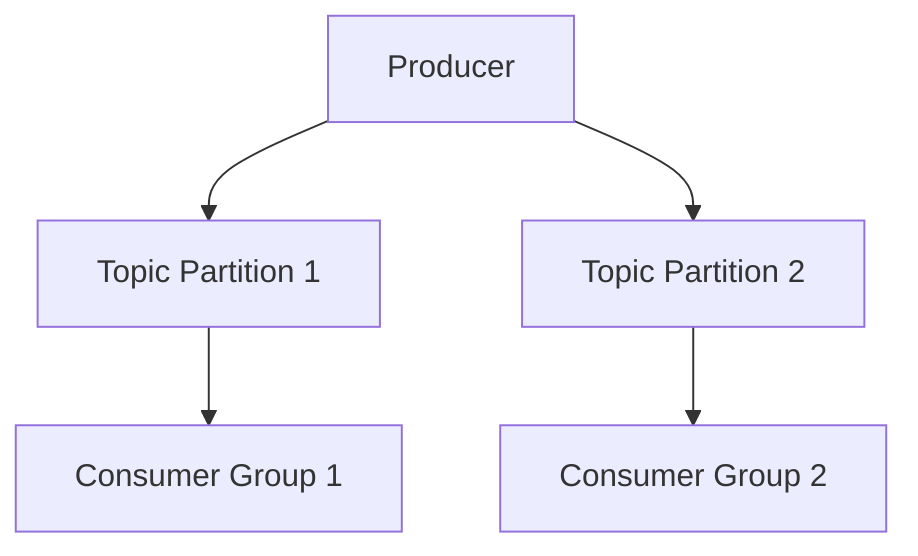
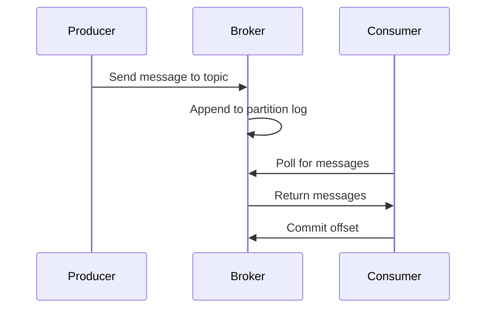

# Event Streaming with Apache Kafka

## Overview

Apache Kafka is a distributed event streaming platform used for building real-time data pipelines and streaming applications. It provides high-throughput, fault-tolerant messaging system that decouples data producers from consumers, enabling scalable and reliable data processing.



## Detailed Explanation

### Core Concepts

#### Producers and Consumers
Producers are applications that publish messages to Kafka topics. Consumers subscribe to topics and process the messages. Kafka supports multiple consumers per topic, allowing for parallel processing and load balancing.

#### Topics and Partitions
Topics are logical channels for messages. Each topic is divided into partitions, which are ordered, immutable sequences of messages. Partitions enable parallelism: multiple consumers can read from different partitions simultaneously.

#### Brokers and Clusters
Brokers are Kafka servers that store and serve messages. A cluster consists of multiple brokers for fault tolerance and scalability. Messages are replicated across brokers to ensure durability.

#### Retention and Scaling
Kafka retains messages for a configurable period (e.g., 7 days) or size. Scaling is achieved by adding more partitions or brokers. Partitions can be reassigned dynamically without downtime.

### Advanced Features
- **Consumer Groups**: Allow multiple consumers to share the load of processing messages from a topic.
- **Offsets**: Track consumer progress within partitions.
- **Log Compaction**: Retain only the latest message per key for stateful topics.
- **Streams API**: Process and transform data streams in real-time.

### Data Flow
1. Producers send messages to topic partitions based on key (for ordering) or round-robin.
2. Messages are appended to partition logs.
3. Consumers poll brokers for new messages, committing offsets to track progress.

## Journey / Sequence



## Real-world Examples & Use Cases

### Log Aggregation
Centralize logs from multiple services for monitoring and debugging. Kafka's durability ensures no log loss.

### Real-time Analytics
Process user events (clicks, views) in real-time for dashboards, recommendations, and fraud detection.

### Event-driven Microservices
Decouple services: one service publishes events, others react asynchronously.

### IoT Data Processing
Handle high-volume sensor data from devices, with partitioning for scalability.

### Data Pipeline
Ingest data from databases, APIs, or files, transform with Kafka Streams, and output to data lakes or warehouses.

## Code Examples

### Kafka Producer
```java
Properties props = new Properties();
props.put("bootstrap.servers", "localhost:9092");
props.put("key.serializer", "org.apache.kafka.common.serialization.StringSerializer");
props.put("value.serializer", "org.apache.kafka.common.serialization.StringSerializer");

Producer<String, String> producer = new KafkaProducer<>(props);
producer.send(new ProducerRecord<String, String>("my-topic", "key", "value"));
producer.close();
```

### Kafka Consumer
```java
Properties props = new Properties();
props.put("bootstrap.servers", "localhost:9092");
props.put("group.id", "test");
props.put("key.deserializer", "org.apache.kafka.common.serialization.StringDeserializer");
props.put("value.deserializer", "org.apache.kafka.common.serialization.StringDeserializer");

KafkaConsumer<String, String> consumer = new KafkaConsumer<>(props);
consumer.subscribe(Arrays.asList("my-topic"));
while (true) {
    ConsumerRecords<String, String> records = consumer.poll(Duration.ofMillis(100));
    for (ConsumerRecord<String, String> record : records)
        System.out.printf("offset = %d, key = %s, value = %s%n", record.offset(), record.key(), record.value());
}
```

### Kafka Streams Processing
```java
Properties props = new Properties();
props.put(StreamsConfig.APPLICATION_ID_CONFIG, "wordcount-app");
props.put(StreamsConfig.BOOTSTRAP_SERVERS_CONFIG, "localhost:9092");
props.put(StreamsConfig.DEFAULT_KEY_SERDE_CLASS_CONFIG, Serdes.String().getClass());
props.put(StreamsConfig.DEFAULT_VALUE_SERDE_CLASS_CONFIG, Serdes.String().getClass());

StreamsBuilder builder = new StreamsBuilder();
KStream<String, String> textLines = builder.stream("TextLinesTopic");
KTable<String, Long> wordCounts = textLines
    .flatMapValues(textLine -> Arrays.asList(textLine.toLowerCase().split("\\W+")))
    .groupBy((key, word) -> word)
    .count();

wordCounts.toStream().to("WordsWithCountsTopic", Produced.with(Serdes.String(), Serdes.Long()));

KafkaStreams streams = new KafkaStreams(builder.build(), props);
streams.start();
```

### Topic Creation
```bash
kafka-topics --create --topic my-topic --bootstrap-server localhost:9092 --partitions 3 --replication-factor 1
```

## Common Pitfalls & Edge Cases

- **Message Ordering**: Guaranteed only within a partition; use keys for ordering across partitions.
- **Consumer Lag**: Monitor lag to prevent backlog; scale consumers or partitions.
- **Rebalancing**: Consumer group rebalances can cause temporary pauses; handle gracefully.
- **Data Loss**: Ensure proper replication and acks settings.
- **Large Messages**: Avoid; use external storage for big payloads.
- **Schema Evolution**: Use Avro or Protobuf for backward compatibility.

## Tools & Libraries

- **Kafka CLI Tools**: For topic management, consumer groups, etc.
- **Confluent Platform**: Enterprise features, schema registry.
- **Kafka Connect**: For integrating with databases, filesystems.
- **KSQL**: SQL-like streaming queries.
- **Monitoring**: Prometheus, Grafana for metrics.

## References

- [Apache Kafka Documentation](https://kafka.apache.org/documentation/)
- [Kafka Streams](https://kafka.apache.org/documentation/streams/)
- [Confluent Kafka Documentation](https://docs.confluent.io/)

## Github-README Links & Related Topics

- [Event Driven Architecture](../event-driven-architecture/README.md)
- [Event Driven Architecture Patterns](../event-driven-architecture-patterns/README.md)
- [Message Queues and Brokers](../message-queues-and-brokers/README.md)