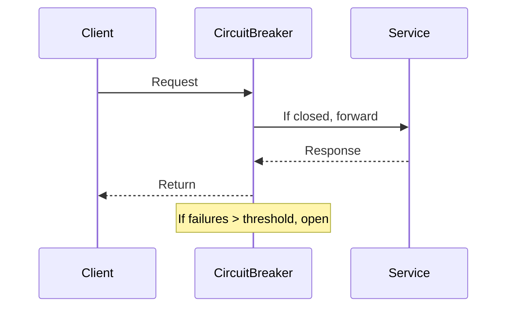

## Overview
Fault tolerance patterns ensure systems remain operational despite failures. They prevent cascading failures, isolate faults, and enable graceful degradation in distributed environments.

## STAR Summary
**Situation:** A payment service experienced 20% failure rate during peak load, causing order failures.  
**Task:** Implement fault tolerance to achieve 99.95% success rate.  
**Action:** Added circuit breaker, retry with exponential backoff, and bulkhead isolation.  
**Result:** Reduced failures to <1%, improved user experience, and prevented service overload.

## Detailed Explanation
Key patterns:

- **Circuit Breaker:** Stops calls to failing services, allowing recovery.
- **Retry:** Reattempts failed operations with backoff.
- **Bulkhead:** Isolates failures to prevent spread.
- **Timeout:** Limits wait time for responses.
- **Fallback:** Provides alternative responses on failure.

## Real-world Examples & Use Cases
- Netflix Hystrix for circuit breaking.
- AWS Lambda retries for transient failures.
- Kubernetes pod isolation.

## Code Examples
### Java Circuit Breaker with Resilience4j
```java
import io.github.resilience4j.circuitbreaker.CircuitBreaker;
import io.github.resilience4j.circuitbreaker.CircuitBreakerConfig;

CircuitBreakerConfig config = CircuitBreakerConfig.custom()
    .failureRateThreshold(50)
    .waitDurationInOpenState(Duration.ofMillis(1000))
    .build();

CircuitBreaker circuitBreaker = CircuitBreaker.of("service", config);

// Usage
Supplier<String> decorated = CircuitBreaker.decorateSupplier(circuitBreaker, () -> callService());
String result = decorated.get();
```

Add to pom.xml: `<dependency><groupId>io.github.resilience4j</groupId><artifactId>resilience4j-circuitbreaker</artifactId><version>1.7.1</version></dependency>`

## Data Models / Message Formats
| Field | Type | Description |
|-------|------|-------------|
| requestId | String | Unique ID |
| status | Enum | SUCCESS/FAIL/RETRY |
| retryCount | Int | Attempts made |

## Journey / Sequence


## Common Pitfalls & Edge Cases
- Over-retrying exhausts resources.
- Circuit breaker stuck open.
- Bulkhead misconfiguration causes underutilization.

## Tools & Libraries
- Resilience4j, Hystrix, Polly.

## Github-README Links & Related Topics
Related: [[circuit-breaker-pattern]], [[microservices-architecture]], [[distributed-tracing-and-observability]]

## References
- https://microservices.io/patterns/reliability/